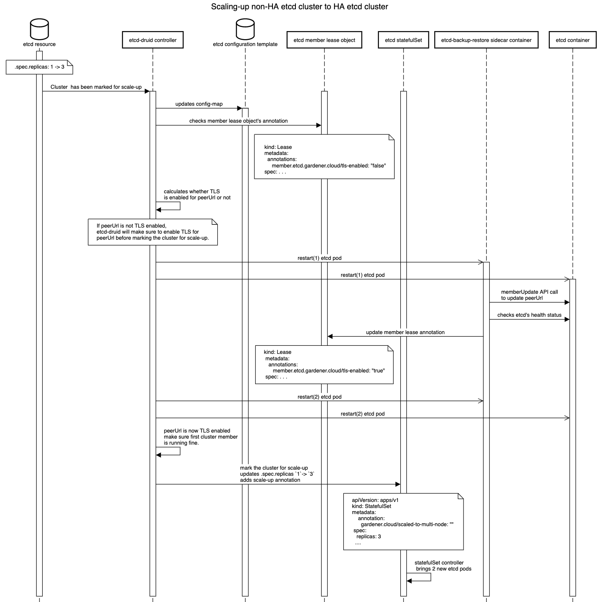

## Scaling-up a single-node to multi-node etcd cluster deployed by etcd-druid

To mark a cluster for scale-up from single node to multi-node etcd, just patch the etcd custom resource's `.spec.replicas` from `1` to `3` (for example).

### Challenges for scale-up
1. Etcd cluster with single replica don't have any peers, so no peer communication is required hence peerUrl may or may not be TLS enabled. However, while scaling up from single node etcd to multi-node etcd, there will be a requirement to have a peer communication between members of etcd cluster. Peer communication is required for various reasons like to get in a sync with each other cluster state, data and to perform leader election or any cluster wide operation like to remove/add a member etc. Hence in multi-node etcd cluster we need to have TLS enable peer url for peer communication.
2. Providing the correct configuration to start a new etcd members as it is different from boostrapping a cluster since this new etcd members will join an existing cluster.

### Approach
We first went through the etcd doc of [update-advertise-peer-urls](https://etcd.io/docs/v3.4/op-guide/runtime-configuration/#update-advertise-peer-urls) to find out information regarding peerUrl updation. Interestingly, etcd doc has mentioned the following:
```
To update the advertise peer URLs of a member, first update it explicitly via member command and then restart the member.
```

But we can't assume peerUrl is not TLS enabled for single-node cluster as it depends on end-user. A user may or may not enable the TLS for peerUrl for a single node etcd cluster. so, How to detect whether peerUrl was enabled or not when cluster is marked for scale-up ?

### Detecting if peerURL TLS is enabled or not
For this we have used member lease annotation `member.etcd.gardener.cloud/tls-enabled` set by backup-restore sidecar of etcd. As etcd configuration is provided by backup-restore, so backup-restore can find out whether TLS is enabled or not and accordingly set this annotation `member.etcd.gardener.cloud/tls-enabled: "true"` or `member.etcd.gardener.cloud/tls-enabled: "false"` in member lease object.
And with the help of this annotation and config-map values etcd-druid is able to detect whether there is a change in a peerUrl or not.


### Etcd-Druid helps in scaling up etcd cluster
Now, it is detected whether peerUrl was TLS enabled or not for single node etcd cluster. Etcd-druid can now use this information to take action:
- If peerUrl was already TLS enabled then no action is required from etcd-druid side. Etcd-druid can proceed with scaling up the cluster.
- If peerUrl was not TLS enabled then etcd-druid has to intervene and make sure peerUrl should be TLS enabled first for the single node before marking the cluster for scale-up.

### Action taken by etcd-druid to enable the peerUrl TLS
1. Etcd-druid will updates the `etcd-bootstrap` config-map with new config like initial-cluster,initial-advertise-peer-urls etc. Backup-restore will detect this change and updates the member lease annotation to `member.etcd.gardener.cloud/tls-enabled: "true"`.
2. In case the peerUrl TLS has been changed to `enabled`: Etcd-druid will adds tasks to the deployment flow.
    - To ensure that the TLS enablement of peerUrl is properly reflected in etcd, the existing etcd StatefulSet pods should be restarted twice. 
    - The first restart pushes a new configuration which contains PeerUrlTLS configuration. Backup-restore will update the member peer url. This will result in the change of the peer url in the etcd's database, but it may not reflect in the already running etcd container. Ideally a restart of an etcd container would have been sufficient but currently k8s doesn't expose an API to force restart a single container within a pod. Therefore, we need to restart the StatefulSet pod(s) once again. When the pod(s) is restarted the second time it will now start etcd with the correct peer url which will be TLS enabled.
    - To achieve 2 restarts following is done:
        * An update is made to the spec mounting the peer URL TLS secrets. This will cause a rolling update of the existing pod.
        * Once the update is successfully completed, then we delete StatefulSet pods, causing a restart by the StatefulSet controller.


### After PeerUrl is TLS enabled
After peerUrl TLS enablement for single node etcd cluster, now etcd-druid adds a scale-up annotation: `gardener.cloud/scaled-to-multi-node` to etcd statefulset and etcd-druid will patches the statefulset `.spec.replicas` to `3`(say), now statefulset controller will bring up new pods(etcd with backup-restore as a sidecar). Now etcd's sidecar i.e backup-restore will check whether this member is already a part of cluster or not and incase it is unable to check (may be due to some network issues) then backup-restore checks presence of this annotation: `gardener.cloud/scaled-to-multi-node` in etcd statefulset to detect scale-up if it finds out it is the scale-up case then backup-restore adds new etcd member as a [learner](https://etcd.io/docs/v3.3/learning/learner/) first then start the etcd learner by providing the correct configuration. Once learner is get in sync with etcd cluster leader, then learner will get promoted to voting member.

### Providing the correct etcd config
As backup-restore has detected that it a scale-up scenario, now backup-restore calculates `initial-cluster-state` to `existing` as this member will join the existing cluster and it calculates rest of the config from updated config-map provided by etcd-druid.




#### Future improvements:
Need to restart etcd pods twice will change in the future. please refer: https://github.com/gardener/etcd-backup-restore/issues/538
