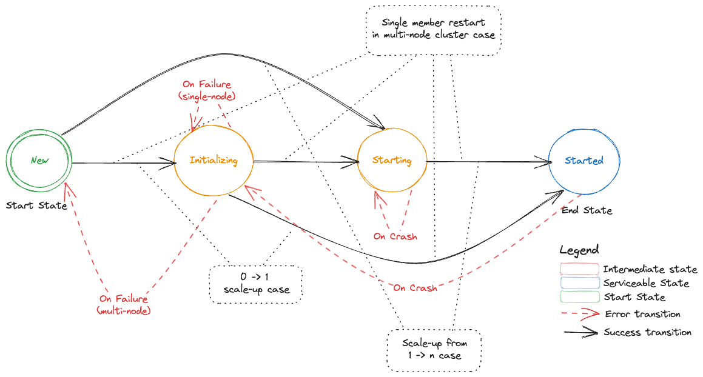
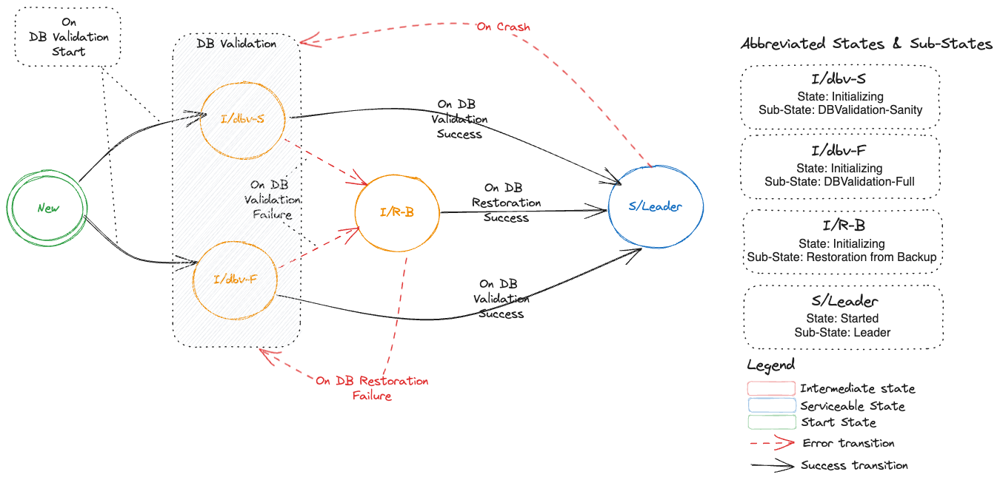
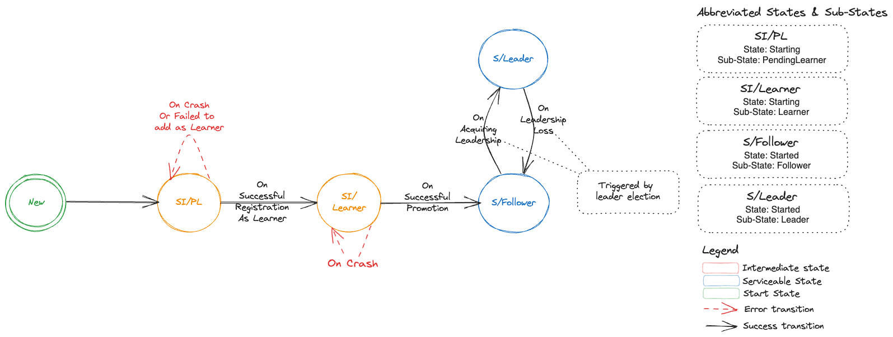
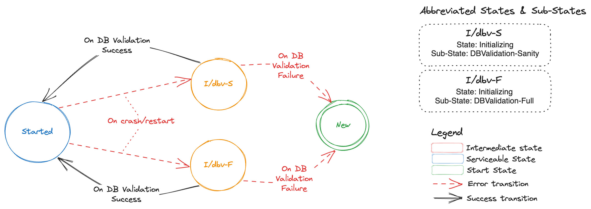

# DEP-04: EtcdMember Custom Resource

## Table of Contents

 * [Summary](#summary)
 * [Terminology](#terminology)
 * [Motivation](#motivation)
    * [Goals](#goals)
    * [Non-Goals](#non-goals)
 * [Proposal](#proposal)
    * [Etcd Member Metadata](#etcd-member-metadata)
    * [Etcd Member State Transitions](#etcd-member-state-transitions)
       * [States and Sub-States](#states-and-sub-states)
       * [Top Level State Transitions](#top-level-state-transitions)
       * [Starting an Etcd-Member in a Single-Node Etcd Cluster](#starting-an-etcd-member-in-a-single-node-etcd-cluster)
       * [Addition of a New Etcd-Member in a Multi-Node Etcd Cluster](#addition-of-a-new-etcd-member-in-a-multi-node-etcd-cluster)
       * [Restart of a Voting Etcd-Member in a Multi-Node Etcd Cluster](#restart-of-a-voting-etcd-member-in-a-multi-node-etcd-cluster)
    * [Deterministic Etcd Member Bootstrap/Restart During Scale-Up](#deterministic-etcd-member-bootstraprestart-during-scale-up)
    * [TLS Enablement for Peer Communication](#tls-enablement-for-peer-communication)
    * [Monitoring Backup Health](#monitoring-backup-health)
    * [Enhanced Snapshot Compaction](#enhanced-snapshot-compaction)
    * [Enhanced Defragmentation](#enhanced-defragmentation)
    * [Monitoring Defragmentations](#monitoring-defragmentations)
    * [Monitoring Restorations](#monitoring-restorations)
    * [Monitoring Volume Mismatches](#monitoring-volume-mismatches)
    * [Custom Resource API](#custom-resource-api)
       * [Spec vs Status](#spec-vs-status)
       * [Representing State Transitions](#representing-state-transitions)
          * [Reason Codes](#reason-codes)
       * [API](#api)
    * [Lifecycle of an EtcdMember](#lifecycle-of-an-etcdmember)
       * [Creation](#creation)
       * [Updation](#updation)
       * [Deletion](#deletion)
 * [Reference](#reference)

## Summary

Today, [etcd-druid](https://github.com/gardener/etcd-druid) mainly acts as an etcd cluster provisioner, and seldom takes remediatory actions if the [etcd](https://etcd.io/) cluster goes into an undesired state that needs to be resolved by a human operator. In other words, etcd-druid cannot perform day-2 operations on etcd clusters in its current form, and hence cannot carry out its full set of responsibilities as a true "operator" of etcd clusters. For etcd-druid to be fully capable of its responsibilities, it must know the latest state of the etcd clusters and their individual members at all times.

This proposal aims to bridge that gap by introducing `EtcdMember` custom resource allowing individual etcd cluster members to publish information/state (previously unknown to etcd-druid). This provides etcd-druid a handle to potentially take cluster-scoped remediatory actions.

## Terminology

* **druid:** [etcd-druid](https://github.com/gardener/etcd-druid) - an operator for etcd clusters.

* **etcd-member:** A single etcd pod in an etcd cluster that is realised as a [StatefulSet](https://kubernetes.io/docs/concepts/workloads/controllers/statefulset/).

* **backup-sidecar:** It is the etcd-backup-restore sidecar container in each etcd-member pod. 
  
  > **NOTE:** Term sidecar can now be confused with the latest definition in [KEP-73](https://github.com/kubernetes/enhancements/blob/master/keps/sig-node/753-sidecar-containers/README.md). etcd-backup-restore container is currently not set as an `init-container` as proposed in the KEP but as a regular container in a multi-container [Pod]([Pods | Kubernetes](https://kubernetes.io/docs/concepts/workloads/pods/)).

* **leading-backup-sidecar:** A backup-sidecar that is associated to an etcd leader.

* **restoration:** It refers to an individual etcd-member restoring etcd data from an existing backup (comprising of full and delta snapshots). The authors have deliberately chosen to distinguish between restoration and learning. Learning refers to a process where a [learner](https://etcd.io/docs/v3.3/learning/learner/#raft-learner) "learns" from an etcd-cluster leader.

## Motivation

Sharing state of an individual etcd-member with druid is essential for diagnostics, monitoring, cluster-wide-operations and potential remediation. At present, only a subset of etcd-member state is shared with druid using [leases](https://kubernetes.io/docs/concepts/architecture/leases/). It was always meant as a stopgap arrangement as mentioned in the [corresponding issue](https://github.com/gardener/etcd-druid/pull/207) and is not the best use of leases.

There is a need to have a clear distinction between an etcd-member state and etcd cluster state since most of an etcd cluster state is often derived by looking at individual etcd-member states. In addition, actors which update each of these states should be clearly identified so as to prevent multiple actors updating a single resource holding the state of either an etcd cluster or an etcd-member. As a consequence, etcd-members should not directly update the `Etcd` resource status and would therefore need a new custom resource allowing each member to publish detailed information about its latest state.

### Goals

* Introduce `EtcdMember` custom resource.

* Enhance [etcd-backup-restore](https://github.com/gardener/etcd-backup-restore) to publish member specific information by updating `EtcdMember` resource. 

* Today [leases](https://kubernetes.io/docs/concepts/architecture/leases/) are misused to share member-specific information with etcd-druid. Their usage to share member state [leader, follower, learner], member-id, snapshot revisions etc should be removed.

### Non-Goals

* Auto-recovery from quorum loss or cluster-split due to network partitioning.
* Auto-recovery of an etcd-member due to volume mismatch.

## Proposal

This proposal introduces a new custom resource `EtcdMember`, and in the following sections describes different sets of information that should be captured as part of the new resource.

### Etcd Member Metadata

Every etcd-member has a unique `memberID` and it is part of an etcd cluster which has a unique `clusterID`. In a well-formed etcd cluster every member must have the same `clusterID`. Publishing this information to druid helps in identifying issues when one or more etcd-members form their own individual clusters, thus resulting in multiple clusters where only one was expected. Issues [Issue#361](https://github.com/gardener/etcd-druid/issues/361) and [Issue#419](https://github.com/gardener/etcd-druid/issues/419) are some such occurrences.

Today, this information is published by using a member [lease](https://kubernetes.io/docs/concepts/architecture/leases/). Both these fields are populated in the leases' `Spec.HolderIdentity` by the backup-sidecar container. 

The authors propose to publish member metadata information in `EtcdMember` resource.

```yaml
id: <etcd-member id>
clusterID: <etcd cluster id>
```

> **NOTE:** Druid would not do any auto-recovery when it finds out that there are more than one clusters being formed. Instead this information today will be used for diagnostic and alerting.

### Etcd Member State Transitions

Each etcd-member goes through different `States` during its lifetime. `State` is a derived high-level summary of where an etcd-member is in its lifecycle. A `SubState` gives additional information about the state. This proposal extends the concept of states with the notion of a `SubState`, since `State` indicates a top-level state of an `EtcdMember` resource, which can have one or more `SubState`s.

While `State` is sufficient for many human operators, the notion of a `SubState` provides operators with an insight about the discrete stage of an etcd-member in its lifecycle. For example, consider a top-level `State: Starting`, which indicates that an etcd-member is starting. `Starting` is meant to be a transient state for an etcd-member. If an etcd-member remains in this `State` longer than expected, then an operator would require additional insight, which the authors propose to provide via `SubState` (in this case, the possible `SubStates` could be `PendingLearner` and `Learner`, which are detailed in the following sections).

At present, these states are not captured and only the final state is known - i.e the etcd-member either fails to come up (all re-attempts to bring up the pod via the StatefulSet controller has exhausted) or it comes up. Getting an insight into all its state transitions would help in diagnostics.

The status of an etcd-member at any given point in time can be best categorized as a combination of a top-level `State` and a `SubState`. The authors propose to introduce the following states and sub-states:

#### States and Sub-States

> **NOTE**: Abbreviations have been used wherever possible, only to represent sub-states. These representations are chosen only for brevity and will have proper longer names.

| States        | Sub-States                 | Description                                                  |
| ------------- | -------------------------- | ------------------------------------------------------------ |
| New           | -                          | Every newly created etcd-member will start in this state and is termed as the initial state or the start state. |
| Initializing  | DBV-S (DBValidationSanity) | This state denotes that backup-restore container in etcd-member pod has started initialization. Sub-State `DBV-S` which is an abbreviation for `DBValidationSanity` denotes that currently sanity etcd DB validation is in progress. |
| Initializing  | DBV-F (DBValidationFull)   | This state denotes that backup-restore container in etcd-member pod has started initialization. Sub-State `DBV-F` which is an abbreviation for `DBValidationFull` denotes that currently full etcd DB validation is in progress. |
| Initializing  | R (Restoration)            | This state denotes that backup-restore container in etcd-member pod has started initialization. Sub-State `R` which is an abbreviation for `Restoration` denotes that DB validation failed and now backup-restore has commenced restoration of etcd DB from the backup (comprising of full snapshot and delta-snapshots). An etcd-member will transition to this sub-state only when it is part of a single-node etcd-cluster. |
| Starting (SI) | PL (PendingLearner)        | An etcd-member can transition from `Initializing` state to `PendingLearner` state. In this state backup-restore container will optionally delete any existing etcd data directory and then attempts to add its peer etcd-member process as a learner. Since there can be only one learner at a time in an etcd cluster, an etcd-member could be in this state for some time till its request to get added as a learner is accepted. |
| Starting (SI) | Learner                    | When backup-restore is successfully able to add its peer etcd-member process as a `Learner`. In this state the etcd-member process will start its DB sync from an etcd leader. |
| Started (Sd)  | Follower                   | A follower is a voting raft member. A `Learner` etcd-member will get promoted to a `Follower` once its DB is in sync with the leader. It could also become a follower if during a re-election it loses leadership and transitions from being a `Leader` to `Follower`. |
| Started (Sd)  | Leader                     | A leader is an etcd-member which will handle all client write requests and linearizable read requests. A member could transition to being a `Leader` from an existing `Follower` role due to winning a leader election or for a single node etcd cluster it directly transitions from `Initializing` state to `Leader` state as there is no other member. |

In the following sub-sections, the state transitions are categorized into several flows making it easier to grasp the different transitions.

#### Top Level State Transitions

Following DFA represents top level state transitions (without any representation of sub-states). As described in the table above there are 4 top level states:

* `New`- this is a start state for all newly created etcd-members

* `Initializing` - In this state backup-restore will perform pre-requisite actions before it triggers the start of an etcd process. DB validation and optionally restoration is done in this state. Possible sub-states are: `DBValidationSanity`, `DBValidationFully` and `Restoration`

* `Starting` - Once the optional initialization is done backup-restore will trigger the start of an etcd process. It can either directly go to `Learner` sub-state or wait for getting added as a learner and therefore be in `PendingLearner` sub-state.

* `Started` - In this state the etcd-member is a full voting member. It can either be in `Leader` or `Follower` sub-states.



#### Starting an Etcd-Member in a Single-Node Etcd Cluster

Following DFA represents the states, sub-states and transitions of a single etcd-member for a cluster that is bootstrapped from cluster size of 0 -> 1.



#### Addition of a New Etcd-Member in a Multi-Node Etcd Cluster

Following DFA represents the states, sub-states and transitions of an etcd cluster which starts with having a single member (Leader) and then one or more new members are added which represents a scale-up of an etcd cluster from 1 -> n, where n is [odd](https://etcd.io/docs/v3.5/faq/#why-an-odd-number-of-cluster-members).



#### Restart of a Voting Etcd-Member in a Multi-Node Etcd Cluster

Following DFA represents the states, sub-states and transitions when a voting etcd-member in a multi-node etcd cluster restarts.



> NOTE: If the DB validation fails then data directory of the etcd-member is removed and etcd-member is removed from cluster membership, thus transitioning it to `New` state. The state transitions from `New` state are depicted by [this section](#addition-of-a-new-etcd-member-in-a-multi-node-etcd-cluster).

### Deterministic Etcd Member Creation/Restart During Scale-Up

**Bootstrap information:**

When an etcd-member starts, then it needs to find out:

* If it should join an existing cluster or start a new cluster.

* If it should add itself as a `Learner` or directly start as a voting member.

**Issue with the current approach**:

*At present*, this is facilitated by three things:

1. During scale-up, druid adds an annotation `gardener.cloud/scaled-to-multi-node` to the `StatefulSet`. Each etcd-members looks up this annotation.

2. backup-sidecar attempts to fetch etcd cluster member-list and checks if this etcd-member is already part of the cluster.

3. Size of the cluster by checking `initial-cluster` in the etcd config.

Druid adds an annotation `gardener.cloud/scaled-to-multi-node` on the `StatefulSet` which is then shared by all etcd-members irrespective of the starting state of an etcd-member (as `Learner` or `Voting-Member`). This especially creates an issue for the current leader (often pod with index 0) during the scale-up of an etcd cluster as described in [this](https://github.com/gardener/etcd-backup-restore/issues/646) issue. 

It has been agreed that the current solution to [this]([[BUG] Restart of first cluster member can lead to quorum loss while scaling up a non-HA etcd cluster. · Issue #646 · gardener/etcd-backup-restore · GitHub](https://github.com/gardener/etcd-backup-restore/issues/646)) issue is a quick and dirty fix and needs to be revisited to be uniformly applied to all etcd-members. The authors propose to provide a more deterministic approach to scale-up using the `EtcdMember` resource.

**New approach**

Instead of adding an annotation `gardener.cloud/scaled-to-multi-node` on the `StatefulSet`, a new annotation `druid.gardener.cloud/create-as-learner` should be added by druid on an `EtcdMember` resource. This annotation will only be added to newly created members during scale-up.

Each etcd-member should look at the following to deterministically compute the `bootstrap information` specified above:

* `druid.gardener.cloud/create-as-learner` annotation on its respective `EtcdMember` resource. This new annotation will be honored in the following cases:
  * When an etcd-member is created for the very first time.

  * An etcd-member is restarted while it is in `Starting` state (`PendingLearner` and `Learner` sub-states).

* Etcd-cluster member list.  to check if it is already part of the cluster. 

* Existing etcd data directory and its validity.

> **NOTE:** When the etcd-member gets promoted to a voting-member, then it should remove the annotation on its respective `EtcdMember` resource.

### TLS Enablement for Peer Communication

Etcd-members in a cluster use [peer URL(s)](https://etcd.io/docs/v3.4/op-guide/configuration/#--initial-advertise-peer-urls) to communicate amongst each other. If the advertised peer URL(s) for an etcd-member are updated then [etcd mandates a restart](https://etcd.io/docs/v3.4/op-guide/runtime-configuration/#update-advertise-peer-urls) of the etcd-member.

Druid only supports toggling the transport level security for the advertised peer URL(s). To indicate that the etcd process within the etcd-member has the updated advertised peer URL(s), an annotation `member.etcd.gardener.cloud/tls-enabled` is added by backup-sidecar container to the member lease object.

During the reconciliation run for an `Etcd` resource in druid, if reconciler detects a change in advertised peer URL(s) TLS configuration then it will watch for the above mentioned annotation on the member lease. If the annotation has a value of `false` then it will trigger a restart of the etcd-member pod. 

The authors propose to publish member metadata information in `EtcdMember` resource and not misuse member [lease](https://kubernetes.io/docs/concepts/architecture/leases/)s.

```yaml
peerTLSEnabled: <bool>
```

### Monitoring Backup Health

Backup-sidecar takes delta and full snapshot both periodically and threshold based. These backed-up snapshots are essential for restoration operations for bootstrapping an etcd cluster from 0 -> 1 replicas. It is essential that leading-backup-sidecar container which is responsible for taking delta/full snapshots and uploading these snapshots to the configured backup store, publishes this information for druid to consume.

At present, information about backed-up snapshot (*only* `latest-revision-number`) is published by leading-backup-sidecar container by updating `Spec.HolderIdentity` of the delta-snapshot and full-snapshot [lease](https://kubernetes.io/docs/concepts/architecture/leases/)s.

Druid maintains `conditions` in the `Etcd` resource status, which include but are not limited to maintaining information on whether backups being taken for an etcd cluster are healthy (up-to-date) or stale (outdated in context to a configured schedule). Druid computes these conditions using information from full/delta snapshot leases.

In order to provide a holistic view of the health of backups to human operators, druid requires additional information about the snapshots that are being backed-up. The authors propose to not misuse [lease](https://kubernetes.io/docs/concepts/architecture/leases/)s and instead publish the following snapshot information as part `EtcdMember` custom resource:

```yaml
snapshots:
  lastFull:
    timestamp: <time of full snapshot>
    name: <name of the file that is uploaded>
    size: <size of the un-compressed snapshot file uploaded>
    startRevision: <start revision of etcd db captured in the snapshot>
    endRevision: <end revision of etcd db captured in the snapshot>
  lastDelta:
    timestamp: <time of delta snapshot>
    name: <name of the file that is uploaded>
    size: <size of the un-compressed snapshot file uploaded>
    startRevision: <start revision of etcd db captured in the snapshot>
    endRevision: <end revision of etcd db captured in the snapshot>
```

While this information will primarily help druid compute accurate conditions regarding backup health from snapshot information and publish this to human operators, it could be further utilised by human operators to take remediatory actions (e.g. manually triggering a full or delta snapshot or further restarting the leader if the issue is still not resolved) if backup is unhealthy.

### Enhanced Snapshot Compaction

Druid can be configured to perform regular snapshot compactions for etcd clusters, to reduce the total number of delta snapshots to be restored if and when a DB restoration for an etcd cluster is required. Druid triggers a snapshot compaction job when the accumulated etcd events in the latest set of delta snapshots (taken after the last full snapshot) crosses a specified threshold.

As described in [Issue#591](https://github.com/gardener/etcd-druid/issues/591) scheduling compaction only based on number of accumulated etcd events is not sufficient to ensure a successful compaction. This is specifically targeted for kubernetes clusters where each etcd event is larger in size owing to large spec or status fields or respective resources. 

Druid will now need information regarding snapshot sizes, and more importantly the total size of accumulated delta snapshots since the last full snapshot.

The authors propose to enhance the proposed `snapshots` field described in [Use Case #3](#use-case-3-monitoring-backup-health) with the following additional field:

```yaml
snapshots:
  accumulatedDeltaSize: <total size of delta snapshots since last full snapshot>
```

Druid can then use this information in addition to the existing revision information to decide to trigger an early snapshot compaction job. This effectively allows druid to be proactive in performing regular compactions for etcds receiving large events, reducing the probability of a failed snapshot compaction or restoration.

### Enhanced Defragmentation

Reader is recommended to read [Etcd Compaction & Defragmentation](https://etcd.io/docs/v3.4/op-guide/maintenance/) in order to understand the following terminology:

[`dbSize`](https://github.com/etcd-io/etcd/blob/a603c0798948941d453b158af794edab1a8230be/mvcc/backend/backend.go#L60-L64) - total storage space used by the etcd database

[`dbSizeInUse`](https://github.com/etcd-io/etcd/blob/a603c0798948941d453b158af794edab1a8230be/mvcc/backend/backend.go#L65-L68) - logical storage space used by the etcd database, not accounting for free pages in the DB due to etcd history compaction

The leading-backup-sidecar performs periodic defragmentations of the DBs of all the etcd-members in the cluster, controlled via a defragmentation cron schedule provided to each backup-sidecar. Defragmentation is a costly maintenance operation and causes a brief downtime to the etcd-member being defragmented, due to which the leading-backup-sidecar defragments each etcd-member sequentially. This ensures that only one etcd-member would be unavailable at any given time, thus avoiding an accidental quorum loss in the etcd cluster.

The authors propose to move the responsibility of orchestrating these individual defragmentations to druid due to the following reasons:

- Since each backup-sidecar only has knowledge of the health of its own etcd, it can only determine whether its own etcd can be defragmented or not, based on etcd-member health. Trying to defragment a different healthy etcd-member while another etcd-member is unhealthy would lead to a transient quorum loss.
- Each backup-sidecar is only a `sidecar` to its own etcd-member, and by good design principles, it must not be performing any cluster-wide maintenance operations, and this responsibility should remain with the etcd cluster operator.

Additionally, defragmentation of an etcd DB becomes inevitable if the DB size exceeds the specified DB space quota, since the etcd DB then becomes read-only, ie no write operations on the etcd would be possible unless the etcd DB is defragmented and storage space is freed up. In order to automate this, druid will now need information about the etcd DB size from each member, specifically the leading etcd-member, so that a cluster-wide defragmentation can be triggered if the DB size reaches a certain threshold, as already described by [this issue](https://github.com/gardener/etcd-backup-restore/issues/556).

The authors propose to enhance each etcd-member to regularly publish information about the `dbSize` and ` dbSizeInUse` so that druid may trigger defragmentation for the etcd cluster. 

```yaml
dbSize: <db-size> # e.g 6Gi
dbSizeInUse: <db-size-in-use> # e.g 3.5Gi
```

Difference between `dbSize` and `dbSizeInUse` gives a clear indication of how much storage space would be freed up if a defragmentation is performed. If the difference is not significant (based on a configurable threshold provided to druid), then no defragmentation should be performed. This will ensure that druid does not perform frequent defragmentations that do not yield much benefit. Effectively it is to maximise the benefit of defragmentation since this operations involves transient downtime for each etcd-member. 

### Monitoring Defragmentations

As discussed in the previous section, every etcd-member is defragmented periodically, and can also be defragmented based on the DB size reaching a certain threshold. It is beneficial for druid to have knowledge of this data from each etcd-member for the following reasons:

* [**Diagnostics**] Druid can aggregate data about every member's defragmentations and calculate the frequency of defragmentations on an etcd cluster. Combined with details about the triggers for these defragmentations, druid can derive insights and raise alerts about the cause for frequent defragmentations, such as possible DB spikes.

* [**Operational**] Derive status of defragmentation at etcd cluster level. In case of partial failures for a subset of etcd-members druid can potentially re-trigger defragmentation only for those etcd-members.

The authors propose to capture this information as part of `defragmentations` section in the `EtcdMember` resource.

```yaml
defragmentations:
- startTime: <start time of defragmentation>
  endTime: <end time of defragmentation>
  status: <Succeeded | Failed>
  message: <success or failure message>
  initialDBSize: <size of etcd DB prior to defragmentation>
  finalDBSize: <size of etcd DB post degragmentation>
```

> **NOTE**: Defragmentation is a cluster-wide operation, and insights derived from aggregating defragmentation data from individual etcd-members would be captured in the `Etcd` resource status 

### Monitoring Restorations

Each etcd-member may perform restoration of data multiple times throughout its lifecycle, possibly owing to data corruptions. It would be useful to capture this information as part of an `EtcdMember` resource, for the following use cases:

* [**Diagnostics**] Druid can detect frequent or multiple restorations on an etcd-member and derive insights on whether there is an underlying issue that is causing frequent corruptions of the etcd DB.

* [**Operational**] In case of failed restoration backup-sidecar could detect if the restoration failure is due to corrupt backup. In order to aid restoration of the etcd-member, druid can force a full-snapshot. See [related issue](https://github.com/gardener/etcd-backup-restore/issues/583).

The authors propose to capture this information under `restorations` section in the `EtcdMember` resource.

```yaml
restorations:
- status: <Failed | Success | In-Progress>
  reason: <reason-code for status>
  message: <human readable message for status>
  startTime: <start time of restoration>
  endTime: <end time of restoration>
```

### Monitoring Volume Mismatches

Each etcd-member checks for possible etcd data volume mismatches, based on which it decides whether to start the etcd process or not, but this information is not captured anywhere today. It would be beneficial to capture this information as part of the `EtcdMember` resource so that a human operator may check this and manually fix the underlying problem with the wrong volume being attached or mounted to an etcd-member pod.

The authors propose to capture this information under `volumeMismatches` section in the `EtcdMember` resource.

```yaml
volumeMismatches:
- identifiedAt: <time at which wrong volume mount was identified>
  fixedAt: <time at which correct volume was mounted>
  volumeID: <volume ID of wrong volume that got mounted>
  numRestarts: <num of etcd-member restarts that were attempted>
```

Each entry under `volumeMismatches` will be for a unique `volumeID`. If there is a pod restart and it results in yet another unexpected `volumeID` (different from the already captured volumeIDs) then a new entry will get created. `numRestarts` denotes the number of restarts seen by the etcd-member for a specific `volumeID`.

Based on information from the `volumeMismatches` section, druid *may* choose to perform rudimentary remediatory actions as simple as restarting the member pod to force a possible rescheduling of the pod to a different node which could potentially force the correct volume to be mounted to the member.

### Custom Resource API

#### Spec vs Status

Information that is captured in the etcd-member custom resource could be represented either as `EtcdMember.Status` or `EtcdMemberState.Spec`. 

Gardener has a similar need to capture a shoot state and they have taken the decision to represent it via [ShootState](https://github.com/gardener/gardener/blob/9e1a20aa9cc32fc806123003ba6079b284948767/pkg/apis/core/types_shootstate.go#L27-L33) resource where the state or status of a shoot is captured as part of the `Spec` field in the `ShootState` custom resource.

The authors wish to instead align themselves with the [K8S API conventions](https://github.com/kubernetes/community/blob/master/contributors/devel/sig-architecture/api-conventions.md#spec-and-status) and choose to use `EtcdMember` custom resource and capture the status of each member in `Status` field of this resource. This has the following advantages:

* `Spec` represents a desired state of a resource and what we capture is the `As-Is` state of a resource which `Status` is meant to capture. Therefore semantically using `Status` is the correct choice.

* Not mis-using `Spec` now to represent `As-Is` state provides us with a choice to extend the custom resource with any future need for a `Spec` a.k.a desired state.

#### Representing State Transitions

The authors propose to use a custom representation for states, sub-states and transitions.

Consider the following representation:

```yaml
transitions:
- state: <name of the state that the etcd-member has transitioned to>
  subState: <name of the sub-state if any>
  reason: <reason code for the transition>
  transitionTime: <time of transition to this state>
  message: <detailed message if any>
```

As an example, consider the following transitions which represent addition of an etcd-member during scale-up of an etcd cluster, followed by a restart of the etcd-member which detects a corrupt DB:

```yaml
status:
  transitions:
  - state: New
    subState: New
    reason: ClusterScaledUp
    transitionTime: "2023-07-17T05:00:00Z"
    message: "New member added due to etcd cluster scale-up"
  - state: Starting
    subState: PendingLearner
    reason: WaitingToJoinAsLearner
    transitionTime: "2023-07-17T05:00:30Z"
    message: "Waiting to join the cluster as a learner"
  - state: Starting
    subState: Learner
    reason: JoinedAsLearner
    transitionTime: "2023-07-17T05:01:20Z"
    message: "Joined the cluster as a learner"
  - state: Started
    subState: Follower
    reason: PromotedAsVotingMember
    transitionTime: "2023-07-17T05:02:00Z"
    message: "Now in sync with leader, promoted as voting member"
  - state: Initializing
    subState: DBValidationFull
    reason: DetectedPreviousUncleanExit
    transitionTime: "2023-07-17T08:00:00Z"
    message: "Detected previous unclean exit, requires full DB validation"
  - state: New
    subState: New
    reason: DBCorruptionDetected
    transitionTime: "2023-07-17T08:01:30Z"
    message: "Detected DB corruption during initialization, removing member from cluster"
  - state: Starting
    subState: PendingLearner
    reason: WaitingToJoinAsLearner
    transitionTime: "2023-07-17T08:02:10Z"
    message: "Waiting to join the cluster as a learner"
  - state: Starting
    subState: Learner
    reason: JoinedAsLearner
    transitionTime: "2023-07-17T08:02:20Z"
    message: "Joined the cluster as a learner"
  - state: Started
    subState: Follower
    reason: PromotedAsVotingMember
    transitionTime: "2023-07-17T08:04:00Z"
    message: "Now in sync with leader, promoted as voting member"
```

##### Reason Codes

The authors propose the following list of possible reason codes for transitions. This list is not exhaustive, and can be further enhanced to capture any new transitions in the future.

| Reason                                | Transition From State (SubState)                             | Transition To State (SubState)         |
| ------------------------------------- | ------------------------------------------------------------ | -------------------------------------- |
| `ClusterCreated`                      | nil                                                          | New                                    |
| `DetectedPreviousCleanExit`           | New \| Started (Leader) \| Started (Follower)                | Initializing (DBValidationSanity)      |
| `DetectedPreviousUncleanExit`         | New \| Started (Leader) \| Started (Follower)                | Initializing (DBValidationFull)        |
| `DBValidationFailed`                  | Initializing (DBValidationSanity) \| Initializing (DBValidationFull) | Initializing (Restoration) \| New      |
| `DBValidationSucceeded`               | Initializing (DBValidationSanity) \| Initializing (DBValidationFull) | Started (Leader) \| Started (Follower) |
| `Initializing (Restoration)Succeeded` | Initializing (Restoration)                                   | Started (Leader)                       |
| `ClusterScaledUp`                     | nil                                                          | New                                    |
| `WaitingToJoinAsLearner`              | New                                                          | Starting (PendingLearner)              |
| `JoinedAsLearner`                     | Starting (PendingLearner)                                    | Starting (Learner)                     |
| `PromotedAsVotingMember`              | Starting (Learner)                                           | Started (Follower)                     |
| `GainedClusterLeadership`             | Started (Follower)                                           | Started (Leader)                       |
| `LostClusterLeadership`               | Started (Leader)                                             | Started (Follower)                     |

#### API

The authors propose to add the `EtcdMember` custom resource API to etcd-druid APIs and initially introduce it with `v1alpha1` version.

```yaml
apiVersion: druid.gardener.cloud/v1alpha1
kind: EtcdMember
metadata:
  labels:
    gardener.cloud/owned-by: <name of parent Etcd resource>
  name: <name of the etcd-member>
  namespace: <namespace | will be the same as that of parent Etcd resource>
  ownerReferences:
  - apiVersion: druid.gardener.cloud/v1alpha1
    blockOwnerDeletion: true
    controller: true
    kind: Etcd
    name: <name of the parent Etcd resource>
    uid: <UID of the parent Etcd resource> 
status:
  id: <etcd-member id>
  clusterID: <etcd cluster id>
  peerTLSEnabled: <bool>
  dbSize: <db-size>
  dbSizeInUse: <db-size-in-use>
  snapshots:
    lastFull:
      timestamp: <time of full snapshot>
      name: <name of the file that is uploaded>
      size: <size of the un-compressed snapshot file uploaded>
      startRevision: <start revision of etcd db captured in the snapshot>
      endRevision: <end revision of etcd db captured in the snapshot>
    lastDelta:
      timestamp: <time of delta snapshot>
      name: <name of the file that is uploaded>
      size: <size of the un-compressed snapshot file uploaded>
      startRevision: <start revision of etcd db captured in the snapshot>
      endRevision: <end revision of etcd db captured in the snapshot>
    accumulatedDeltaSize: <total size of delta snapshots since last full snapshot>
  restorations:
  - type: <FromSnapshot | FromLeader>
    status: <Failed | Success | In-Progress>
    startTime: <start time of restoration>
    endTime: <end time of restoration>
  defragmentations:
  - startTime: <start time of defragmentation>
    endTime: <end time of defragmentation>
    reason: 
    message:
    initialDBSize: <size of etcd DB prior to defragmentation>
    finalDBSize: <size of etcd DB post degragmentation>
  volumeMismatches:
  - identifiedAt: <time at which wrong volume mount was identified>
    fixedAt: <time at which correct volume was mounted>
    volumeID: <volume ID of wrong volume that got mounted>
    numRestarts: <num of pod restarts that were attempted>
  transitions:
  - state: <name of the state that the etcd-member has transitioned to>
    subState: <name of the sub-state if any>
    reason: <reason code for the transition>
    transitionTime: <time of transition to this state>
    message: <detailed message if any>
```

### Lifecycle of an EtcdMember

#### Creation

Druid creates an `EtcdMember` resource for every replica in `etcd.Spec.Replicas` during reconciliation of an etcd resource. For a fresh etcd cluster this is done prior to creation of the StatefulSet resource and for an existing cluster which has now been scaled-up, it is done prior to updating the StatefulSet resource.

#### Updation

All fields in `EtcdMember.Status` are *only* updated by the corresponding etcd-member. Druid only consumes the information published via `EtcdMember` resources.

#### Deletion

Druid is responsible for deletion of all existing `EtcdMember` resources for an etcd cluster. There are three scenarios where an `EtcdMember` resource will be deleted:

1. Deletion of etcd resource.

2. Scale down of an etcd cluster to 0 replicas due to hibernation of the k8s control plane.

3. Transient scale down of an etcd cluster to 0 replicas to recover from a quorum loss.

Authors found no reason to retain EtcdMember resources when the etcd cluster is scale down to 0 replicas since the information contained in each EtcdMember resource would no longer represent the current state of each member and would thus be stale. Any controller in druid which acts upon the `EtcdMember.Status` could potentially take incorrect actions.

## Reference

* [Disaster recovery | etcd](https://etcd.io/docs/v3.3/op-guide/recovery/#snapshotting-the-keyspace)

* [etcd API Reference | etcd](https://etcd.io/docs/v3.3/dev-guide/api_reference_v3/#message-statusresponse-etcdserveretcdserverpbrpcproto)

* [Raft Consensus Algorithm](https://raft.github.io/raft.pdf)
