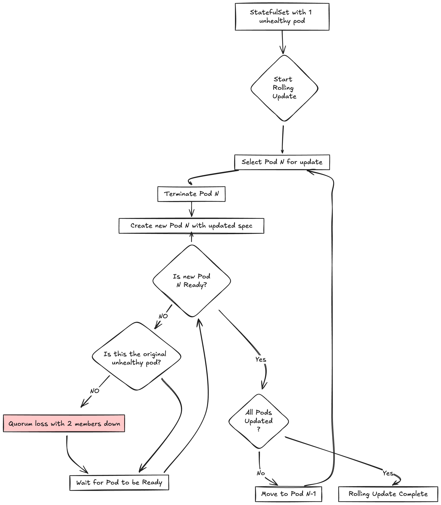
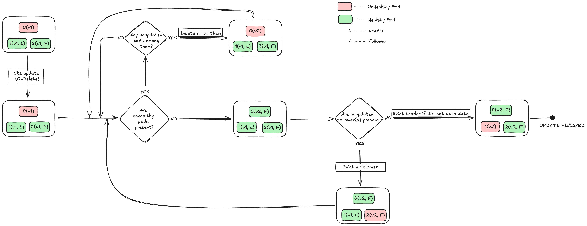

# DEP-06: Druid Controlled Updates for Etcd Pods

## Summary

This Druid Enhancement Proposal (DEP) proposes to change the updateStrategy of the Etcd StatefulSet deployed by `etcd-druid` operator from `RollingUpdate` to `OnDelete`.

This is done to better orchestrate the rolling of the pods in a way to avoid any unintended quorum loss scenarios introduced because of the current rolling update strategy.

## Terminology

- **[OnDelete](https://kubernetes.io/docs/concepts/workloads/controllers/statefulset/#update-strategies)**: A statefulset update strategy that updates the pods only when they are deleted.
- **[RollingUpdate](https://kubernetes.io/docs/concepts/workloads/controllers/statefulset/#rolling-updates)**: A statefulset update strategy that updates the pods one by one in a rolling fashion.
- **Quorum**: The minimum number of members required to form a consensus in a distributed system like etcd.
- **Leader**: The member of the etcd cluster that is responsible for handling all the client requests and replicating the data to the followers.
- **Follower**: The member of the etcd cluster that replicates the data from the leader.
- **Learner**: The member of the etcd cluster that does not participate in the quorum and is used for learning the data from the leader.
- **Participating Pod**: A pod that is part of the quorum. Both `leader` and `follower` are participating pods.
- **Non Participating Pod**: A pod that is not part of the quorum.

## Motivation

`etcd-druid` currently deploys the etcd cluster as a statefulset with `RollingUpdate` strategy where the pod updation is controlled by the statefulset controller in the order of higher ordinal to lower. This can lead to unintended quorum loss scenarios when a pod goes unhealthy and the rolling update is triggered simultaneously. This is because the rolling update strategy does not consider the health of the pods other than the one it is currently updating. To read more about the `rollingUpdate` strategy, refer to the [kubernetes docs](https://kubernetes.io/docs/concepts/workloads/controllers/statefulset/#rolling-updates)

Consider the following scenario where we have a running 3 member etcd cluster with pods `P-0`, `P-1` & `P-2` and one of `P-0` or `P-1` stops participating due to any reason, now the cluster operates with only 2 healthy pods which is the required quorum for a 3 member distributed cluster like etcd. Now at this point, any update to the statefulset pod template results in the statefulset controller rolling from `P-2` where it replaces the pod with the latest spec and waits for the pod to become healthy. Meanwhile the cluster is in a unintended quorum loss situation which could have been avoided if `etcd-druid` takes control over the pod updation as it can control the order of pod updation based on the health and role of the pods.

For a single node etcd cluster, both the `RollingUpdate` and `OnDelete` strategies work the same way as there is only a single pod to roll in case of an update to the statefulset. However, for a multi-node etcd cluster, the `OnDelete` strategy can be used to avoid unintended quorum loss scenarios by controlling the order of pod updation.

## Goals

- Provide a way to avoid unintended quorum loss scenarios introduced because of the current rolling update strategy.
- This design document proposes the introduction of a feature gate in the `etcd-druid` operator. The feature gate is intended to provide users with the ability to select the `OnDelete` update strategy for the StatefulSet deployed by the operator.
- This design document proposes a modification to the `etcd-druid` operator to accommodate potential changes to the Etcd StatefulSet's container resource recommendations. These changes could be initiated by various actors, such as the Vertical Pod Autoscaler (VPA) or other external entities. The `OnDelete` strategy will ensure that any modifications to the container resource recommendations are propagated from the StatefulSet to the underlying pods.

## Non-Goals

- The proposal does not claim to solve the quorum loss issues completely. It only aims to reduce the chances of unintended quorum loss scenarios and protect from voluntary disruptions.
- Although this proposal works for an etcd cluster with any odd number of replicas, there is a clear possibility of optimising the logic further for clusters with more than 3 replicas by trying to update multiple pods at once to make the update process faster while also avoiding any unintended quorum loss situations. The optimisation can be scoped for the future.
- This proposal does not cover the usecase of autonomous clusters where the etcd cluster is deployed as static pods instead of a StatefulSet. The proposal is limited to the StatefulSet deployment of the etcd cluster as it only changes the update strategy of the StatefulSet.

## Proposal

To avoid the beforementioned scenarios of unintended quorum loss, one can make use of the `OnDelete` updateStrategy provided by the statefulset. This essentially disables the automatic rollouts of pods upon statefulset pod template spec updates, and instead rolls the pods only when they are deleted.

This gives `etcd-druid` a way to control the order of pod updation by taking into account the health and role of the pods (follower or leader).

### Things to consider

#### Health Assessment Of Containers

The overall health of an etcd pod is determined by the status of its constituent containers. An etcd pod primarily consists of two containers:

1. **etcd container**: Runs the etcd process. The health of the etcd container is evaluated using a [readiness probe](https://kubernetes.io/docs/concepts/configuration/liveness-readiness-startup-probes/#readiness-probe). This probe checks if the etcd container is ready to handle traffic.

2. **backup-restore container**: Operates as a sidecar to the etcd container. No readiness probe is defined for the backup-restore container. Its health is not a primary concern post-initialization since it does not impact the quorum.

In the context of the `OnDelete` update strategy, the health assessment is focused solely on the etcd container. This is because, post-initialization, the backup sidecar's health does not impact the quorum. There is a possibility of the sidecar container becoming unhealthy which may falsely indicate that the pod can be deleted to update it, but has the risk of losing quorum. `backup-restore` container's health is not a significant concern as the etcd container is the primary entity responsible for handling traffic and maintaining the quorum. The primary objective of the `OnDelete` strategy is to prevent quorum loss, not to ensure the `backup-restore` sidecar container's health.

##### **Single-Node vs. Multi-Node Clusters**

- **Single-Node etcd:** The etcd container is considered healthy as soon as the etcd process starts running, as it can handle traffic independently.

- **Multi-Node etcd:** The etcd container is considered healthy when it can serve traffic. It is deemed unhealthy if the etcd process is in the `Learner` state or if there is a quorum loss in the cluster.

For these reasons, the proposal focuses on health of individual containers in the pod instead of the pod as a whole.

In the remainder of the proposal, the term "participating pod" refers to a pod that has the etcd container in a healthy state i.e. part of the quorum. Conversely, the term "non-participating pod" refers to a pod that has the etcd container in an unhealthy state, i.e. not part of the quorum.

Understanding the health of individual containers within the pod is crucial for the update process to avoid quorum loss situations. The protection mechanisms for etcd pods vary depending on whether it is a single-node or multi-node cluster, which is essential for comprehending the update strategy.

#### Safeguarding Etcd Pods from Voluntary Disruptions

Two primary mechanisms are in place to protect etcd pods from being [evicted](https://kubernetes.io/docs/tasks/administer-cluster/safely-drain-node/#eviction-api) due to voluntary disruptions:

1. The [PodDisruptionBudget](https://kubernetes.io/docs/tasks/run-application/configure-pdb/) (PDB) configured for the etcd pods.
2. The [safe-to-evict](https://kubernetes.io/docs/reference/labels-annotations-taints/#cluster-autoscaler-kubernetes-io-safe-to-evict) annotation applied by the Cluster Autoscaler (CA) to the etcd pods to prevent cluster scale-down.

In a single-node etcd scenario, the PDB `.spec.minAvailable` is set to `0`, but the pod carries a CA annotation `cluster-autoscaler.kubernetes.io/safe-to-evict` set to `false`. This configuration prevents the pod from being evicted by the cluster autoscaler during voluntary disruptions. However, the pod remains susceptible to eviction by the Vertical Pod Autoscaler (VPA) or eviction API calls, thus allowing the `OnDelete` process to evict the pod if necessary.

For a three-member etcd cluster, the PDB `minAvailable` is set to `2` to ensure the availability of at least two pods at any given time to maintain quorum. This configuration permits the `OnDelete` process to evict only a single pod at any time from a three-member etcd cluster.

## Design

In the current `RollingUpdate` strategy, any update to the StatefulSet pod template specification is managed by the StatefulSet controller, which handles rolling updates of the pods. With the introduction of the `OnDelete` process as a replacement for the RollingUpdate process, the etcd-druid operator must now take control of the pod update process. This update process is triggered whenever the `.status.updateRevision` of the StatefulSet changes, indicating a modification in the pod template specification that needs to be propagated to the pods.

There are two approaches to trigger the update process, each with its own advantages and disadvantages:

### **Approaches to Trigger the Update Process:**

#### **Triggering from the StatefulSet component:**

The `StatefulSet` component is responsible for propagating changes in the Etcd resource specification to the StatefulSet. This component can also trigger the update process whenever the StatefulSet is updated, as indicated by its `.status.UpdateRevision`. In this approach, the StatefulSet component becomes responsible for the controlled update of the pods.

**Advantages:**

- Intuitive: The StatefulSet component manages both the StatefulSet and the pods under it, acting as a single point of control.
- Controlled: The StatefulSet component can trigger the update process whenever the StatefulSet is updated, ensuring that the pods are updated in a controlled manner.

**Disadvantages:**

- Increased Complexity: The StatefulSet component must handle both the StatefulSet and the pod update process, leading to a more tightly coupled and potentially harder-to-maintain component.
- Performance Issues: The update process becomes a blocking operation for the component. Since the `OnDelete` update process may require several reconciliation cycles to complete, this adds unnecessary overhead to the entire etcd controller, potentially causing performance issues.

#### **Having a Separate Controller:**

An alternative approach is to have a separate controller responsible for the pod update process. This controller watches the `StatefulSet` resource for any update events and triggers the reconcile process to start the update if required.

**Advantages:**

- Modularity: A separate controller dedicated to the pod update process makes the system more modular and easier to maintain.
- Non-Blocking: The StatefulSet component can continue its normal operations without waiting for the pod update process to complete.
- Idiomatic: This approach aligns with the Kubernetes StatefulSet controller's asynchronous update handling.

**Disadvantages:**

- Additional Component: Introducing a new controller adds another component to manage within the system.

#### **Proposed Approach**

The authors propose adopting the second approach of having a separate controller responsible for the pod update process. This approach offers significant advantages in terms of modularity, maintainability, and non-blocking operations, making it a more suitable choice for managing the OnDelete update process.

### The Pod Update Procedure

The `OnDelete` process is responsible for updating the pods, considering their roles and participation in the cluster. This process is part of the controller's reconciliation logic and may require multiple reconciliation cycles to bring the pods under the StatefulSet to the desired state, which is to align them with the latest pod template specification. The update process unfolds in a sequence of steps per reconciliation cycle, with the controller requeuing itself to reconcile in the next cycle whenever it needs to wait for resources to reach a specific state.

> [!Note]
> To determine if a pod is upto date is by comparing the `.status.UpdateRevision` of the StatefulSet with the `.metadata.labels["controller-revision-hash"]` of the pod. If they are the same, then the pod is upto date.

#### Initial Check

1. **Fetch StatefulSet and Check Pods:** The process begins by fetching the StatefulSet and checking the status of the pods under it.

  - If all pods are up-to-date, the reconciliation is complete.
  - If there are outdated pods, the process moves to the next phase.

#### Update Non-Participating Pods

2. **Update Non-Participating Pods:**

  - If there are any non-updated and non-participating pods, they are updated simultaneously through delete calls.
  - The process is then requeued to reconcile in the next cycle.
  - If there are no non-updated non-participating pods, the process proceeds to the next phase.

#### Ensure Updated Pods are Participating

3. **Check Updated Pods Participation:**
  
  - If any updated pods are in a non-participating state, the process is requeued to reconcile in the next cycle.
  - This ensures that all updated pods are participating in the quorum before updating other participating pods to avoid quorum loss.
  - Once all updated pods are participating, the process moves to the next phase.

#### Update Remaining Pods

4. **Update Remaining Pods:**

  - At this point, all updated and non-updated pods are participating (i.e., the etcd container is healthy, and the backup-restore container can be either healthy or unhealthy).
  - The process updates the non-updated pods one at a time, based on the health of the backup-restore container and the role of the pod.
  - Pods with unhealthy backup-restore containers are updated before those with healthy containers, in the hope that the update will fix the unhealthy containers.
  - Among pods with the same backup-restore health status, followers are updated before leaders to minimize the number of leader elections in the cluster.

#### Pod Update Preference Order

5. **Determine Pod Update Order:**

  - The pod to be updated is selected based on the following preference order:
    1. Pods with unhealthy `backup-restore` containers and follower roles are updated first through a delete call.
    2. Pods with unhealthy `backup-restore` containers and leader roles are updated next through a delete call.
    3. Pods with healthy `backup-restore` containers and follower roles are updated next through an eviction call.
    4. Pods with healthy `backup-restore` containers and leader roles are updated last through an eviction call.

  - The selected pod is updated through a delete or eviction call, as appropriate.

#### Reconciliation Completion

6. **Reconcile and Requeue:**

  - The process continues to reconcile and requeue until all pods are up-to-date.
  - Once all pods are up-to-date, the reconciliation is complete.

#### Rationale for Simultaneous Deletion of Non-Updated Non-Participating Pods

The reason for making delete calls to all the non-participating pods at once is due to the fact that the cluster cannot go into a more degraded situation than what it currently is in, because these pods are not serving any traffic and are hence not part of the quorum. Therefore, it is most efficient to remove all these pods at once and then wait for the new pods to get into a participating state. Using Eviction calls for these pods would not be efficient as the PDB might block the eviction calls if the cluster is already in a degraded state.

> [!Note]
> The PodDisruptionBudget (PDB) includes a [`.spec.unhealthyPodEvictionPolicy`](https://kubernetes.io/docs/tasks/run-application/configure-pdb/#unhealthy-pod-eviction-policy) field. If the Etcd resource carries the annotation `resources.druid.gardener.cloud/allow-unhealthy-pod-eviction`, this field is set to `AlwaysAllow`. This setting permits the eviction of unhealthy pods, bypassing the PDB protection, and facilitating a smoother update process. However, this annotation is not set by default and may be phased out in the future. Therefore, it is not advisable to depend on this annotation for the update process. Hence, the deletion approach is preferred for handling non-participating pods.

#### Rationale for Deleting/Evicting Non-Updated Participating Pods

One standard the proposal strictly follows is that, for the pods where at least one container is unhealthy, delete calls are made to update them as PDB may falsely block the updates if eviction calls are used. And for the pods whose both containers are healthy, only evict calls are to be made to update them to respect the PDB. This is to ensure that the update process is smooth and does not get blocked by the PDB.

The proposal adheres to a strict standard for updating pods based on their health status:

- **Unhealthy Containers:**: For pods where at least one container is unhealthy, delete calls are made to update them. This approach is taken because Pod Disruption Budgets (PDB) may incorrectly block updates if eviction calls are used.

- **Healthy Containers**: For pods where both containers are healthy, eviction calls are used to update them, respecting the PDB. This ensures a smooth update process without being blocked by the PDB.

##### **Deleting Non-Updated Participating Pods with Unhealthy Containers**

The rationale for using delete calls for non-updated participating pods with unhealthy `backup-restore` containers is to ensure updates proceed regardless of the PDB. Consider a scenario with a 3-member etcd cluster where there are 3 non-updated participating pods, and 2 or 3 of them have unhealthy `backup-restore` containers. If eviction calls were used, the PDB would block these calls because the minimum available pods requirement is not met, leading to a blocked update process. By using delete calls, these pods are updated, and new pods are brought up to achieve a participating state.

##### **Evicting Non-Updated Participating Pods with Healthy Containers**

For non-updated participating pods with healthy `backup-restore` containers, eviction calls are used to respect the PDB. By the time the process starts to update these pods, there should be no pods with unhealthy `backup-restore` containers, allowing the PDB to permit eviction calls. This ensures the update process proceeds smoothly. However, if any pod becomes unhealthy during eviction, the PDB will correctly block the eviction calls, and the update process will be requeued for the next reconciliation cycle.

> [!Note]
> : The learner pod is excluded from the sequence of deleting/evicting non-updated participating pods as it is not considered a participating pod. The readiness probe attached to the etcd container periodically verifies if the container is ready to serve traffic. Since the learner pod does not participate in the quorum and is still synchronizing its data with the leader, it is not ready to serve traffic. Given that etcd is a strongly consistent distributed key-value store, the learner pod does not respond to requests until its data is in sync with the leader. Therefore, the learner pod is not included in the set of participating pods.

The order of updating the pods plays a crucial role in maintaining the quorum of the etcd cluster during the update process. The above approach allows for fine-grained control over the update process, ensuring quorum maintenance by prioritizing the health of the etcd cluster.

### State Diagrams

> [!Note]
> The following state diagrams are just a representation of the update process and are just to give an idea of how the update process works. They do not cover all the cases.

#### RollingUpdate Strategy update process State diagram

#### OnDelete Strategy update process State diagram

### Update Scenarios

#### Scenario 1: Update Initiated with a Single Non-Participating Pod

Consider a scenario involving a three-member etcd cluster, consisting of pods `P-0`, `P-1`, and `P-2`, where pod `P-0` has become non-participating. The update process differs significantly between the `OnDelete` strategy and the `RollingUpdate` strategy:

The `RollingUpdate` strategy commences the update process from `P-2` to `P-0`, in descending order of their ordinals, thus updating the pod `P-2` first. This approach leads to a temporary quorum loss, which could have been circumvented if the update process had begun with the non-participating `P-0` pod.

In contrast, the `OnDelete` strategy initiates the update process by deleting the `P-0` pod and waits for the new pod to participate. Once the new pod starts participating, it proceeds to evicting the remaining participating pods. This approach ensures that the cluster's quorum is maintained throughout the update process.

#### Scenario 2 : Handling Updates When One Pod is Non-Participating and Another Fails Mid-Update

Consider an extension of the previous scenario, where pod `P-1` also becomes non-participating during the update process. The `OnDelete` strategy and the `RollingUpdate` strategy would handle this situation differently:

With the `RollingUpdate` strategy, the update process commences with pod `P-2`, leading to a quorum loss as two pods `P-0` & `P-2` are now non-participating. At this point, if pod `P-1` also becomes non-participating while `P-2` is joining the cluster, `P-2` will be unable to form a quorum until either `P-1` or `P-0` regains health. This halts the update process as the StatefulSet controller waits for `P-2` to become healthy before proceeding.

In contrast, the `OnDelete` strategy begins by deleting pod `P-0` and waits for the new pod to start participating. Meanwhile if `P-1` stops participating during this time, causing a quorum loss, the `OnDelete` strategy deletes `P-1` to make the update faster. This, in turn, unintentionally leads to `P-2` becoming non-participating and subsequently `P-2` also gets deleted for updating. While the `OnDelete` strategy cannot prevent quorum loss in this scenario, it accelerates the update process and could potentially resolve the issue in cases where a pod restart is the solution.

#### Scenario 3 : Handling Updates When the Cluster Experiences a Permanent Quorum Loss

Consider a scenario involving a three-member etcd cluster that has experienced a permanent quorum loss with pods `P-0` and `P-1` stops participating. If an update to the StatefulSet is initiated under these circumstances, below is how the `RollingUpdate` strategy and the `OnDelete` strategy would handle the situation:

In this scenario, the remaining etcd container in pod `P-2` also stops participating as it fails to form a quorum. With the `RollingUpdate` strategy, the update process would commence with `P-2` and wait for it to regain health before proceeding. However, due to the permanent quorum loss, the etcd container cannot recover, resulting in a deadlock.

In contrast, the `OnDelete` strategy would first delete pods `P-0` and `P-1`, then wait for the new pods to start participating. Meanwhile, as pod `P-2` also becomes non-participating, this strategy would proceed to delete `P-2` as well. Unlike the `RollingUpdate` strategy, the `OnDelete` strategy does not halt the update process. It ensures that the cluster's state is always better even in the face of a permanent quorum loss.

In such a scenario, opting to delete the non-participating pods could potentially rectify the issue, as a pod restart might resolve the problem. The `OnDelete` strategy expedites this process by enabling the prompt updating of pods, thereby facilitating a more efficient resolution of the issue.

### Etcd Status Update

With the updateStrategy of the StatefulSet set to `OnDelete`, the `status.currentRevision` and `status.currentReplicas` fields of the StatefulSet do not automatically update due to a known [issue](https://github.com/kubernetes/kubernetes/issues/73492) in upstream Kubernetes. The Etcd controller has traditionally relied on these fields to ascertain the readiness of the Etcd Custom Resource (CR).

To address this, the `OnDelete` process will now assume the responsibility of updating these fields in the Etcd status. This will be achieved by directly retrieving the necessary information from the pods, thereby ensuring the accurate reflection of the Etcd CR's readiness.

### Feature Gate

The `UpdateStrategyOnDelete` feature gate will serve as the mechanism to enable or disable the `OnDelete` strategy. Setting the feature gate to `true` will activate the `OnDelete` strategy and setting it to `false` will maintain the existing behavior of the StatefulSet with the `RollingUpdate` strategy.

By default, this feature gate will be set to `false`. To activate the `OnDelete` strategy and its associated update process, the feature gate can be set to `true`. As the feature progresses to beta status, the default setting of the feature gate will be revised to `true`.

In the case of the feature gate being disabled, the StatefulSet will continue to use the `RollingUpdate` strategy for updating the pods. The `OnDelete` controller will not be responsible for the pod update process.

### Transitioning Between Strategies

Transitioning between the `RollingUpdate` and `OnDelete` strategies is designed to be seamless and automatic, requiring no manual intervention. The `OnDelete` controller will manage the pod update process when the feature gate is enabled. Conversely, when the feature gate is disabled, the `RollingUpdate` strategy will resume control.

#### Transition Process

1. **Enabling the Feature Gate:**

  - When the feature gate is enabled, the `OnDelete` controller is added to the controller manager and begins monitoring the StatefulSet resource for **updates**.

  - Initially, the StatefulSet continues to use the RollingUpdate strategy until the Etcd resource is reconciled. The OnDelete controller will not interfere during this period due to a predicate that allows reconciliation only when the `updateStrategy` of the StatefulSet is set to `OnDelete`.

  - Once the Etcd resource is reconciled:

    - **If the StatefulSet is currently rolling out pods using the RollingUpdate strategy:** The StatefulSet is updated to use the OnDelete strategy. The OnDelete controller then takes over the update process, checking for any non-updated pods and initiating their update.

    - **If the StatefulSet is not rolling out pods:** The OnDelete controller starts monitoring the StatefulSet for updates. The predicate now allows updates as the updateStrategy is set to OnDelete, and the controller manages the update process whenever the StatefulSet is updated.

2. **Disabling the Feature Gate:**
  
    - When the feature gate is disabled, the OnDelete controller is not added to the controller manager.

    - If the StatefulSet was previously using the OnDelete strategy, the Etcd resource must be reconciled to set the updateStrategy of the StatefulSet back to RollingUpdate for the StatefulSet controller to resume managing the update process.

This transition mechanism ensures a smooth switch between update strategies, maintaining the integrity and consistency of the StatefulSet updates.

## Alternatives

An alternate solution to this issue could be to employ the `RollingUpdate` strategy itself but while setting the [`spec.updateStrategy.rollingUpdate.maxUnavailable`](https://kubernetes.io/docs/concepts/workloads/controllers/statefulset/#maximum-unavailable-pods) to `1`. This configuration ensures that only one pod is unavailable during the update process, thereby maintaining quorum. However, this approach has the drawback of pausing the update until the non-participating pods regain health and starts participating. This could potentially lead to a deadlock in the update process, especially in scenarios where the pod restart is the solution.

Compared to the proposed `OnDelete` strategy, this approach is less efficient. In the `OnDelete` strategy, the controller can expedite the update process by deleting non-participating pods first to create new updated ones, without compromising safety. Furthermore, the `RollingUpdate` strategy with `maxUnavailable` field is still in its Alpha stage and is not recommended for production useage.
