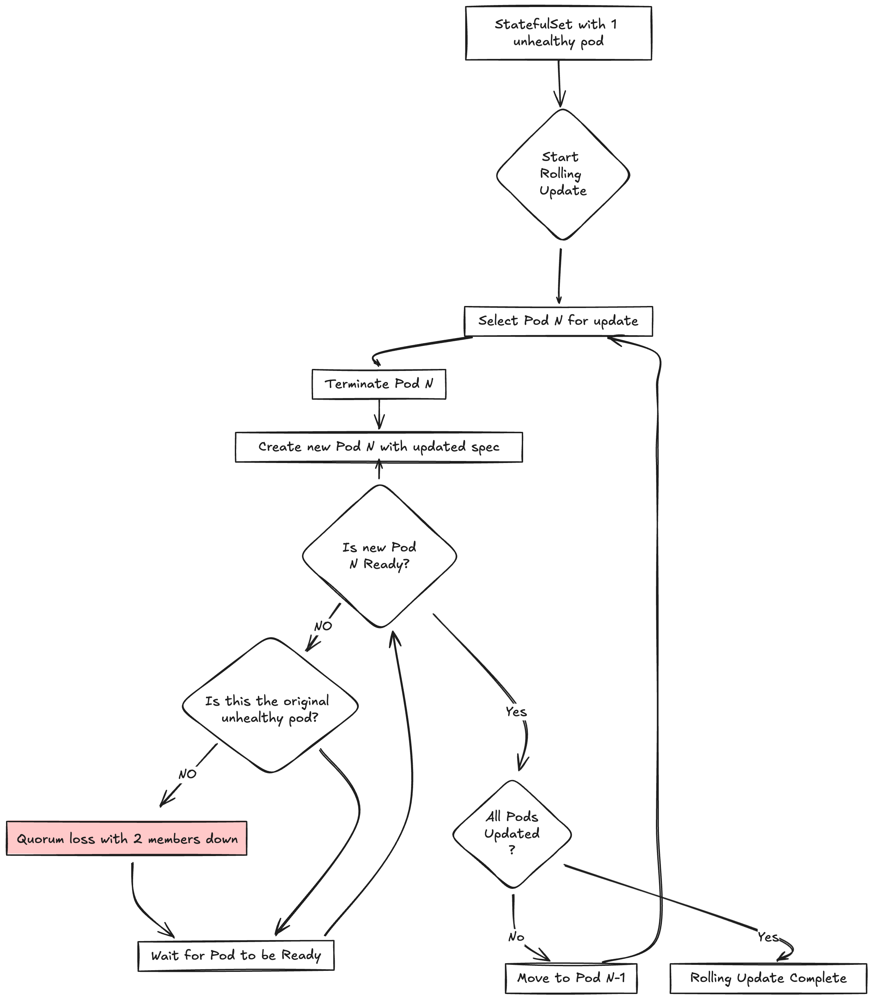
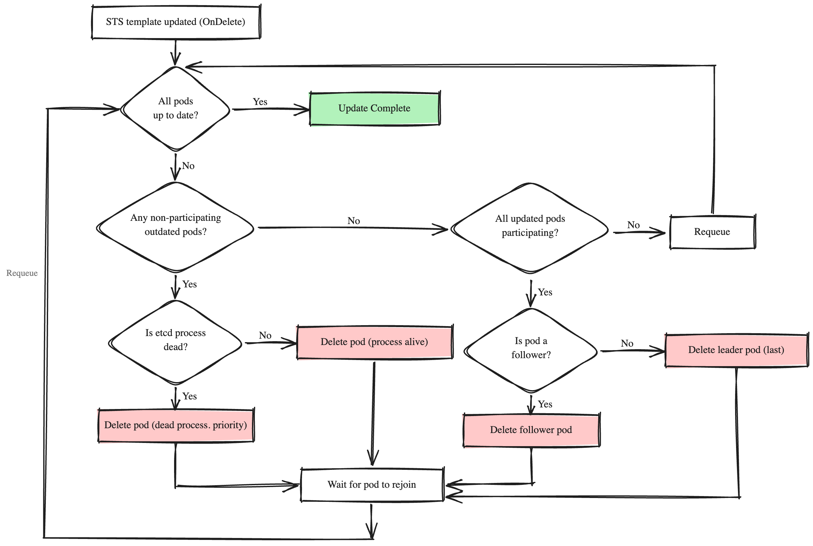
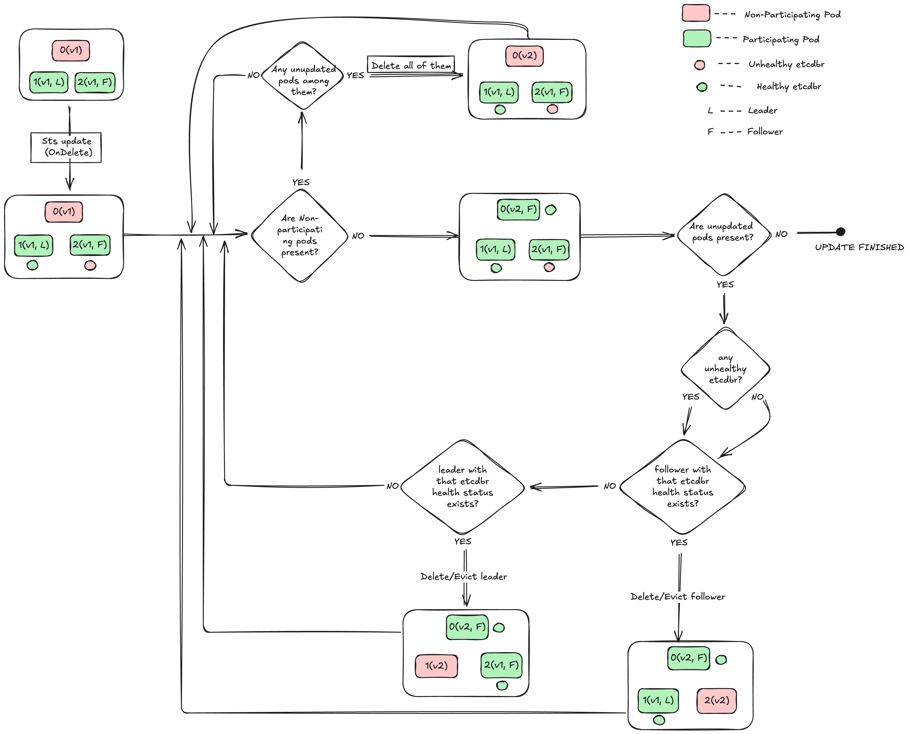

# DEP-06: Druid Controlled Pod Updates via StatefulSet OnDelete Strategy

## Summary

This proposal recommends changing the StatefulSet update strategy used by etcd-druid from `RollingUpdate` to `OnDelete`. With `OnDelete`, the Kubernetes StatefulSet controller no longer automatically restarts pods when the pod template changes. Instead, a new dedicated controller in etcd-druid takes responsibility for deleting and recreating pods in a carefully chosen order that accounts for etcd member health and cluster role. The goal is to prevent unintended quorum loss during pod updates.

## Terminology

- **OnDelete**: A StatefulSet update strategy where pods are only updated when they are explicitly deleted. The StatefulSet controller does not automatically roll pods on template changes.
- **RollingUpdate**: A StatefulSet update strategy where the StatefulSet controller automatically updates pods one by one, from the highest ordinal to the lowest.
- **Quorum**: The minimum number of etcd members that must agree on a value for the cluster to make progress. For a 3-member cluster, quorum is 2.
- **Leader**: The etcd member responsible for handling client write requests and coordinating replication.
- **Follower**: An etcd member that replicates data from the leader and can serve linearizable reads.
- **Participating pod**: A pod whose etcd container is part of the quorum (the member is either a leader or a follower).
- **Non-participating pod**: A pod whose etcd container is not part of the quorum (the member may be down, restarting, or not yet joined).

## Motivation

etcd-druid deploys etcd clusters as StatefulSets with `RollingUpdate` strategy. The StatefulSet controller rolls pods from the highest ordinal to the lowest, without considering the health or role of individual etcd members. This creates a risk of unintended quorum loss.

Consider a 3-member etcd cluster with pods `P-0`, `P-1`, and `P-2`. If `P-0` becomes unhealthy (due to network issues, node failure, or an internal error), the cluster still has quorum with `P-1` and `P-2`. Now, if a StatefulSet template update is triggered (for example, an image version bump), the StatefulSet controller starts rolling from `P-2`. It deletes `P-2` and waits for it to come back. During this window, only `P-1` is healthy and participating, which is below quorum (2 out of 3). The cluster experiences a quorum loss that could have been entirely avoided if the update had started with the already-unhealthy `P-0` instead.

The following diagram illustrates how the `RollingUpdate` strategy can lead to quorum loss in this scenario:

<div align="center">

</div>

The StatefulSet controller starts from Pod N (the highest ordinal), terminates it, and waits for the new pod to become ready. If the terminated pod is not the originally unhealthy one, quorum is lost with 2 members down.

For a single-node etcd cluster, both `RollingUpdate` and `OnDelete` produce the same outcome since there is only one pod to update. The benefit of `OnDelete` is specific to multi-node clusters where update ordering matters.

### Goals

- Prevent unintended quorum loss caused by the StatefulSet controller updating pods in an order that does not consider cluster health.
- Introduce a spec field on the Etcd custom resource that allows operators to choose between `RollingUpdate` and `OnDelete` strategies per cluster.
- Ensure that updates triggered by changes to the StatefulSet pod template (image versions, configuration, resource requests) are propagated to pods under druid's control.

### Non-Goals

- This proposal does not claim to prevent all forms of quorum loss. It reduces the likelihood of quorum loss caused by poorly-ordered voluntary pod updates.
- This proposal does not cover PVC resizing or volume replacement. The OnDelete strategy makes PVC resizing safer (see [Interaction with PVC Resizing](#interaction-with-pvc-resizing)), but the PVC resize flow itself is a separate feature.
- Optimizing the update process for clusters with more than 3 replicas (updating multiple pods concurrently while maintaining quorum) is left as future work.

## Proposal

### Update Strategy as an Etcd Spec Field

The update strategy will be exposed as a field on the Etcd custom resource:

```yaml
apiVersion: druid.gardener.cloud/v1alpha1
kind: Etcd
spec:
  updateStrategy: OnDelete  # or RollingUpdate
```

- **Default value**: `OnDelete`
- **Valid values**: `RollingUpdate`, `OnDelete`

This is a per-cluster choice. Operators can set different strategies for different Etcd clusters. Changing the field on a live cluster is supported and triggers a seamless transition (see [Transitioning Between Strategies](#transitioning-between-strategies)).

The decision to use a spec field instead of a feature gate is documented in [Decision Record 003](../decisions/003-ondelete-as-spec-field-not-feature-gate.md). The key reasons are: per-cluster control, no forced migration at maturity, and both strategies remaining available indefinitely.

### The OnDelete Controller

A new controller, separate from the existing Etcd reconciler, is responsible for managing pod updates when the OnDelete strategy is active. This controller watches StatefulSet resources and reconciles whenever the StatefulSet's `.status.updateRevision` changes, indicating that a pod template update needs to be propagated to pods.

**Why a separate controller instead of extending the StatefulSet component:**

- The update process may span multiple reconciliation cycles (waiting for pods to come back, checking health, proceeding to the next pod). Embedding this in the StatefulSet component would make it a blocking operation for the entire Etcd reconciliation loop.
- A separate controller can watch StatefulSet events independently and act asynchronously, which aligns with how the Kubernetes StatefulSet controller itself works.

**Controller predicate:** The controller only reconciles StatefulSets whose `spec.updateStrategy.type` is set to `OnDelete`. This means the controller is always registered in the controller manager but has zero overhead for clusters using `RollingUpdate`.

### Determining Whether a Pod Needs Updating

A pod is considered outdated if its `controller-revision-hash` label does not match the StatefulSet's `.status.updateRevision`. The `controller-revision-hash` is a Kubernetes-managed label on each pod that reflects the revision of the pod template it was created from.

> Note: The `controller-revision-hash` is computed from the pod template spec only. Changes to `volumeClaimTemplates` do not affect this hash. See [Interaction with PVC Resizing](#interaction-with-pvc-resizing).

### Health Assessment

The OnDelete controller needs to understand two things about each pod:

1. **Is the pod participating in the etcd quorum?** This is determined by the etcd container's readiness. The readiness probe hits etcd-wrapper's `/readyz` endpoint, which performs an etcd client `Get` call. This is a linearizable (cluster-wide) check: it succeeds only when the etcd member can serve traffic, which requires quorum. When quorum is lost, all pods fail readiness, even those whose local etcd process is running fine.

2. **Is the local etcd process alive?** This is a separate question from quorum participation. A pod may fail readiness (because quorum is lost) while its local etcd process is perfectly healthy. Distinguishing between "process is dead" and "process is alive but quorum is lost" allows the controller to make better decisions about which non-participating pod to update first.

   The controller determines local process liveness by inspecting the pod's container status from the Kubernetes API. If the etcd container is in `CrashLoopBackOff`, `Error`, or is not running, the process is considered dead. If the container is `Running` but the readiness probe is failing, the process is alive but quorum is lost.

   In the future, adding a liveness probe to the etcd container using etcd's native `/livez` endpoint (available since etcd 3.5.x, performs a serializable/local-only health check) would provide a more reliable signal. This is tracked in [etcd-wrapper#7](https://github.com/gardener/etcd-wrapper/issues/7) and [etcd-druid#280](https://github.com/gardener/etcd-druid/issues/280). The OnDelete controller is designed to work without this probe (using container status as described above) and to benefit from it when available.

### Pod Update Procedure

The controller processes one pod per reconciliation cycle. After updating a pod, it requeues and waits for the pod to come back before proceeding to the next one. This ensures that the cluster is never in a state where more than one pod is being updated at the same time due to the controller's own actions.

The procedure in each reconciliation cycle:

**Step 1: Check if all pods are up to date.** Compare each pod's `controller-revision-hash` with the StatefulSet's `.status.updateRevision`. If all match, the update is complete.

**Step 2: Check for non-participating pods that need updating.** If any outdated pod is non-participating, select one for deletion using the following sub-priority:

| Priority | Container Status | Rationale |
|----------|-----------------|-----------|
| First | etcd process is dead (CrashLoopBackOff, Error, not running) | Already broken. Restarting it may fix the issue. |
| Second | etcd process is alive but readiness fails (quorum loss) | Process is healthy. Restarting it gets the new spec without making things worse. |

Delete the selected pod and requeue. Wait for it to come back before proceeding.

**Step 3: Ensure all updated pods are participating.** If any previously-updated pod is still not participating, requeue and wait. Do not update another participating pod until all already-updated pods have joined the quorum.

**Step 4: Update one participating pod.** At this point, all outdated pods are participating. Select one for deletion using this priority:

| Priority | Role | Rationale |
|----------|------|-----------|
| First | Follower | Deleting a follower does not trigger a leader election. |
| Second | Leader | Deleting the leader triggers an election, so it is done last. |

The controller determines member roles by reading the member lease's `holderIdentity` field, which contains the member ID and role.

Delete the selected pod and requeue. Wait for it to come back before proceeding to the next.

**Step 5: Repeat** until all pods are up to date.

The following diagram summarizes the OnDelete update procedure:

<div align="center">

</div>

### Pod Deletion Method

The controller uses direct `Delete` calls for all pod deletions, rather than using the eviction API.

**Why Delete instead of Evict:**

Several approaches were evaluated:

1. **Eviction without `unhealthyPodEvictionPolicy`**: The PDB blocks all evictions when any pod is unready (since `minAvailable` drops to the threshold). This deadlocks the controller when a pod is already unhealthy, which is precisely the scenario OnDelete is designed to handle.

2. **Eviction with `unhealthyPodEvictionPolicy: IfHealthyBudget`**: Allows eviction of unhealthy pods when enough healthy pods exist. Handles the common case of one unhealthy pod, but still deadlocks when two or more pods are unhealthy.

3. **Eviction with `unhealthyPodEvictionPolicy: AlwaysAllow`**: Allows eviction of all unhealthy pods regardless of budget. Solves the deadlock but weakens PDB protection against external actors (VPA, node drain, cluster autoscaler) that could concurrently evict unhealthy pods.

4. **Direct Delete**: Simple and does not interact with the PDB at all.

The recommended approach is direct `Delete` for the following reasons:

- The OnDelete controller is a conscious actor that makes health-aware decisions about which pod to delete and when. Unlike the StatefulSet controller (which blindly follows ordinal order), the OnDelete controller checks participation status, role, and liveness before every deletion. The risk of accidentally causing quorum loss is minimal because the controller explicitly verifies cluster state before acting.
- The theoretical race condition (an external actor disrupts a pod between the controller's health check and its delete call) is possible but rare in practice, and it exists equally with the current `RollingUpdate` strategy, which also uses direct pod deletions internally.
- The current `RollingUpdate` strategy already uses `Delete` calls. Switching to `OnDelete` with `Delete` calls does not change the deletion mechanism, only the ordering.
- Using eviction would require managing PDB policy settings and handling blocked evictions with fallback logic, adding complexity without proportional safety benefit given that the controller is already health-aware.

The PDB remains configured as today (`minAvailable = replicas/2 + 1` for multi-node clusters) and continues to protect against evictions from external actors like VPA, node drain, and cluster autoscaler. The OnDelete controller's direct deletes bypass the PDB by design, because the controller has domain knowledge that the PDB lacks (etcd member health, role, quorum status).

### Safeguarding Etcd Pods from Voluntary Disruptions

Two mechanisms protect etcd pods from being disrupted by external actors:

1. **PodDisruptionBudget (PDB)**: For a 3-member etcd cluster, `minAvailable` is set to 2, allowing at most 1 pod to be evicted at a time. For single-node clusters, `minAvailable` is 0 (PDB provides no protection). The PDB protects against evictions from VPA, node drain, and similar actors. The OnDelete controller bypasses the PDB via direct delete calls because it makes its own health-aware decisions.

2. **Cluster autoscaler `safe-to-evict` annotation**: The `cluster-autoscaler.kubernetes.io/safe-to-evict: "false"` annotation prevents the cluster autoscaler from evicting etcd pods during node scale-down.

### Single-Node Clusters

For single-node etcd clusters, the OnDelete controller follows the same procedure but with a simplification: there is only one pod, so there is no ordering decision to make. The controller deletes the single outdated pod and waits for it to come back.

Before deleting the single pod, the controller should trigger an on-demand snapshot (if backup is configured) to ensure that the latest data is persisted. This is because the single-node cluster has no redundancy: if the pod restart fails and a restoration is needed, the snapshot provides a recent recovery point.

### StatefulSet Status Fields

With the `OnDelete` strategy, the StatefulSet's `status.currentRevision` and `status.currentReplicas` fields are not automatically updated by the Kubernetes StatefulSet controller. This is a known upstream issue ([kubernetes/kubernetes#73492](https://github.com/kubernetes/kubernetes/issues/73492)). The etcd-druid code that checks StatefulSet readiness (`IsStatefulSetReady` in `internal/utils/kubernetes/statefulset.go` and the `AllMembersUpdated` condition in `internal/health/condition/check_all_members_updated.go`) currently compares `currentRevision` with `updateRevision` and would incorrectly report the cluster as not ready under the `OnDelete` strategy.

The OnDelete controller will address this by computing the equivalent information from the pods directly (comparing each pod's `controller-revision-hash` with the StatefulSet's `updateRevision`). The existing readiness and condition checks will be updated to use this pod-level comparison when the `OnDelete` strategy is active.

### Transitioning Between Strategies

Transitioning between `RollingUpdate` and `OnDelete` is seamless and requires no manual intervention beyond changing the `spec.updateStrategy` field on the Etcd custom resource.

**Switching from RollingUpdate to OnDelete:**

1. The operator sets `spec.updateStrategy: OnDelete` on the Etcd CR.
2. On the next Etcd reconciliation, the StatefulSet component updates the StatefulSet's `spec.updateStrategy` to `OnDelete`.
3. The OnDelete controller's predicate now matches this StatefulSet. If there are any outdated pods (from a previously in-progress RollingUpdate or from a new template change), the OnDelete controller picks up the work and starts updating pods in its health-aware order.
4. If no pods are outdated, the OnDelete controller simply watches for future StatefulSet template changes.

**Switching from OnDelete to RollingUpdate:**

1. The operator sets `spec.updateStrategy: RollingUpdate` on the Etcd CR.
2. On the next Etcd reconciliation, the StatefulSet component updates the StatefulSet's `spec.updateStrategy` to `RollingUpdate`.
3. The OnDelete controller's predicate no longer matches this StatefulSet. The Kubernetes StatefulSet controller resumes managing pod updates in its default ordinal order.
4. If there were outdated pods that the OnDelete controller had not yet processed, the StatefulSet controller picks them up and rolls them in the standard highest-to-lowest ordinal order.

### VPA and HVPA Interaction

The Vertical Pod Autoscaler (VPA) does not modify the StatefulSet spec directly. VPA operates through two independent mechanisms:

1. **VPA Updater**: Evicts pods that don't match the recommended resource values. This eviction respects the PDB.
2. **VPA Admission Controller**: When the StatefulSet controller (or the OnDelete controller) recreates a pod, the admission webhook injects VPA-recommended resource values into the new pod's spec at creation time.

Since VPA does not modify the StatefulSet pod template, it does not trigger a new `updateRevision` and the OnDelete controller is not involved in VPA-driven resource updates. VPA continues to operate independently regardless of the update strategy.

### Interaction with PVC Resizing

The PVC resizing story ([etcd-druid#481](https://github.com/gardener/etcd-druid/issues/481)) benefits from `OnDelete` because it allows controlled per-pod volume replacement while maintaining quorum. However, the OnDelete controller and PVC resizing are independent features.

The OnDelete controller detects outdated pods by comparing `controller-revision-hash` labels. This hash is computed from the pod template spec only and does not include `volumeClaimTemplates`. This means that a change to `storageCapacity` or `storageClass` alone (without any pod template change) will not be detected by the OnDelete controller. The PVC resize flow must handle pod deletion independently in such cases.

The details of the PVC resize flow (orphan-delete of the StatefulSet, per-pod PVC replacement, interaction with the OnDelete controller) will be covered in a separate proposal.

### Metrics

The OnDelete controller exposes the following metrics:

- `etcd_druid_ondelete_update_duration_seconds`: Time from the first detection of an `updateRevision` change to the completion of all pod updates. Labeled by etcd cluster name.
- `etcd_druid_ondelete_reconcile_cycles_total`: Number of reconciliation cycles required to complete a full pod update. Labeled by etcd cluster name.

### Future Scope

- **Backup-restore container health in update ordering**: The current design does not consider the health of the backup-restore sidecar container when deciding which pod to update next. The rationale is that backup-restore health does not affect quorum, and prioritizing it could lead to unnecessary leader elections (for example, if a pod with an unhealthy backup-restore happens to be the leader). If future operational experience shows value in considering backup-restore health as a secondary sorting criterion, the priority order can be extended. The following state diagram illustrates what a backup-restore-aware ordering would look like:

  <div align="center">
  
  </div>

- **Concurrent pod updates for larger clusters**: For clusters with more than 3 replicas, it is possible to update multiple pods concurrently while maintaining quorum. For example, in a 5-member cluster, 2 pods can be updated simultaneously. This optimization is left for a future iteration.
- **Liveness probe integration**: When a liveness probe using etcd's `/livez` endpoint is added ([etcd-wrapper#7](https://github.com/gardener/etcd-wrapper/issues/7), [etcd-druid#280](https://github.com/gardener/etcd-druid/issues/280)), the OnDelete controller can use the probe's signal directly instead of inferring liveness from container status.

## Alternatives

### RollingUpdate with `maxUnavailable`

Kubernetes supports a `maxUnavailable` field on the StatefulSet's `RollingUpdate` strategy ([StatefulSet documentation](https://kubernetes.io/docs/concepts/workloads/controllers/statefulset/#maximum-unavailable-pods)). Setting `maxUnavailable: 1` ensures that only one pod is unavailable during the update process.

This approach has a key limitation: the StatefulSet controller waits for any unavailable pod to recover before proceeding. If a pod is already unhealthy and the update itself might fix it (for example, a configuration change or image bump), the controller is stuck waiting. The `OnDelete` strategy does not have this limitation because it can proactively delete the unhealthy pod first, potentially resolving the issue.

Additionally, the `maxUnavailable` field does not allow control over the order of pod updates. The StatefulSet controller still follows the ordinal order (highest to lowest), which may not align with the cluster's health state.

For these reasons, `OnDelete` with a health-aware controller provides a more robust solution for etcd clusters where quorum safety is critical.
