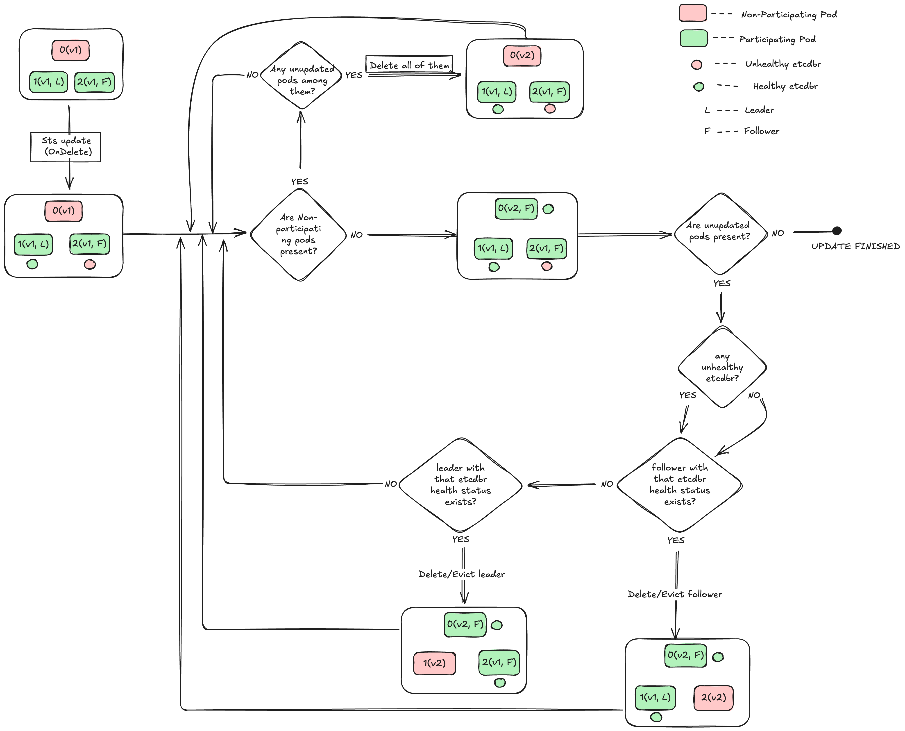

# DEP-06: Druid Controlled Updates for Etcd Pods

## Table of Contents

- [DEP-06: StatefulSet OnDelete Strategy](#dep-06-druid-controlled-updates-for-etcd-pods)
  - [Summary](#summary)
  - [Terminology](#terminology)
  - [Motivation](#motivation)
  - [Goals](#goals)
  - [Non-Goals](#non-goals)
  - [Proposal](#proposal)
    - [Things to consider](#things-to-consider)
      - [Pod Health Assessment](#pod-health-assessment)
      - [Safeguarding Etcd Pods from Voluntary Disruptions](#safeguarding-etcd-pods-from-voluntary-disruptions)
  - [Design](#design)
    - [Pod Update Procedure](#the-pod-update-procedure)
      - [Rationale for Simultaneous Deletion of Unhealthy Pods](#rationale-for-simultaneous-deletion-of-unhealthy-pods)
      - [Rationale for Evicting Non-Updated Healthy Pods](#rationale-for-evicting-non-updated-healthy-pods)
    - [State Diagrams](#state-diagrams)
      - [RollingUpdate update process State diagram:](#rollingupdate-strategy-update-process-state-diagram)
      - [OnDelete update process State diagram:](#ondelete-strategy-update-process-state-diagram)
    - [Update Scenarios](#update-scenarios)
        - [Scenario 1: Update Initiated with a Single Unhealthy Pod](#scenario-1-update-initiated-with-a-single-unhealthy-pod)
        - [Scenario 2 : Handling Updates When One Pod is Unhealthy and Another Fails Mid-Update](#scenario-2--handling-updates-when-one-pod-is-unhealthy-and-another-fails-mid-update)
        - [Scenario 3 : Handling Updates When the Cluster Experiences a Permanent Quorum Loss](#scenario-3--handling-updates-when-the-cluster-experiences-a-permanent-quorum-loss)
    - [Etcd Status Update](#etcd-status-update)
    - [Feature Gate](#feature-gate)
    - [Transitioning Between Strategies](#transitioning-between-strategies)
  - [Alternatives](#alternatives)

## Summary

This Druid Enhancement Proposal (DEP) proposes to provide an option to change the updateStrategy of the Etcd StatefulSet deployed by `etcd-druid` operator from `RollingUpdate` to `OnDelete`.

This is done to better orchestrate the rolling of the pods in a way to avoid any unintended quorum loss scenarios introduced because of the current rolling update strategy.

## Terminology

- **OnDelete**: A statefulset update strategy that updates the pods only when they are deleted.
- **RollingUpdate**: A statefulset update strategy that updates the pods one by one in a rolling fashion.
- **Quorum**: The minimum number of members required to form a consensus in a distributed system like etcd.
- **Leader**: The member of the etcd cluster that is responsible for handling all the client requests.
- **Follower**: The member of the etcd cluster that replicates the data from the leader.
- **Learner**: The member of the etcd cluster that does not participate in the quorum and is used for learning the data from the leader.

## Motivation

`etcd-druid` currently deploys the etcd cluster as a statefulset with `RollingUpdate` strategy where the pod updation is controlled by the statefulset controller in the order of higher ordinal to lower. This can lead to unintended quorum loss scenarios when a pod goes unhealthy and the rolling update is triggered simultaneously. This is because the rolling update strategy does not consider the health of the pods other than the one it is currently updating. To read more about the `rollingUpdate` strategy, refer to the [official kubernetes docs](https://kubernetes.io/docs/concepts/workloads/controllers/statefulset/#rolling-updates)

Consider the following scenario where we have a running 3 member etcd cluster with pods `P-0`, `P-1` & `P-2` and one of `P-0` or `P-1` becomes unhealthy due to any reason, now the cluster operates with only 2 healthy pods which is the required quorum for a 3 member distributed cluster like etcd. Now at this point, any update to the statefulset pod template results in the statefulset controller rolling from `P-2` where it deletes and replaces the pod with the latest spec and waits for the pod to become healthy. Meanwhile the cluster is in a unintended quorum loss situation which could have been avoided if `etcd-druid` takes control over the pod updation.

## Goals

- Provide a way to avoid unintended quorum loss scenarios introduced because of the current rolling update strategy.
- This design document proposes the introduction of a feature gate in the `etcd-druid` operator. The feature gate is intended to provide users with the ability to select the `OnDelete` update strategy for the StatefulSet deployed by the operator.
- This design document proposes a modification to the `etcd-druid` operator to accommodate potential changes to the Etcd StatefulSet's container resource recommendations. These changes could be initiated by various actors, such as the Vertical Pod Autoscaler (VPA) or other external entities. The `OnDelete` strategy will ensure that any modifications to the container resource recommendations are propagated from the StatefulSet to the underlying pods.

## Non-Goals

- The proposal does not claim to solve the quorum loss issues completely. It only aims to reduce the chances of unintended quorum loss scenarios and protect from voluntary disruptions.
- Although this proposal works for an etcd cluster with any odd number of replicas, there is a clear possibility of optimising the logic further for clusters with more than 3 replicas by trying to update multiple pods at once to make the update process faster while also avoiding any unintended quorum loss situations. The optimisation can be scoped for the future.

## Proposal

To avoid the beforementioned scenarios of unintended quorum loss, one can make use of the `OnDelete` updateStrategy provided by the statefulset. This essentially disables the automatic rollouts of pods upon statefulset spec updates, and instead rolls the pods only when they are deleted.

This gives `etcd-druid` a way to control the order of pod updation by taking into account the health and role of the pods (follower or leader).

### Things to consider

#### Pod Health Assessment

The overall health of a pod is determined by the status of all its constituent containers. An etcd pod primarily consists of two containers: the `etcd` container, which runs the etcd process, and the `backup-restore` container, which operates as a sidecar to the `etcd` container. The health of the etcd container is evaluated by the [readiness probe](https://kubernetes.io/docs/concepts/configuration/liveness-readiness-startup-probes/#readiness-probe) attached to it, which verifies if the etcd container is prepared to handle traffic. However, no readiness probe is defined for the sidecar container.

In the context of the `OnDelete` update strategy, the health assessment is focused solely on the etcd container. This is because, post-initialization, the backup sidecar's health does not impact the quorum. Because there is a possibility of the sidecar container becoming unhealthy which may falsely indicate the pod is unhealthy, but this is not a significant concern as the etcd container is the primary entity responsible for handling traffic and maintaining the quorum. The primary objective of the `OnDelete` strategy is to prevent quorum loss, not to ensure the sidecar container's health.

In a single-node etcd, the etcd container is deemed healthy as soon as the etcd process within it starts running, as it can independently handle traffic without requiring member promotion or quorum.

In a multi-node etcd cluster, the etcd container in any pod is considered healthy once it is capable of serving traffic. The container (and by extension, the pod) is deemed unhealthy if the etcd process is in the `Learner` state or if there is a quorum loss in the cluster.

Depending on whether single or multi node, there are different entities protecting the etcd pods. Understanding the protection mechanisms is important to better understand how the update process avoids quorum loss situations.

#### Safeguarding Etcd Pods from Voluntary Disruptions

Two primary mechanisms are in place to protect etcd pods from being [evicted](https://kubernetes.io/docs/tasks/administer-cluster/safely-drain-node/#eviction-api) due to voluntary disruptions:

1. The [PodDisruptionBudget](https://kubernetes.io/docs/tasks/run-application/configure-pdb/) (PDB) configured for the etcd pods.
2. The [safe-to-evict](https://kubernetes.io/docs/reference/labels-annotations-taints/#cluster-autoscaler-kubernetes-io-safe-to-evict) annotation applied by the Cluster Autoscaler (CA) to the etcd pods to prevent cluster scale-down.

In a single-node etcd scenario, the PDB `.spec.minAvailable` is set to `0`, but the pod carries a CA annotation `cluster-autoscaler.kubernetes.io/safe-to-evict` set to `false`. This configuration prevents the pod from being evicted by the cluster autoscaler during voluntary disruptions. However, the pod remains susceptible to eviction by the Vertical Pod Autoscaler (VPA) or eviction API calls, allowing the `Pod` component of the Etcd controller to evict the pod if necessary.

For a three-member etcd cluster, the PDB `minAvailable` is set to `2` to ensure the availability of at least two pods at any given time to maintain quorum. This configuration permits the `Pod` component of the Etcd controller to evict a single pod from a healthy three-member etcd cluster if required.

## Design

The etcd controller is responsible for the reconciliation of the Etcd resource spec and status. It handles the provisioning and management of the etcd cluster. Different components that are required for the functioning of the cluster like Leases, ConfigMaps, and the Statefulset for the etcd cluster are all deployed and managed by the etcd controller. The controller is made up of multiple components that are run in a specific order to ensure the correct functioning of the etcd cluster. To read more about etcd controller, refer to the [official docs](https://github.com/gardener/etcd-druid/blob/master/docs/concepts/controllers.md#etcd-controller)

The authors propose the introduction of a new `Pod` component to the existing component model of the Etcd controller. This component will be tasked with updating the pods based on their health status and role within the cluster when the `OnDelete` updateStrategy is set for the StatefulSet.

The update process is executed in the following sequence: initially, the unhealthy pods are updated. Once all these pods have regained health, the healthy pods are updated in an order of increasing importance, with a `follower` updated before a `leader`. This sequence is designed to minimize unnecessary leader elections. Further details are provided in the subsequent section.

### The Pod Update Procedure

The Pod component is in charge of updating the pods, taking into account their [health status](#pod-health-assessment) and role within the cluster. The update process unfolds in a sequence of steps:

Initially, the process fetches the StatefulSet that corresponds to the `Etcd`. It then checks the pods under this StatefulSet. If all pods are up-to-date, the update process is skipped.

If there are any non-updated unhealthy pods, they are updated simultaneously through delete calls. Once all the unhealthy pods have been updated and regained their health, the process moves to the next phase.

The next phase involves waiting for all the updated pods to become healthy. Once all updated pods are healthy, the process proceeds to the final step.

The final step is to evict non-updated healthy pods based on their role within the cluster. The pods are evicted in a specific order, with followers being evicted before leaders. If there are multiple pods of the same role, any one of them is evicted. After each eviction, the process waits for the next reconciliation cycle before proceeding.

#### Rationale for Simultaneous Deletion of Unhealthy Pods

The reason for making delete calls to all the unhealthy pods at once is due to the fact that the cluster cannot go into a more degraded situation than what it currently is in, because the unhealthy pods are not serving any traffic and are not part of the quorum. Therefore, it is most efficient to remove all unhealthy pods at once and then wait for the new pods to regain health.

> **Note:** The PodDisruptionBudget (PDB) includes a [`.spec.unhealthyPodEvictionPolicy`](https://kubernetes.io/docs/tasks/run-application/configure-pdb/#unhealthy-pod-eviction-policy) field. If the Etcd resource carries the annotation `resources.druid.gardener.cloud/allow-unhealthy-pod-eviction`, this field is set to `AlwaysAllow`. This setting permits the eviction of unhealthy pods, bypassing the PDB protection, and facilitating a smoother update process. However, this annotation is not set by default and may be phased out in the future. Therefore, it is not advisable to depend on this annotation for the update process. Hence, the deletion approach is preferred for handling unhealthy pods.

#### Rationale for Evicting Non-Updated Healthy Pods

In a multi-node etcd cluster, the eviction of non-updated healthy pods is performed one pod at a time. This approach is necessitated by the PodDisruptionBudget (PDB) configuration, which sets `minAvailable` to `2`, ensuring the availability of at least two pods at any given time to maintain quorum. This configuration permits the `Pod` component of the Etcd controller to evict a single pod from a healthy three-member etcd cluster.

The choice to use eviction calls instead of deletion calls is due to the protection offered by the PDB. If another pod becomes unhealthy during the eviction process, the PDB will block the eviction call made by the `Pod` component. This safeguard ensures that the cluster always remains healthy and the quorum is preserved.

> **Note:** In the sequence of evicting non-updated healthy pods, the learner pod is not included as it is not considered a healthy pod. This is due to the readiness probe attached to the etcd container, which periodically verifies if the container is ready to serve traffic. As the learner pod does not participate in the quorum and is still synchronizing its data with the leader, it is not ready to serve traffic. Given that etcd is a strongly consistent distributed key-value store, the learner pod does not respond to requests until its data is in sync with the leader. Therefore, the learner pod is not included in the set of healthy pods.

The order of updating the pods plays a crucial role in maintaining the quorum of the etcd cluster during the update process. The above approach will allow for fine-grained control over the update process, ensuring quorum maintenance by prioritizing the health of the etcd cluster.

### State Diagrams

**Note:** The following state diagrams are just a representation of the update process and are just to give an idea of how the update process works. They do not cover all the cases.

#### RollingUpdate Strategy update process State diagram

#### OnDelete Strategy update process State diagram

### Update Scenarios

#### Scenario 1: Update Initiated with a Single Unhealthy Pod

Consider a scenario involving a three-member etcd cluster, consisting of pods `P-0`, `P-1`, and `P-2`, where pod `P-0` has become unhealthy. The update process differs significantly between the `OnDelete` strategy and the `RollingUpdate` strategy:

The `RollingUpdate` strategy commences the update process from `P-2` to `P-0`, in descending order of their ordinals. This approach could potentially lead to a temporary quorum loss, which could have been circumvented if the update process had begun with the unhealthy `P-0` pod.

In contrast, the `OnDelete` strategy initiates the update process by deleting the `P-0` pod and waits for the new pod to regain health. Once the new pod is healthy, it proceeds to evict one of the remaining healthy pods, prioritizing the `follower` pod before the `leader`. This approach ensures that the cluster's quorum is maintained throughout the update process.

#### Scenario 2 : Handling Updates When One Pod is Unhealthy and Another Fails Mid-Update

Consider an extension of the previous scenario, where pod `P-1` becomes unhealthy during the update process. The `OnDelete` strategy and the `RollingUpdate` strategy would handle this situation differently:

With the `RollingUpdate` strategy, the update process commences with pod `P-2`, leading to a quorum loss as two pods are now unhealthy. If pod `P-1` becomes unhealthy while `P-2` is joining the cluster, `P-2` will be unable to form a quorum until either `P-1` or `P-0` regains health. This halts the update process.

In contrast, the `OnDelete` strategy begins by deleting pod `P-0` and waits for the new pod to become healthy. If `P-1` becomes unhealthy during this time, the `OnDelete` strategy deletes `P-1`, causing a quorum loss. This, in turn, leads to `P-2` becoming unhealthy and subsequently deleted for updating. While the `OnDelete` strategy cannot prevent quorum loss in this scenario, it accelerates the update process and could potentially resolve the issue in cases where a pod restart is the solution.

#### Scenario 3 : Handling Updates When the Cluster Experiences a Permanent Quorum Loss

Consider a scenario involving a three-member etcd cluster that has experienced a permanent quorum loss due to pods `P-0` and `P-1` becoming unhealthy. If an update to the StatefulSet is initiated under these circumstances, the `OnDelete` strategy would handle the situation differently compared to the `RollingUpdate` strategy.

In this scenario, the remaining etcd container in pod `P-2` also becomes unhealthy as it fails to form a quorum. With the `RollingUpdate` strategy, the update process would commence with `P-2` and wait for it to regain health before proceeding. However, due to the quorum loss, the etcd container cannot recover, resulting in a deadlock.

In contrast, the `OnDelete` strategy would first delete pods `P-0` and `P-1`, then wait for the new pods to become healthy. Meanwhile, as pod `P-2` also becomes unhealthy, this strategy would proceed to delete `P-2` as well. Unlike the `RollingUpdate` strategy, the `OnDelete` strategy does not halt the update process. It ensures that the cluster's state is always better even in the face of a permanent quorum loss.

In such a scenario, opting to delete the unhealthy pods could potentially rectify the issue, as a pod restart might resolve the problem. The `OnDelete` strategy expedites this process by enabling the prompt updating of pods, thereby facilitating a more efficient resolution of the issue.

### Etcd Status Update

With the updateStrategy of the StatefulSet set to `OnDelete`, the `status.currentRevision` and `status.currentReplicas` fields of the StatefulSet do not automatically update due to a known [issue](https://github.com/kubernetes/kubernetes/issues/73492) in upstream Kubernetes. The Etcd controller has traditionally relied on these fields to ascertain the readiness of the Etcd Custom Resource (CR).

To address this, the Etcd controller will now assume the responsibility of updating these fields in the Etcd status. This will be achieved by directly retrieving the necessary information from the pods, thereby ensuring the accurate reflection of the Etcd CR's readiness.

### Feature Gate

The `UpdateStrategyOnDelete` feature gate will serve as the mechanism to enable or disable the `OnDelete` strategy. Setting the feature gate to `true` will activate the `OnDelete` strategy and setting it to `false` will maintain the existing behavior of the Etcd controller with the `RollingUpdate` strategy.

By default, this feature gate is set to `false`, thereby preserving the existing behavior of the Etcd controller. To activate the `OnDelete` strategy and its associated `Pod` component, the feature gate can be set to `true`. As the feature progresses to beta status, the default setting of the feature gate may be revised to `true`.

### Transitioning Between Strategies

The process of transitioning of `etcd-druid` to and from the `OnDelete` strategy can be achieved in two ways: through an actual upgrade or downgrade of the operator version, or by enabling or disabling the associated feature gate.

In the case of an upgrade to a version that supports the `OnDelete` strategy, or when the feature gate is enabled, the `updateStrategy` of the StatefulSet is set to `OnDelete` during the subsequent reconciliation cycle. Simultaneously, the `Pod` component is integrated into the Etcd controller, thereby assuming the responsibility for the pod update process.

Conversely, a downgrade to a version that does not support the `OnDelete` strategy, or the disabling of the feature gate, will revert the `updateStrategy` of the StatefulSet to `RollingUpdate`, and the `Pod` component will be disassociated from the Etcd controller.

The process of upgrading and downgrading is designed to be seamless without affecting the state of the Etcd cluster.

## Alternatives

An alternate solution to this issue could be to employ the `RollingUpdate` strategy, while setting the [`spec.updateStrategy.rollingUpdate.maxUnavailable`](https://kubernetes.io/docs/concepts/workloads/controllers/statefulset/#maximum-unavailable-pods) to `1`. This configuration ensures that only one pod is unavailable during the update process, thereby maintaining quorum. However, this approach has the drawback of pausing the update until the unhealthy pods regain health.

Compared to the proposed `OnDelete` strategy, this approach is less efficient. In the `OnDelete` strategy, the Etcd controller can expedite the update process by deleting unhealthy pods first to create new updated ones, without compromising safety. Furthermore, the `RollingUpdate` strategy with `maxUnavailable` set to `1` is still in its Alpha stage and is not recommended for production use.
