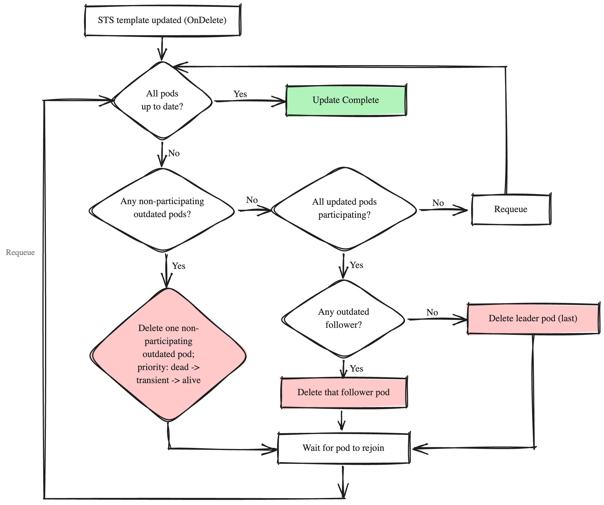

# DEP-07: Druid Controlled Quorum-Aware Pod Updates via StatefulSet OnDelete Strategy

## Summary

Today, etcd-druid provisions etcd clusters as StatefulSets configured with the RollingUpdate update strategy. On a pod-template change, the StatefulSet controller rolls pods in a fixed highest-to-lowest ordinal order, with no awareness of etcd member health or role. When an existing member is already unhealthy, this ordering can cause an avoidable transient quorum loss during routine spec updates.

This proposal introduces configuring the StatefulSet with the `OnDelete` update strategy provided by Kubernetes. Under OnDelete, the StatefulSet controller does not roll pods automatically on pod-template changes; instead, a new dedicated controller in etcd-druid deletes and recreates pods in an order that accounts for member health and cluster role. Voluntary updates - image bumps, configuration changes, resource changes - are then propagated under druid's control, with significantly reduced risk of unintended quorum loss in multi-node clusters.

## Terminology

- **OnDelete**: A StatefulSet update strategy where pods are only updated when they are explicitly deleted. The StatefulSet controller does not automatically rollout the pods on template changes.
- **RollingUpdate**: A StatefulSet update strategy where the StatefulSet controller automatically updates pods one by one, from the highest ordinal to the lowest.
- **Quorum**: The minimum number of etcd members that must agree on a value for the cluster to make progress. For a 3-member cluster, quorum is 2.
- **Leader**: The etcd member responsible for handling client write requests and coordinating replication.
- **Follower**: An etcd member that replicates data from the leader and can serve linearizable reads.
- **Participating pod**: A pod whose etcd container is currently serving as a leader or follower in the cluster's quorum (i.e., it passes its readiness probe).
- **Non-participating pod**: A pod whose etcd member is not currently contributing to quorum, regardless of cause (process down, member not yet joined, network-partitioned etc.).

## Motivation

Currently etcd-druid deploys etcd clusters as StatefulSets with `RollingUpdate` strategy. The StatefulSet controller rolls pods from the highest ordinal to the lowest, without considering the health or role of individual etcd members. This creates a risk of unintended quorum loss.

Consider a 3-member cluster with pods P-0, P-1, and P-2. Suppose P-0 is currently unhealthy (it could be partitioned from the network, on a failing node, or hitting an internal etcd error) while P-1 and P-2 are healthy and form a quorum. An operator now triggers a routine spec update, e.g. an image bump. The StatefulSet controller starts at the highest ordinal, deletes P-2, and waits for it to come back ready before proceeding. During that window only P-1 is participating; with 1 of 3 members up, the cluster has lost quorum and stalls writes until P-2 returns. The same outcome repeats when P-1 is rolled next. The unhealthy P-0 (the pod whose deletion would have been safe, since it wasn't contributing anyway) is rolled last, by which time the avoidable downtime has already been incurred.

The following diagram illustrates how the `RollingUpdate` strategy can lead to quorum loss in this scenario:

<div align="center">

</div>

The StatefulSet controller starts from Pod N (the highest ordinal), terminates it, and waits for the new pod to become ready. If the terminated pod is not the originally unhealthy one, cluster goes into a transient quorum loss with 2 members down.

Moving the pod update process under druid's control, via the `OnDelete` strategy, addresses three concerns:

1. **Reduce transient quorum loss.** Select outdated pods for deletion based on member health, so it doesn't prematurely remove a healthy member while an unhealthy one waits its turn in the sequence.
2. **Reduce unnecessary leader elections.** Update followers before the leader, so the leader-election does not happen as frequently during a rollout.
3. **Enable safer in-place volume changes.** A safer PVC resize procedure benefits from controlled replacement of pods, which is what `OnDelete` provides. The resize flow itself is out of scope for this DEP and is covered separately (see [Interaction with PVC Resizing](#interaction-with-pvc-resizing)).

For a single-node etcd cluster, concerns 1 and 2 do not apply: there is no quorum to preserve and no leader-election to avoid.

### Goals

- Prevent unintended quorum loss during voluntary pod updates by replacing the default StatefulSet rolling order with a druid-controlled, health-aware order.

### Non-Goals

- This proposal does not claim to prevent all forms of quorum loss. It reduces the likelihood of quorum loss that arises from applying the StatefulSet's default, health-agnostic rolling order to a quorum-sensitive workload.
- This proposal does not cover the PVC resizing or volume replacement flow itself. `OnDelete` is recommended for a safe resize procedure, but the resize flow is covered in a separate proposal (see [Interaction with PVC Resizing](#interaction-with-pvc-resizing)).

## Proposal

### Feature Gate

Quorum-aware pod updates with the `OnDelete` strategy are opt-in via a new feature gate, `QuorumAwareUpdatesWithOnDelete`, declared alongside the existing gates in `api/config/v1alpha1/features.go`. Operators enable it by setting it in the `featureGates` map of the operator configuration:

```yaml
# OperatorConfiguration
featureGates:
  QuorumAwareUpdatesWithOnDelete: true
```

- **Maturity:** Alpha
- **Default:** `false`
- **Scope:** Operator-wide. The gate applies to every etcd cluster managed by that etcd-druid instance; there is no per-cluster override.
- **Effect when enabled:** The Etcd reconciler sets `spec.updateStrategy.type = OnDelete` on every managed StatefulSet, and the OnDelete controller (described below) orchestrates pod updates.
- **Effect when disabled:** The Etcd reconciler sets `spec.updateStrategy.type = RollingUpdate` on the StatefulSet, preserving the current behaviour. The OnDelete controller's predicate does not match, so it stays inert.

**Why a feature gate.**

The choice of StatefulSet update strategy is an internal implementation detail of how etcd-druid realises an etcd cluster on top of Kubernetes primitives. The user's contract is the `Etcd` resource; they should not need to know that a StatefulSet is involved at all, let alone which of its update strategies is in effect. Exposing the choice as a spec field on `Etcd` would leak that implementation detail into a stable API surface and foreclose the option to evolve away from StatefulSets later without an awkward API deprecation.

A feature gate is the right mechanism for an operator-controlled toggle that is purely operational: it gives the operator a single switch to enable the new behaviour at a time of their choosing, and, critically, a safe rollback path if a regression is observed in production. Disabling the gate (or downgrading to a version that pre-dates it) restores the pre-OnDelete behaviour without any per-cluster cleanup. Once the feature is exercised long enough to be considered stable, the gate will be graduated through beta to GA and eventually locked to `true`, at which point no per-operator knob remains to maintain.

### The OnDelete Controller

A new controller, separate from the existing Etcd reconciler, is responsible for managing pod updates when the OnDelete strategy is active. This controller watches StatefulSet resources and reconciles whenever the StatefulSet's `.status.updateRevision` changes, indicating that a pod template update needs to be propagated to pods.

**Why a separate controller instead of extending the StatefulSet component:**

The OnDelete pod update process could be folded into the existing Etcd reconciliation loop by extending the StatefulSet component. We chose a separate controller for two reasons:

- **Preserves the Etcd reconciler's current role.** The reconciler today writes the desired state of the cluster's Kubernetes resources (StatefulSet, ConfigMap, Services, Leases, etc.) and relies on each resource's controller to act on it. It does not act on the individual pods. Adding the OnDelete update logic to the reconciler would extend its responsibilities into pod-lifecycle management for the first time; a separate controller keeps that boundary intact and lets the OnDelete logic evolve independently of the rest of the reconciliation pipeline.
- **Mirrors how `RollingUpdate` is managed today.** Under `RollingUpdate`, the Etcd reconciler writes the StatefulSet spec and the Kubernetes StatefulSet controller takes that spec and updates pods accordingly. Under `OnDelete`, the StatefulSet controller steps back from pod updates and a dedicated controller in etcd-druid takes on that role instead. The split (one component computes the desired StatefulSet spec, another manages the pods that realise it) is the same pattern; only the second half moves into etcd-druid.

**Coordination with the Etcd reconciler.**

The Etcd reconciler writes the StatefulSet spec; the OnDelete controller only deletes pods. They don't contend on the same field, so there is no update conflict on the StatefulSet object itself.

The OnDelete controller is stateless: every reconciliation re-reads the current StatefulSet's `.status.updateRevision` and the current pod set. If the Etcd reconciler pushes a new pod template while OnDelete is mid-rollout of a prior revision, the next reconciliation observes the new `updateRevision`, treats every pod whose `controller-revision-hash` no longer matches as outdated (including ones already updated against the prior revision), and continues the procedure from there. No explicit handover between controllers is needed.

When the feature gate's effective state changes, either at runtime (operator config update + restart) or as a result of a druid version upgrade/downgrade, the Etcd reconciler updates the StatefulSet's `spec.updateStrategy.type` first; the OnDelete controller's predicate (`spec.updateStrategy.type == OnDelete`) then engages or disengages accordingly. The Kubernetes StatefulSet controller and the OnDelete controller therefore never act on pod updates concurrently. See [Transitioning Between Strategies](#transitioning-between-strategies) for the full handover behaviour.

**Controller predicate:** The controller only reconciles StatefulSets whose `spec.updateStrategy.type` is set to `OnDelete`. This means the controller is always registered in the controller manager but has zero overhead for clusters using `RollingUpdate`.

### Determining Whether a Pod Needs Updating

A pod is considered outdated if its `controller-revision-hash` label does not match the StatefulSet's `.status.updateRevision`. The `controller-revision-hash` is a Kubernetes-managed label on each pod that reflects the revision of the pod template it was created from.

> **Note:** The OnDelete controller relies on the `controller-revision-hash` label being present on pods and on the StatefulSet's `.status.updateRevision` to signal the target revision. While `appsv1.StatefulSetRevisionLabel` is a public constant and the string comparison logic is safe regardless of how the hash is computed, the contract of how and whether the k8s populates this label on pods is not formally guaranteed. If Kubernetes changes how the StatefulSet controller determines whether pods are up-to-date, the OnDelete controller's outdated-pod detection may need to be revisited.
>
> The `controller-revision-hash` is computed from the pod template spec only. Changes to `volumeClaimTemplates` do not affect this hash. See [Interaction with PVC Resizing](#interaction-with-pvc-resizing).

### Health Assessment

The OnDelete controller needs to understand two things about each pod:

1. **Is the pod participating in the etcd quorum?** This is determined by the etcd container's readiness probe, which the kubelet evaluates against the pod's IP directly (it does not go through any Service). The probe hits etcd-wrapper's `/readyz` endpoint, which issues a linearizable `Get` against the local etcd process. Because a linearizable read can only be served with quorum:
   - A **passing** probe means the member is up and in contact with a healthy quorum: it is participating.
   - A **failing** probe means either this member is itself down or partitioned, or the cluster as a whole has lost quorum. The probe alone cannot distinguish these two cases: when quorum is lost, every pod's probe fails, including pods whose local etcd process is perfectly healthy.

2. **Is the local etcd process alive?** This is a separate question from quorum participation, and it is what lets the controller pick a useful pod to delete first when quorum is lost (where readiness alone would mark every pod equally unready). The controller infers process liveness from the etcd container's state under `pod.status.containerStatuses[]`, classifying it as one of:

   - **Dead**: `state.Terminated` is set (the container has exited), or `state.Waiting` is set with a failure reason such as `CrashLoopBackOff`, `RunContainerError`, `ImagePullBackOff`, `ErrImagePull`, or `CreateContainerConfigError`.
   - **Transient/starting**: `state.Waiting` is set with `ContainerCreating` or `PodInitializing` (the container is still being set up).
   - **Alive**: `state.Running` is set, regardless of readiness.

   This classification only labels the container's state; how the controller acts on each is decided in the [Pod Update Procedure](#pod-update-procedure).

### Pod Update Procedure

The controller deletes at most one pod per reconciliation cycle. The invariant that protects quorum is this: it never removes a *participating* member while a previously-updated pod has not yet rejoined the quorum. Participating pods are therefore updated strictly one at a time, each only after the previously-updated pod is participating again.

Non-participating pods do not count toward quorum, so they carry no such constraint: the controller recreates them in successive cycles without waiting for each one to come back.

This cadence applies to clusters of all sizes. Clusters with more than three replicas have the quorum headroom to update multiple *participating* pods concurrently, but that optimization is intentionally deferred: parallel updates would require handling partial-batch outcomes (one pod of a batch rejoining while another stalls), which significantly complicates the controller's decisions. The first iteration keeps the conservative one-at-a-time cadence for participating pods at every cluster size (see [Future Scope](#future-scope)).

The procedure in each reconciliation cycle:

**Step 1: Check if all pods are up to date.** Compare each pod's `controller-revision-hash` with the StatefulSet's `.status.updateRevision`. If all match, the update is complete.

**Step 2: Check for non-participating pods that need updating.** If any outdated pod is non-participating, select one for deletion using the following sub-priority (using the container-state classification from [Health Assessment](#health-assessment)):

| Priority | Container state | Rationale |
|----------|-----------------|-----------|
| First | **Dead** | Already broken and contributing nothing. Recreating it at the new revision risks nothing and may fix it. |
| Second | **Transient/starting** | Not serving yet. Recreating it at the new revision is cheap and makes update progress. |
| Third | **Alive** but readiness failing | The most functional of the three: a live etcd process that rejoins the moment quorum returns, so it is kept running longest to help restore quorum quickly. Recreated last. |

Delete the selected pod and requeue. Deleting any of these pods causes the StatefulSet controller to recreate it at the new revision, so it leaves the outdated set and is never re-selected in this step. If a recreated pod cannot come back, the rollout holds at Step 3 (which waits for all updated pods to participate) rather than being retried here.

**Step 3: Ensure all updated pods are participating.** Before touching any participating pod, verify that every pod already carrying the latest revision is in a participating state. If any updated pod is still non-participating (for example, a pod deleted in a previous cycle has not yet rejoined the quorum), requeue and wait. This prevents the controller from removing a second participating member while a previously-updated one is still recovering.

**Step 4: Update one participating pod.** At this point, all outdated pods are participating. Select one for deletion using this priority:

| Priority | Role | Rationale |
|----------|------|-----------|
| First | Follower | Deleting a follower does not trigger a leader election. |
| Second | Leader | Deleting the leader may trigger a brief leader election, so it is done last. |

The controller determines member roles by reading the member lease's `holderIdentity` field, which contains the member ID and role.

> **Known limitation.** Member lease updates can lag the actual leadership change by a brief interval, during which the controller may read a stale role. If a leadership change occurs in that window, the controller could select the newly-elected leader as a follower and trigger one additional leader election. This is rare and inherent to using the lease as the role source; it is accepted as a known limitation.
>
> **Note:** When the leader pod is deleted with a normal grace period, the etcd server attempts a graceful [leadership transfer](https://github.com/etcd-io/etcd/blob/326d5a2e7765d1d918865d2c3897f0a27320db80/server/etcdserver/server.go#L1319-L1331) to a follower before shutting down. This transfer is **best-effort**: etcd initiates it during shutdown but does not wait for it to succeed, so a leader election can still occur if the handover does not complete in time. In the common case the handover succeeds and the cluster avoids a full leader-election downtime, which is why an explicit move-leader call from the controller before updating a leader is not needed.

Delete the selected pod and requeue.

**Step 5: Repeat** until all pods are up to date.

The following diagram summarizes the OnDelete update procedure:

<div align="center">

</div>

### Pod Deletion Method

The controller deletes pods by calling the pod `DELETE` endpoint (`client.Delete`), not the `pods/eviction` subresource. These are two distinct API operations: a pod `DELETE` does not consult the PodDisruptionBudget, whereas an eviction does. The OnDelete controller relies on its own health-aware logic to decide when a deletion is safe, so it does not need the PDB's budget check on top.

**Why Delete instead of Evict:**

Several approaches were evaluated:

1. **Eviction without `unhealthyPodEvictionPolicy`**: The PDB blocks all evictions when any pod is unready (since `minAvailable` drops to the threshold). This deadlocks the controller when a pod is already unhealthy, which is precisely the scenario OnDelete is designed to handle.

2. **Eviction with `unhealthyPodEvictionPolicy: IfHealthyBudget`**: Allows eviction of unhealthy pods when enough healthy pods exist. Handles the common case of one unhealthy pod, but still deadlocks when two or more pods are unhealthy.

3. **Eviction with `unhealthyPodEvictionPolicy: AlwaysAllow`**: Allows eviction of all unhealthy pods regardless of budget. Solves the deadlock but weakens PDB protection against external actors (VPA, node drain, cluster autoscaler) that could concurrently evict unhealthy pods.

4. **Direct Delete**: Simple and does not interact with the PDB at all.

The recommended approach is direct `Delete` for the following reasons:

- The current `RollingUpdate` strategy already deletes pods via the pod `DELETE` endpoint, not the `pods/eviction` subresource ([Kubernetes StatefulSet controller source](https://github.com/kubernetes/kubernetes/blob/865560c3d264865c2cf7e86863feb220e7848bba/pkg/controller/statefulset/stateful_pod_control.go#L118-L120)). Switching to `OnDelete` does not change the deletion mechanism, only the ordering.
- Using eviction would require managing PDB policy settings and handling blocked evictions with fallback logic, adding complexity without proportional safety benefit given that the controller is already health-aware.

**Limitation of the Delete approach:**

Because direct `Delete` bypasses the PDB, there is a theoretical race condition: an external actor (VPA, node drain) could disrupt a pod between the OnDelete controller's health check and its delete call, resulting in two pods being unavailable simultaneously. In practice this is rare because the window is very short, and the same race exists with the current `RollingUpdate` strategy which also uses direct deletions. If the race does occur, the controller's next reconciliation will observe the degraded state and pause further updates until the cluster recovers.

The PDB remains configured as today (`minAvailable = replicas/2 + 1` for multi-node clusters) and continues to protect against evictions from external actors like VPA, node drain, and cluster autoscaler. The OnDelete controller's direct deletes bypass the PDB by design, because the controller has domain knowledge that the PDB lacks (etcd member health, role, quorum status).

### Safeguarding Etcd Pods from Voluntary Disruptions

Two mechanisms protect etcd pods from being disrupted by external actors:

1. **PodDisruptionBudget (PDB)**: For a 3-member etcd cluster, `minAvailable` is set to 2, allowing at most 1 pod to be evicted at a time. For single-node clusters, `minAvailable` is 0 (PDB provides no protection). The PDB protects against evictions from VPA, node drain, and similar actors. The OnDelete controller bypasses the PDB via direct delete calls because it makes its own health-aware decisions.

2. **Cluster autoscaler `safe-to-evict` annotation**: The `cluster-autoscaler.kubernetes.io/safe-to-evict: "false"` annotation prevents the cluster autoscaler from evicting etcd pods during node scale-down.

### Single-Node Clusters

For single-node etcd clusters, the OnDelete controller follows the same procedure but with a simplification: there is only one pod, so there is no ordering decision to make. The controller deletes the single outdated pod and waits for it to come back.

### StatefulSet Status Fields

The Kubernetes StatefulSet controller historically did not promote `status.currentRevision` to match `status.updateRevision` when the `OnDelete` strategy was used ([kubernetes/kubernetes#73492](https://github.com/kubernetes/kubernetes/issues/73492), [kubernetes/kubernetes#106055](https://github.com/kubernetes/kubernetes/issues/106055)). This has now been fixed upstream by [kubernetes/kubernetes#136833](https://github.com/kubernetes/kubernetes/pull/136833) and ships in Kubernetes `v1.37`. For clusters on Kubernetes versions below `v1.37`, however, the etcd-druid code that compares `currentRevision` with `updateRevision` (`IsStatefulSetReady` and the `AllMembersUpdated` condition) would incorrectly report the cluster as not ready under the `OnDelete` strategy.

To support both pre-fix and post-fix Kubernetes versions, the OnDelete controller computes the equivalent information directly from the pods: it compares each pod's `controller-revision-hash` with the StatefulSet's `updateRevision`. The existing readiness and condition checks will be updated to use this pod-level comparison when the `OnDelete` strategy is active. This pod-level approach is robust across Kubernetes versions, so it remains valid after etcd-druid raises its minimum supported Kubernetes version to one that includes the upstream fix.

### Transitioning Between Strategies

The Etcd reconciler is the single owner of `StatefulSet.spec.updateStrategy.type`. On every reconciliation it sets this field based on the current state of the `QuorumAwareUpdatesWithOnDelete` feature gate: enabled → `OnDelete`, disabled → `RollingUpdate`. This invariant means that whenever the gate's effective state changes, the StatefulSet's strategy follows on the next reconciliation, and no manual intervention is required to keep the two in sync.

The gate's effective state can change in two ways:

1. **Feature gate toggled at runtime.** The operator updates the gate value in `OperatorConfiguration.FeatureGates` and restarts the etcd-druid pod so the new value is loaded.
2. **Druid version upgrade or downgrade.** Upgrading to a version that introduces the gate (with the gate enabled) flips the effective state to `OnDelete`. Downgrading to a version that pre-dates the gate is equivalent to disabling it, because the older Etcd reconciler has no awareness of the gate and will unconditionally set `RollingUpdate`.

**Switch from `RollingUpdate` to `OnDelete`.**

1. On the next Etcd reconciliation, the StatefulSet component sets `spec.updateStrategy.type` to `OnDelete`. The Kubernetes StatefulSet controller stops auto-rolling pods.
2. The OnDelete controller's predicate now matches the StatefulSet and engages. If a `RollingUpdate` was in flight (some pods at the new revision, some not), the OnDelete controller observes the same `controller-revision-hash` labels and continues from where the previous controller left off, in health-aware order. Pods already updated by the StatefulSet controller are not re-deleted.
3. If no pods are outdated, the OnDelete controller simply watches for future template changes.
4. If the previous `RollingUpdate` had stalled waiting for some pod to come back, the OnDelete controller also waits for those; the wait behaviour is unchanged, only the selection order for subsequent pods differs.

**Switch from `OnDelete` to `RollingUpdate`.**

1. On the next Etcd reconciliation, the StatefulSet component sets `spec.updateStrategy.type` to `RollingUpdate`. The OnDelete controller's predicate no longer matches; it disengages.
2. The Kubernetes StatefulSet controller resumes pod updates in ordinal order. Because it also consults `controller-revision-hash` and `.status.updateRevision`, pods already updated by the OnDelete controller are not re-rolled: only the remaining outdated ones are processed.

Both switches are inherently safe because they touch only the StatefulSet's `spec.updateStrategy.type` field; no pod is deleted as part of the switch itself. A pod whose deletion is in flight when the switch happens completes its lifecycle normally and is replaced; the new strategy applies to subsequent pods.

**Note on version downgrade.** Downgrading to a version of etcd-druid that pre-dates this DEP is functionally identical to disabling the gate (the second switch above), since the older reconciler will set `RollingUpdate` on its next reconciliation. Any OnDelete rollout in progress at the time of the downgrade continues under Kubernetes StatefulSet control afterwards, with no loss of progress.

### VPA Interaction

The Vertical Pod Autoscaler (VPA) in `Recreate` or `InPlaceOrRecreate` mode does not modify the StatefulSet spec directly. VPA operates through two independent mechanisms:

1. **VPA Updater**: Evicts pods that don't match the recommended resource values. This eviction respects the PDB.
2. **VPA Admission Controller**: When the StatefulSet controller recreates a pod, the admission webhook injects VPA-recommended resource values into the new pod's spec at creation time.

Since VPA does not modify the StatefulSet pod template, it does not trigger a new `updateRevision` and the OnDelete controller is not involved in VPA-driven resource updates. VPA continues to operate independently regardless of the update strategy.

### Interaction with PVC Resizing

The PVC resizing story ([etcd-druid#481](https://github.com/gardener/etcd-druid/issues/481)) benefits from the `OnDelete` strategy: replacing pods one-by-one in a controlled, health-aware order is a safer way to carry out a per-pod resize. `OnDelete` is recommended for that flow rather than strictly required. The resize flow itself is out of scope for this DEP and will be covered in a separate proposal.

The OnDelete controller's own detection of outdated pods is based on the `controller-revision-hash` label, which is computed from the pod template spec only and does not include `volumeClaimTemplates`. A change to `storageCapacity` or `storageClass` alone will therefore not trigger the OnDelete controller; the PVC resize flow will handle pod replacement through its own mechanism.

### Future Scope

- **Backup-restore container health in update ordering**: The current design does not consider the health of the backup-restore sidecar container when deciding which pod to update next. The rationale is that backup-restore health does not affect quorum, and prioritizing it could lead to unnecessary leader elections (for example, if a pod with an unhealthy backup-restore happens to be the leader). If future operational experience shows value in considering backup-restore health as a secondary sorting criterion, the priority order can be extended.
- **Concurrent pod updates for larger clusters**: Clusters with more than three replicas have quorum headroom to update multiple participating pods at once. For example, a 5-member cluster can lose 2 and keep quorum, a 7-member cluster can lose 3, and so on. A future iteration can introduce a quorum-aware concurrency limit (a `maxUnavailable`-like bound reinterpreted for quorum-based workloads) so that the controller updates as many participating pods in parallel as the cluster's headroom allows, while never breaching quorum.

## Alternatives

### RollingUpdate with `maxUnavailable`

Kubernetes supports a `maxUnavailable` field on the StatefulSet's `RollingUpdate` strategy ([StatefulSet documentation](https://kubernetes.io/docs/concepts/workloads/controllers/statefulset/#maximum-unavailable-pods)). Setting `maxUnavailable: 1` ensures that only one pod is unavailable during the update process, which provides the same quorum safety guarantee as OnDelete for the common case.

However, `maxUnavailable` has two limitations that OnDelete addresses:

1. **Update progress when a pod is already unhealthy.** The StatefulSet controller waits for any unavailable pod to recover before proceeding. If a pod is already unhealthy and the update itself might fix it (for example, a configuration change or image bump), the controller is stuck waiting indefinitely. The OnDelete controller does not have this limitation because it can proactively delete the unhealthy pod first, allowing the update to make progress.

2. **No control over update order.** The StatefulSet controller still follows the ordinal order (highest to lowest) regardless of cluster health state. The OnDelete controller can prioritize non-participating pods and update followers before the leader, minimizing unnecessary leader elections during the rollout.
