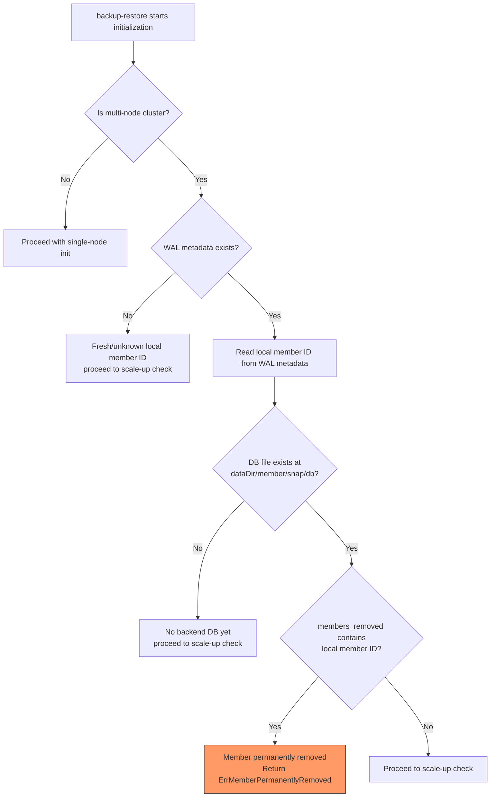
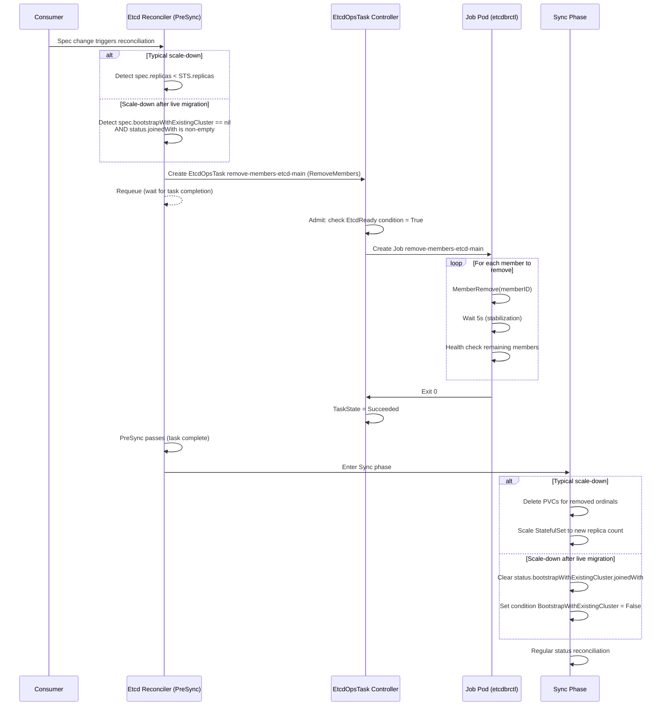

# DEP-07: Scale-Down Support

## Table of Contents

- [DEP-07: Scale-Down Support](#dep-07-scale-down-support)
  - [Table of Contents](#table-of-contents)
  - [Summary](#summary)
  - [Terminology](#terminology)
  - [Motivation](#motivation)
  - [Goals](#goals)
  - [Non-Goals](#non-goals)
  - [Proposal](#proposal)
    - [Prerequisites](#prerequisites)
    - [Approach](#approach)
    - [CEL Validation Change](#cel-validation-change)
    - [Scale-Down Execution](#scale-down-execution)
      - [RemoveMembers EtcdOpsTask](#removemembers-etcdopstask)
      - [Scale-Down Job](#scale-down-job)
      - [etcdbrctl member-remove Subcommand](#etcdbrctl-member-remove-subcommand)
    - [etcd-druid Changes](#etcd-druid-changes)
      - [PreSync detection and OpsTask creation](#presync-detection-and-opstask-creation)
      - [RemoveMembers handler](#removemembers-handler)
      - [Post-scale-down reconciliation](#post-scale-down-reconciliation)
    - [Anti-Rejoin Detection in backup-restore](#anti-rejoin-detection-in-backup-restore)
      - [Detection via boltdb bucket](#detection-via-boltdb-bucket)
      - [Detection flow](#detection-flow)
    - [Failures and Recovery Strategy](#failures-and-recovery-strategy)
  - [Use Cases](#use-cases)
    - [Typical Scale-Down](#typical-scale-down)
    - [Scale-Down after Live Migration (BootstrapWithExistingCluster)](#scale-down-after-live-migration-bootstrapwithexistingcluster)
  - [Unified Scale-Down Sequence](#unified-scale-down-sequence)
  - [Compatibility](#compatibility)
  - [Alternatives](#alternatives)
    - [HTTP Endpoint on backup-restore](#http-endpoint-on-backup-restore)
  - [References](#references)

---

## Summary

etcd-druid can scale up an etcd cluster but **does not yet support scaling it down**. Since there is no coordinated mechanism to remove etcd members before terminating their pods, a CEL validation rule on `spec.replicas` prevents any decrease — only increases or scale-to-zero (hibernation) are permitted.

This DEP introduces scale-down support by:
1. Implementing member removal via a `RemoveMembers` [EtcdOpsTask][DEP-05] that removes etcd members from the cluster **before** the desired member set is reduced in the reconciled resources.
1. Adding a member removal detection mechanism in `etcd-backup-restore` to prevent removed members from re-joining.
1. Removing the CEL validation that blocks decreasing `spec.replicas` once member removal is coordinated in the reconciliation flow.

Scale-down is the symmetric counterpart to [DEP-03]. Where DEP-03 adds members as learners before increasing the desired member set, this DEP removes members from etcd before decreasing the desired member set.

---

## Terminology

| Term | Definition |
|------|------------|
| **backup-restore** | The `etcd-backup-restore` container running alongside etcd in each member pod, responsible for snapshots, restoration, and initialization. |
| **etcdbrctl** | The CLI binary provided by `etcd-backup-restore`, used for out-of-band operations (compact, restore, snapshot, copy, and — with this DEP — member-remove). |
| **EtcdOpsTask** | A custom resource ([DEP-05]) representing an out-of-band operator task on an etcd cluster. |
| **PreSync** | A reconciler phase that executes before Sync (resource creation/update). Operations here must complete before cluster configuration changes take effect. Defined in the [`Operator` interface][OperatorInterface]. |
| **Bootstrap with existing cluster** | A mode where new Etcd CR members join an already-running etcd cluster managed by a different Etcd CR. Configured via `spec.etcd.bootstrapWithExistingCluster`. See [Issue-1239]. |
| **`members_removed` bucket** | A boltdb bucket in the etcd data directory used to record removed member IDs. `etcd-backup-restore` reads it during initialization to detect whether the local member ID was permanently removed and prevent re-adding it as a learner. |

---

## Motivation

Scale-down is relevant for three cases:

1. **Typical scale-down.** A consumer reduces `spec.replicas` (for example, 3→1). This is a capacity-management feature and can also support operational workflows such as zero-downtime upgrades of a normally non-HA cluster: temporarily scale the cluster out, introduce upgraded replacement members, then scale back down after the upgraded member is healthy. The excess members need to be removed from etcd before their pods are terminated. Today this update is rejected at admission time.
1. **Scale-down after live migration.** When an Etcd CR bootstraps its members into an existing cluster via `bootstrapWithExistingCluster` ([Issue-1239]), the original cluster's members eventually need to be removed so that the new cluster operates independently. Without a removal mechanism in etcd-druid, this pruning step has to be performed separately after live migration.

> [!NOTE]
> These capabilities are consumed by higher-level orchestrators — for example, Gardener's Live Control Plane Migration ([GEP-0039]). The GEP (Gardener Enhancement Proposal) defines a concrete scale-down implementation; this DEP defines one for etcd-druid.

## Goals

1. Enable scale-down of etcd clusters by implementing coordinated member removal and removing the CEL validation that currently blocks it.
2. Ensure member removal completes **before** etcd-druid reconciles resources in a way that removes member runtime instances, reducing the risk of split-brain or quorum loss.
3. Provide a unified mechanism to remove one or more etcd members from a running cluster, usable across all three scale-down scenarios.
4. Detect removed members in `etcd-backup-restore` to prevent re-adding them as learners.
5. Integrate with the existing EtcdOpsTask lifecycle (state machine, duplicate prevention, TTL-based garbage collection).
6. Support both TLS-enabled and plaintext etcd clusters.
7. Ensure idempotent behavior — removing an already-absent member is a no-op.

## Non-Goals

1. **Automatic leader transfer.** No explicit `MoveLeader` RPC is issued before removing the leader. Member removal uses etcd's `MemberRemove` flow and lets raft membership changes/election happen according to etcd's existing behavior ([EtcdRemoveMember]).
2. **Quorum recovery.** If removal causes quorum loss, recovery is handled by the existing QuorumRecovery OpsTask — not this mechanism.
3. **Scale-down to zero.** Hibernation (`replicas=0`) is a separate path with its own pre-sync snapshot and is already supported.

---

## Proposal

### Prerequisites

- The etcd cluster is expected to be healthy (`EtcdReady` condition is `True`) before scale-down is attempted.
- The resulting cluster after scale-down needs to retain quorum — at least `(N/2)+1` members must remain. Scaling a 3-member cluster to 1 member is valid (1 remaining member forms a single-node quorum).
- [DEP-05] needs to be implemented — the RemoveMembers task type extends this framework.
- For the live migration case: [Issue-1239] (`bootstrapWithExistingCluster`) needs to be implemented.

### Approach

Scale-down is orchestrated by etcd-druid through the [EtcdOpsTask][DEP-05] framework, following a "remove-before-terminate" invariant.

It aims to achieve coordinated scale-down by:

1. Implementing the `RemoveMembers` OpsTask that internally deploys a Kubernetes Job running `etcdbrctl member-remove`, which sequentially removes members with health checks between each removal.
1. Detecting scale-down intent in the reconciler's PreSync phase and creating the `RemoveMembers` OpsTask that pauses further reconciliation until members are removed from etcd.
1. Preventing removed members from re-joining via `etcd-backup-restore`'s boltdb-based detection during initialization.
1. Removing the CEL admission rule that blocks decreasing `spec.replicas` once the PreSync mechanism enforces removal-before-termination ordering.

The execution path is:

```
spec.replicas decreased → PreSync detects → OpsTask created → Job removes members from etcd
    → Post-removal cleanup (per use case) → Regular reconciliation continues
```

After the `RemoveMembers` OpsTask succeeds:
1. **Typical scale-down**: Delete PVCs for removed ordinals.
1. **Scale-down after live migration**: Update `status.bootstrapWithExistingCluster` and set condition `BootstrapWithExistingCluster` to `False`.

Then the regular reconciliation loop continues. For etcd-druid-managed members, ConfigMap is regenerated, StatefulSet is updated based on `etcd.Spec.Replicas`, and the StatefulSet controller terminates pods for the reduced replica count.

This ordering is intended to ensure that member runtime instances are not removed while still holding etcd membership.

All three use cases share the same OpsTask→Job→etcdbrctl path. They differ in trigger condition and post-removal cleanup.

> [!NOTE]
> The client endpoint used to connect to the etcd cluster is derived from the Etcd CR's client service (`<etcd-name>-client.<namespace>.svc:<client-port>`). In the BootstrapWithExistingCluster case, all members have already joined one logical cluster, so the local client service routes to any member in that single quorum. No cross-cluster client endpoint is needed.

### CEL Validation Change

The existing CEL rule on `spec.replicas` blocks any decrease (except to 0). This rule was added because scale-down was not supported — it served as a guard against unsupported operations:

**Current rule (to be removed):**
```
// +kubebuilder:validation:XValidation:message="Replicas can either be increased or be downscaled to 0.",rule="self==0 ? true : self < oldSelf ? false : true"
```

With this DEP, scale-down is coordinated through PreSync member removal before etcd-druid reconciles the reduced desired member set. This rule is therefore **removed entirely**. The existing `Minimum(0)` constraint on the field remains in place.

**New rule — mutual exclusion of concurrent scale operations:**

A new status condition `ScaleOperationInProgress` is introduced with `status: True/False` and reason `ScalingUp` or `ScalingDown`. A CEL transition rule is placed on the **Etcd type struct** (object-root level, not on a field or EtcdSpec — only the root object can reference both `self.spec` and `self.status`). This rejects conflicting scale operations at admission time:

```go
// On the Etcd type definition (api/core/v1alpha1/etcd.go):
// +kubebuilder:validation:XValidation:message="Cannot scale up while a scale-down operation is in progress.",rule="self.spec.replicas > oldSelf.spec.replicas ? !self.status.conditions.exists(c, c.type == 'ScaleOperationInProgress' && c.status == 'True' && c.reason == 'ScalingDown') : true"
// +kubebuilder:validation:XValidation:message="Cannot scale down while a scale-up operation is in progress.",rule="self.spec.replicas < oldSelf.spec.replicas ? !self.status.conditions.exists(c, c.type == 'ScaleOperationInProgress' && c.status == 'True' && c.reason == 'ScalingUp') : true"
```

The reconciler manages this condition:
1. **Set to `True`** in PreSync when a scale operation is detected (reason `ScalingUp` for replica increase, `ScalingDown` for replica decrease). For scale-up, the condition is set when the reconciler detects `spec.replicas > existingSTS.Spec.Replicas` and before the StatefulSet is updated. For scale-down, it is set when creating the `RemoveMembers` OpsTask.
1. **Set to `False`** at the end of reconciliation after Sync completes successfully and all members are healthy.

This gives consumers an admission rejection rather than a requeue loop when attempting conflicting operations.

### Scale-Down Execution

#### RemoveMembers EtcdOpsTask

A `RemoveMembers` field is added to `EtcdOpsTaskConfig`. Each entry specifies a member name and its peer URL. Members are removed one at a time with a 5-second stabilization interval and health check between each removal. If a member is already absent from the cluster's `MemberList()`, it is skipped (idempotent).

**`RemoveMembersConfig`**

```go
type RemoveMembersConfig struct {
    // +kubebuilder:validation:Required
    // +kubebuilder:validation:MinItems=1
    MembersToRemove []MemberToRemove `json:"membersToRemove"`
}

type MemberToRemove struct {
    // +kubebuilder:validation:Required
    // +kubebuilder:validation:MinLength=1
    Name string `json:"name"`

    // +kubebuilder:validation:Required
    // +kubebuilder:validation:MinLength=1
    PeerURL string `json:"peerUrl"`
}
```

**Example EtcdOpsTask**

```yaml
apiVersion: druid.gardener.cloud/v1alpha1
kind: EtcdOpsTask
metadata:
  name: remove-members-etcd-main
  namespace: shoot--myproject--mycluster
  ownerReferences:
    - apiVersion: druid.gardener.cloud/v1alpha1
      kind: Etcd
      name: etcd-main
      controller: true
      blockOwnerDeletion: true
spec:
  etcdName: etcd-main
  config:
    removeMembers:
      membersToRemove:
        - name: etcd-main-1
          peerUrl: "https://etcd-main-1.etcd-main-peer.shoot--myproject--mycluster.svc:2380"
        - name: etcd-main-2
          peerUrl: "https://etcd-main-2.etcd-main-peer.shoot--myproject--mycluster.svc:2380"
  ttlSecondsAfterFinished: 3600
```

#### Scale-Down Job

The `RemoveMembers` handler creates a Kubernetes Job running `etcdbrctl member-remove`. This proposal uses a Job instead of adding a dedicated backup-restore HTTP endpoint for operational reasons:
- It provides process isolation — failures in the member-removal process are isolated to the Job pod instead of the long-running `etcd-backup-restore` server process.
- Job status, events, and logs provide a Kubernetes-native execution record owned by the `EtcdOpsTask`.
- It does not require extending the backup-restore HTTP API with a rarely used administrative operation.
- The Job mounts the same TLS secrets as the backup-restore container and talks directly to etcd client endpoints.

The Job follows the compaction Job pattern: same labels, security context, and volume mount conventions. The Job's labels are derived from the owning Etcd CR so that they remain consistent with the rest of the Etcd resources. The Job pod communicates directly with etcd using TLS client certificates and does not require Kubernetes API access for the member removal itself.

**Job Spec**

```yaml
apiVersion: batch/v1
kind: Job
metadata:
  name: remove-members-etcd-main
  namespace: shoot--myproject--mycluster
  ownerReferences:
    - apiVersion: druid.gardener.cloud/v1alpha1
      kind: EtcdOpsTask
      name: remove-members-etcd-main
      controller: true
      blockOwnerDeletion: true
  labels:
    app.kubernetes.io/name: etcd-main-member-remove
    app.kubernetes.io/component: etcd-member-removal-job
    networking.gardener.cloud/to-dns: allowed
    networking.gardener.cloud/to-private-networks: allowed
spec:
  activeDeadlineSeconds: 300
  completions: 1
  backoffLimit: 3
  template:
    spec:
      serviceAccountName: etcd-main
      restartPolicy: Never
      terminationGracePeriodSeconds: 30
      containers:
        - name: member-remove
          image: europe-docker.pkg.dev/gardener-project/releases/gardener/etcdbrctl:v0.43.0
          imagePullPolicy: IfNotPresent
          args:
            - member-remove
            - "--member=etcd-main-1=https://etcd-main-1.etcd-main-peer.shoot--myproject--mycluster.svc:2380"
            - "--member=etcd-main-2=https://etcd-main-2.etcd-main-peer.shoot--myproject--mycluster.svc:2380"
            - "--endpoints=https://etcd-main-client.shoot--myproject--mycluster.svc:2379"
            - "--cacert=/var/etcd/ssl/ca/bundle.crt"
            - "--cert=/var/etcd/ssl/client/tls.crt"
            - "--key=/var/etcd/ssl/client/tls.key"
          volumeMounts:
            - name: etcd-ca
              mountPath: /var/etcd/ssl/ca
              readOnly: true
            - name: etcd-client-tls
              mountPath: /var/etcd/ssl/client
              readOnly: true
          resources:
            requests:
              cpu: 100m
              memory: 128Mi
          securityContext:
            allowPrivilegeEscalation: false
      volumes:
        - name: etcd-ca
          secret:
            secretName: etcd-main-ca-bundle
        - name: etcd-client-tls
          secret:
            secretName: etcd-main-client-tls
```

> [!NOTE]
> For non-TLS clusters, `--insecure-transport=true` is passed and the `--cacert`, `--cert`, `--key` flags are omitted. TLS volumes are not mounted.

#### etcdbrctl member-remove Subcommand

A new cobra subcommand is added to the `etcdbrctl` binary in `etcd-backup-restore`. Connection flags reuse the existing `EtcdConnectionConfig.AddFlags()` pattern (`--endpoints`, `--cacert`, `--cert`, `--key`, `--insecure-transport`, `--insecure-skip-tls-verify`). A new `--member` flag (repeatable StringSlice) specifies members to remove in format `<name>=<peerURL>` (the `=` delimiter avoids ambiguity with `://` and `:port` in URLs).

After each `MemberRemove` RPC, the command waits 5 seconds (election timeout + raft propagation margin) and verifies the remaining cluster has quorum. If not, it exits non-zero immediately. No explicit `MoveLeader` is issued; member removal relies on etcd's existing raft membership-change behavior ([EtcdRemoveMember]).

**Flags:**

| Flag | Type | Description |
|------|------|-------------|
| `--member` | StringSlice (repeatable) | Member to remove in format `<name>=<peerURL>` |
| `--endpoints` / `-e` | StringSlice | Comma-separated etcd client endpoints |
| `--cacert` | String | CA bundle to verify TLS servers |
| `--cert` | String | TLS client certificate file |
| `--key` | String | TLS client key file |
| `--insecure-transport` | Bool | Disable transport security (for non-TLS clusters) |

```
etcdbrctl member-remove \
  --member=etcd-main-1=https://etcd-main-1.etcd-main-peer.shoot--myproject--mycluster.svc:2380 \
  --member=etcd-main-2=https://etcd-main-2.etcd-main-peer.shoot--myproject--mycluster.svc:2380 \
  --endpoints=https://etcd-main-client.shoot--myproject--mycluster.svc:2379 \
  --cacert=/var/etcd/ssl/ca/bundle.crt \
  --cert=/var/etcd/ssl/client/tls.crt \
  --key=/var/etcd/ssl/client/tls.key
```

**Algorithm:**

1. Parse `--member` flags into a list of `(name, peerURL)` pairs.
1. Connect to the etcd cluster using `--endpoints` and TLS credentials.
1. Call `MemberList()` to retrieve current cluster members.
1. For each member in the provided list:
   - a. Match peerURL to find the member ID. If not found, log and skip (idempotent).
   - b. If the member is a learner, remove directly — learner removal does not affect quorum.
   - c. Call `MemberRemove(memberID)`.
   - d. Wait 5 seconds for cluster stabilization.
   - e. Health-check remaining members. If fewer than `(N/2)+1` are healthy, exit non-zero.
1. If no members from the input list were found (all already removed), log and exit 0.
1. Exit 0.

### etcd-druid Changes

#### PreSync detection and OpsTask creation

The component reconciliation flow detects when scale-down is requested by comparing the Etcd CR's spec against current state. This check is part of the StatefulSet component's `PreSync()` path. Before creating a new OpsTask, PreSync removes older successful member-removal OpsTasks for the same Etcd CR, then checks for an existing pending/in-progress removal task. If a scale-down is needed and no active `RemoveMembers` OpsTask exists, it creates one named `remove-members-<etcd-name>` (for example, `remove-members-etcd-main`), sets the `ScaleOperationInProgress` condition to `True` with reason `ScalingDown`, and returns an error to requeue. The EtcdOpsTask controller also rejects duplicates for the same Etcd CR.

Each use case has a distinct detection condition:

| Use case | Condition |
|----------|-----------|
| Typical scale-down | `etcd.Spec.Replicas < existingSTS.Spec.Replicas` — removes highest ordinals. |
| Scale-down after live migration | `spec.Etcd.BootstrapWithExistingCluster == nil` AND `status.BootstrapWithExistingCluster.JoinedWith` is non-empty. |

#### RemoveMembers handler

The handler follows the three-phase EtcdOpsTask lifecycle:

1. **Admit.** Fetches the referenced Etcd object and verifies the `EtcdReady` condition is `True`. Rejects if removal would cause quorum loss during the removal process (i.e., at any intermediate step, fewer than `(N/2)+1` of the *remaining* members would be healthy).
1. **Execute.** Creates the Job (or requeues if one already exists), polls completion, and returns success/failure based on Job status.
1. **Cleanup.** Deletes the Job with foreground propagation policy.

> [!NOTE]
> The Admit phase checks the `EtcdReady` condition on the Etcd CR rather than directly checking etcd quorum. This reuses the existing readiness signal maintained by etcd-druid for the Etcd resource.

#### Post-scale-down reconciliation

After the OpsTask succeeds, the next reconciliation passes through PreSync (task complete — returns nil) into Sync. The regular reconcile flow applies: ConfigMap regeneration and status reconciliation. Sync also updates the StatefulSet replica count. At the end of successful reconciliation, the `ScaleOperationInProgress` condition is set to `False`.

The post-removal cleanup differs by use case:

| Use case | Post-removal action |
|----------|---------------------|
| Typical scale-down | Delete PVCs for removed ordinals, scale StatefulSet to new replica count. |
| Scale-down after live migration | Clear `status.bootstrapWithExistingCluster.joinedWith`, set condition `BootstrapWithExistingCluster` to `False`. |

### Anti-Rejoin Detection in backup-restore

#### Detection via boltdb bucket

After scale-down removes a member from the cluster, `etcd-backup-restore` on the scaled-down member's pod needs to detect this and avoid re-adding itself as a learner. Without this detection, the pod — which may still be running during graceful termination or if PVC persists — could undo the scale-down by re-joining. The detection runs during initialization **before** the scale-up check in the existing initializer flow ([InitializerFlow]).

The detection should not be based on pod name. In etcd's backend, the `members` and `members_removed` buckets are keyed by etcd member ID, not Kubernetes pod name. When etcd applies a member removal, it writes the removed member ID into the `members_removed` bucket and deletes the same ID from the `members` bucket ([EtcdMembershipStore]). Therefore, checking that "pod name is absent from `members`" would not identify the removed local member reliably.

**Detection via local member ID (`IsLocalMemberRemovedFromDB`).** A feasible check is:

1. Read the local etcd member ID from the WAL metadata in `dataDir/member/wal`. etcd writes this metadata when creating the WAL: `pb.Metadata{NodeID: uint64(member.ID), ClusterID: uint64(cluster.ID)}` ([EtcdWALMetadata]).
1. Open the boltdb backend at `dataDir/member/snap/db` in read-only mode.
1. Check whether the `members_removed` bucket contains the local member ID.
1. If present, return `ErrMemberPermanentlyRemoved` and stop initialization before the scale-up path can call `AddMemberAsLearner`.

The `members` bucket may still be read for diagnostics or consistency checks, but it is not suitable for discovering the local member ID after removal because the removal path deletes the local member's entry from that bucket. If no WAL metadata is available (for example, a truly fresh data directory), the check cannot identify a removed local member and initialization proceeds normally.

This check relies on data that etcd persists in two places:

- the local member ID in WAL metadata ([EtcdWALMetadata]); and
- removed member IDs as keys in the `members_removed` backend bucket ([EtcdMembershipStore]).

#### Detection flow



### Failures and Recovery Strategy

The Job's `backoffLimit=3` handles transient failures such as network partitions during `MemberRemove`. If all 3 retries fail, the OpsTask transitions to Failed and PreSync creates a new OpsTask on the next reconcile (up to 3 OpsTask attempts). This provides a total of 9 attempts before the reconciler keeps requeuing for manual investigation.

**Admit rejection.** If the `EtcdReady` condition is not `True` or removal would break quorum, the task is Rejected. The cluster may need an explicit recovery action before scale-down can continue — for example, running a QuorumRecovery OpsTask first.

**Partial removal.** If 2 of 3 members are successfully removed but the third fails, re-running follows the idempotent behavior of the command. Already-removed members are not found in `MemberList()` and are skipped.

**PVC corruption on the target member.** Does not block removal as long as the Job can reach healthy members via the client service and call `MemberRemove(memberID)`. The corrupted member's local state is not used for the removal RPC.

**PVC corruption on a remaining member.** The health check after removal detects this — if fewer than `(N/2)+1` members are healthy, the Job exits non-zero.

**Cluster ID mismatch.** If the member is found in `MemberList()` by peerURL, removal proceeds (etcd uses member ID, not cluster ID). If not found, it is skipped.

---

## Use Cases

### Typical Scale-Down

A consumer reduces `spec.replicas` from 3 to 1. Today this update is rejected by CEL validation. With this DEP, the update is accepted, PreSync removes members 1 and 2 from etcd, then Sync scales the StatefulSet and deletes PVCs for the removed ordinals.

### Scale-Down after Live Migration (BootstrapWithExistingCluster)

An Etcd CR (etcd-b) bootstraps its members into an existing cluster managed by another Etcd CR (etcd-a) as part of [Live Control Plane Migration][GEP-0039]. After the new members join and stabilize, the consumer clears `bootstrapWithExistingCluster` from the spec. etcd-druid detects this and scales down by removing the original members.

> [!NOTE]
> At this point, all members (original and new) form a single logical etcd cluster — they share one raft quorum and one `MemberList()`. The `clientEndpoints` from the original `bootstrapWithExistingCluster` spec were only used during the initial join phase. After joining, the local client service (`<etcd-name>-client.<namespace>.svc`) routes to any member in the unified cluster, including the original members that need to be removed. No cross-cluster client endpoint is needed for the removal Job.

---

## Unified Scale-Down Sequence

The following sequence diagram shows the complete scale-down flow. All three use cases share the same OpsTask→Job→etcdbrctl path. The differences appear only in the trigger (PreSync detection) and the post-removal cleanup (Sync phase).



**Post-scale-down Etcd CR status (live migration case):**

```yaml
apiVersion: druid.gardener.cloud/v1alpha1
kind: Etcd
metadata:
  name: etcd-b
spec:
  replicas: 3
status:
  members:
    - name: etcd-b-0
      status: Ready
      role: Leader
    - name: etcd-b-1
      status: Ready
      role: Member
    - name: etcd-b-2
      status: Ready
      role: Member
  conditions:
    - type: ScaleOperationInProgress
      status: "False"
      reason: ScalingDown
      message: "Scale-down completed successfully."
    - type: BootstrapWithExistingCluster
      status: "False"
      reason: BootstrapComplete
      message: "Original members removed. Cluster operating independently."
    - type: AllMembersReady
      status: "True"
```

---

## Compatibility

**API.** The CEL rule removal is a consequence of implementing scale-down support — previously rejected updates that decrease replicas will be accepted. Existing clusters that do not use scale-down continue to follow the existing reconciliation paths. The `RemoveMembers` field is optional in `EtcdOpsTaskConfig`.

**etcd-druid.** Older versions that lack the `RemoveMembers` handler reject such tasks with "unsupported task configuration."

**etcd-backup-restore.** The `member-remove` subcommand is additive. If the image does not include the command, the Job exits with "unknown command" and the OpsTask transitions to Failed.

**Kubernetes.** The proposal uses the stable `batch/v1` Jobs API.

---

## Alternatives

### HTTP Endpoint on backup-restore

Add a `/member/remove` HTTP endpoint to `etcd-backup-restore` and have etcd-druid call that endpoint instead of creating a Job.

This approach is technically feasible because `etcd-backup-restore` already contains etcd client setup and membership-management code paths used by initialization, restore, and scale-up flows. A `/member/remove` endpoint could reuse this machinery instead of introducing a separate Job command path.

The security impact of this approach is deployment-specific. In Gardener deployments, the same certificate material is used for the etcd server and the backup-restore server; a credential accepted by the backup-restore endpoint may also be accepted by etcd for direct membership operations. In this deployment model, the endpoint does not introduce a separate credential class for member removal. In deployment models where the endpoint is exposed without TLS, the endpoint increases the attack surface of etcd-backup-restore through the exposure of an administrative operation as a HTTP endpoint accessible to anyone with network access to the pod.

The leader's location does not materially distinguish the two approaches. This DEP does not perform an explicit leader transfer, so neither the Job approach nor the HTTP endpoint approach depends on where the leader is before removal. In both cases, the caller needs to reach a healthy etcd client endpoint for the unified cluster.

This proposal uses the Job-based approach for operational reasons:

- Member-removal execution is isolated from the long-running `etcd-backup-restore` server process. Failures in the removal command terminate the Job pod rather than the sidecar responsible for snapshots and initialization.
- Job status, events, and logs provide a Kubernetes-native execution record owned by the `EtcdOpsTask`.
- The backup-restore HTTP API does not need to be extended with an additional mutating administrative endpoint. This keeps API lifecycle, input validation, authorization semantics, and observability scoped to the EtcdOpsTask/Job flow.
- The approach matches existing out-of-band task patterns where etcd-druid creates short-lived workloads for discrete maintenance operations.

The HTTP endpoint approach remains a possible future alternative if operational experience shows that creating Jobs is not desirable for this operation or if backup-restore gains a broader authenticated administrative API.

[DEP-05]: 05-etcdopstask.md
[Issue-1239]: https://github.com/gardener/etcd-druid/issues/1239
[GEP-0039]: https://github.com/gardener/enhancements/tree/main/geps/0039-live-control-plane-migration
[OperatorInterface]: https://github.com/gardener/etcd-druid/blob/master/internal/component/types.go
[InitializerFlow]: https://github.com/gardener/etcd-backup-restore/blob/master/pkg/initializer/initializer.go
[EtcdRemoveMember]: https://github.com/etcd-io/etcd/blob/326d5a2e7765d1d918865d2c3897f0a27320db80/server/etcdserver/server.go#L1721-L1738
[EtcdMembershipStore]: https://github.com/etcd-io/etcd/blob/326d5a2e7765d1d918865d2c3897f0a27320db80/server/etcdserver/api/membership/store.go#L71-L123
[EtcdWALMetadata]: https://github.com/etcd-io/etcd/blob/326d5a2e7765d1d918865d2c3897f0a27320db80/server/etcdserver/raft.go#L480-L493
