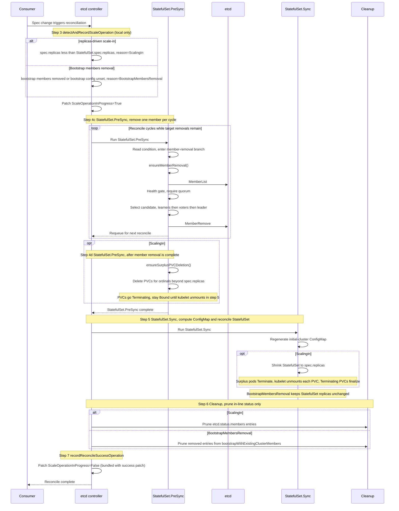
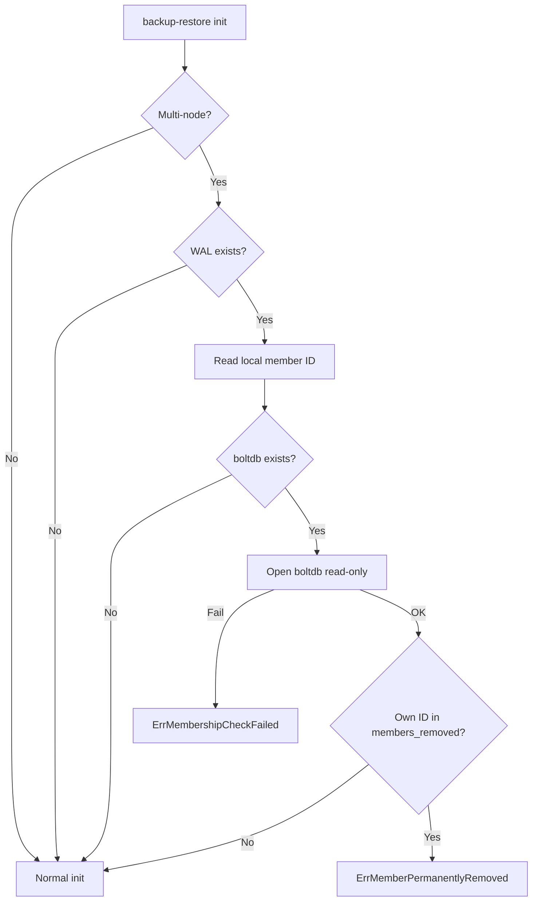

# DEP-08: Scaling-in a multi-node etcd cluster managed by `etcd-druid`

## Summary

This proposal introduces safe scale-in support for multi-node etcd clusters managed by `etcd-druid`, enabling a cluster to shrink without risking quorum loss or leaving etcd membership in an inconsistent state.

Today, `etcd-druid` blocks any decrease of `etcd.spec.replicas` other than to zero (hibernation), so operators have no declarative way to shrink an HA cluster.

The user experience is symmetric with scale-out: declarative, quorum-safe, and free of `etcdctl` intervention.

## Terminology

- **bootstrap-with-existing-cluster** — joining etcd members to an existing source cluster, and later removing those members. Defined by [GEP-0039](https://github.com/gardener/enhancements/tree/main/geps/0039-live-control-plane-migration) and introduced into `etcd-druid` by [PR #1364](https://github.com/gardener/etcd-druid/pull/1364). The "remove source members" half is one of the two flows this DEP supports.
- **`members_removed` bucket** — the boltdb bucket inside each etcd member's local data directory. etcd writes a member's ID into this bucket when `MemberRemove` is applied. This DEP's anti-rejoin guard reads it to distinguish a permanently removed member from one that should be re-added during scale-out.
- **scale-in** — any reduction of the live etcd cluster's voting-member count. Covers both `etcd.spec.replicas`-driven shrinks and removal of source members joined via `bootstrapWithExistingCluster`.
- **`ScaleOperationInProgress` condition** — a status condition on the `Etcd` resource introduced by this DEP. `True` with reason `ScalingIn` / `ScalingOut` / `BootstrapMembersRemoval` while the operation is active; `False` otherwise. Used both as the admission-time gate (via CEL) and as the in-flight handoff between reconcile steps.
- **`StatefulSet.PreSync`** — the existing pre-reconcile hook in `etcd-druid`'s StatefulSet component that runs before the StatefulSet is created or updated.
- **quorum-safe removal** — a member removal that leaves the cluster with at least `⌊N/2⌋ + 1` healthy voting members after the removal, where `N` is the post-removal voting-member count.
- **WAL** — etcd's write-ahead log, stored in each member's local data directory. Its metadata records the local member's ID, which the anti-rejoin guard reads to look up its own entry in `members_removed`.

## Motivation

Two distinct use cases drive scale-in support, and `etcd-druid` fails operators in both today:

1. **`etcd.spec.replicas`-driven scale-in.** Reverting a temporary scale-out, or shrinking a cluster provisioned for peak load. The current CEL admission rule rejects any `replicas` decrease (other than to zero for hibernation), so there is no declarative path to remove members and resize the StatefulSet without risking quorum.

2. **Removing source members joined via `bootstrapWithExistingCluster`.** After [PR #1364](https://github.com/gardener/etcd-druid/pull/1364) joins the destination to a source cluster, the operator decommissions source members by removing them from `etcd.spec.etcd.bootstrapWithExistingCluster.members`. Without this DEP that final step has no declarative path. See [GEP-0039 — Member removal from the cluster](https://github.com/gardener/enhancements/tree/main/geps/0039-live-control-plane-migration#member-removal-from-the-cluster) for the full sequence.

Both reduce to the same shape: a declarative signal that the cluster should shrink, and a controller that removes members safely before the StatefulSet changes. This proposal exposes one mechanism that handles both.

## Goals

* Provide a declarative, safe scale-in path via the `Etcd` API.
* Guarantee quorum and availability throughout the operation.
* Prevent removed members from rejoining (pod restart / PVC reuse).
* Support both `replicas`-driven scale-in and removal of source members joined via `bootstrapWithExistingCluster`.
* Maintain full backward compatibility for single-node clusters and hibernation.

## Non-Goals

* Hibernation (`replicas: N → 0`): remains handled by the existing hibernation flow.
* Single-node etcd clusters: scale-in does not apply — there is no quorum-safe path to remove the sole member.
* Exposing member removal via any externally callable surface (EtcdOpsTask, HTTP endpoint, CLI subcommand, Job). Member removal is internal to the controller and cannot be safely invoked outside the reconciler's coordination.

## Proposal

### Approach

Scale-in is orchestrated by `etcd-druid` through the existing `etcd` controller (`internal/controller/etcd`). The process is driven by changes to the `Etcd` resource, and progress is tracked explicitly through the `ScaleOperationInProgress` status condition to ensure deterministic coordination across reconcile cycles.

It aims to achieve safe scale-in by:

- Removing etcd members one per reconcile cycle, in a quorum-safe order, before the underlying StatefulSet is shrunk.
- Deleting freed PVCs during `StatefulSet.PreSync`, after etcd membership has converged, and allowing them to finalize when `StatefulSet.Sync` terminates the surplus pods.
- Preventing removed members from silently rejoining by adding an anti-rejoin guard in `etcd-backup-restore`.

Scale-in is triggered when:

- An operator decreases `etcd.spec.replicas`, or
- An operator removes member entries from `etcd.spec.etcd.bootstrapWithExistingCluster.members` or unsets `etcd.spec.etcd.bootstrapWithExistingCluster`.

### Prerequisites

* The etcd cluster must be running with all members healthy and quorum intact at the start of scale-in. If quorum is already lost, scale-in does not run — the cluster must be restored to a healthy state first.

### `etcd-druid` changes

This section describes the status, validation, and reconcile-flow changes required in `etcd-druid`.

#### Status condition

A new `ScaleOperationInProgress` condition is introduced in `etcd.status.conditions` to track scale operations. The `etcd` controller sets it to `True` when scale work starts and clears it on successful completion.

| Type                       | Status | Reason                    | Description |
|----------------------------|--------|---------------------------|-------------|
| `ScaleOperationInProgress` | True   | ScalingIn                 | `etcd.spec.replicas`-driven scale-in in progress |
| `ScaleOperationInProgress` | True   | BootstrapMembersRemoval   | Removing source members joined via `bootstrapWithExistingCluster` |
| `ScaleOperationInProgress` | True   | ScalingOut                | Scale-out in progress (set by [DEP-03](https://github.com/gardener/etcd-druid/blob/master/docs/proposals/03-scaling-up-an-etcd-cluster.md)) |
| `ScaleOperationInProgress` | False  | —                         | No scale operation in progress |

The condition is used by:

- CEL validation rules to reject conflicting concurrent scale changes.
- `StatefulSet.PreSync` to decide whether to run the member-removal branch.


#### CEL validation rules

The existing [field-level rule that blocks `replicas` decreases](https://github.com/gardener/etcd-druid/blob/master/api/core/v1alpha1/etcd.go#L385) will be removed so that multi-node clusters can be scaled in declaratively. Hibernation (`replicas: N → 0`) remains covered by the existing hibernation flow.

New object-level CEL rules will guard conflicting operations using the `ScaleOperationInProgress` condition. A `replicas` decrease while `bootstrapWithExistingCluster` is set is treated as a normal `ScalingIn`; bootstrap-member removal is a separate operation and must not run concurrently with scale-in or scale-out.

| User action | Allowed when | Rejected when |
|-------------|--------------|---------------|
| Increase `spec.replicas` | No `ScalingIn` or `BootstrapMembersRemoval` is in progress | `ScaleOperationInProgress=True` with reason `ScalingIn` or `BootstrapMembersRemoval` |
| Decrease `spec.replicas` | No `ScalingOut` or `BootstrapMembersRemoval` is in progress | `ScaleOperationInProgress=True` with reason `ScalingOut` or `BootstrapMembersRemoval` |
| Remove entries from `spec.etcd.bootstrapWithExistingCluster.members` | No `ScalingIn` or `ScalingOut` is in progress | `ScaleOperationInProgress=True` with reason `ScalingIn` or `ScalingOut` |
| Unset `spec.etcd.bootstrapWithExistingCluster` | No `ScalingIn` or `ScalingOut` is in progress | `ScaleOperationInProgress=True` with reason `ScalingIn` or `ScalingOut` |

This gives consumers an immediate admission rejection instead of accepting conflicting changes that would only requeue or fail later in reconciliation.

```go
// REMOVED from the Replicas field:
// +kubebuilder:validation:XValidation:message="Replicas can either be increased or be downscaled to 0.",rule="self==0 ? true : self < oldSelf ? false : true"

// ADDED at the Etcd type level:
// +kubebuilder:validation:XValidation:message="Cannot scale out while a scale-in or bootstrap members removal is in progress.",rule="self.spec.replicas > oldSelf.spec.replicas ? !self.status.conditions.exists(c, c.type == 'ScaleOperationInProgress' && c.status == 'True' && (c.reason == 'ScalingIn' || c.reason == 'BootstrapMembersRemoval')) : true"
// +kubebuilder:validation:XValidation:message="Cannot scale in while a scale-out or bootstrap members removal operation is in progress.",rule="self.spec.replicas < oldSelf.spec.replicas ? !self.status.conditions.exists(c, c.type == 'ScaleOperationInProgress' && c.status == 'True' && (c.reason == 'ScalingOut' || c.reason == 'BootstrapMembersRemoval')) : true"
// +kubebuilder:validation:XValidation:message="Cannot remove bootstrap members while scale-in or scale-out is in progress.",rule="has(oldSelf.spec.etcd.bootstrapWithExistingCluster) && has(self.spec.etcd.bootstrapWithExistingCluster) && self.spec.etcd.bootstrapWithExistingCluster.members != oldSelf.spec.etcd.bootstrapWithExistingCluster.members ? !self.status.conditions.exists(c, c.type == 'ScaleOperationInProgress' && c.status == 'True' && (c.reason == 'ScalingIn' || c.reason == 'ScalingOut')) : true"
// +kubebuilder:validation:XValidation:message="Cannot unset bootstrapWithExistingCluster while scale-in or scale-out is in progress.",rule="has(oldSelf.spec.etcd.bootstrapWithExistingCluster) && !has(self.spec.etcd.bootstrapWithExistingCluster) ? !self.status.conditions.exists(c, c.type == 'ScaleOperationInProgress' && c.status == 'True' && (c.reason == 'ScalingIn' || c.reason == 'ScalingOut')) : true"
```

#### Reconcile flow

The `etcd` controller reconciliation is extended with a scale-operation detection step, a member-removal branch in `StatefulSet.PreSync`, and status cleanup for removed members. Existing reconciliation steps continue to run in the same order. The `ScaleOperationInProgress=False` update is folded into `recordReconcileSuccessOperation`, so completing scale-in does not require an additional status patch.

```
reconcileSpec()
  1. recordReconcileStartOperation
  2. ensureFinalizer
  3. detectAndRecordScaleOperation       — NEW: reconciler patches Status.ScaleOperationInProgress
  4. preSyncEtcdResources
       → StatefulSet.PreSync():
            a. Pre-hibernation snapshot   (existing)
            b. Pre-upgrade snapshot       (existing)
            c. Scale-in member removal    — NEW: at most one removal per reconcile cycle
                 - ensureMemberRemoval()  via etcd v3 client
                 - next reconcile health-checks, picks next candidate
            d. PVC deletion               — NEW: ScalingIn only; runs once after the
                                                 final removal in this reconcile cycle.
                                                 Issues Delete for each PVC of an ordinal
                                                 beyond spec.replicas. Each PVC enters
                                                 Terminating immediately but stays Bound
                                                 until step 5 unmounts it.
  5. syncEtcdResources
       → ConfigMap.Sync()                  regenerate initial-cluster
       → StatefulSet.Sync()                reconcile StatefulSet
  6. cleanupEtcdResources
       → cleanupRemovedMembers()          — NEW: prune Status.Members[] entries for
                                                 removed members. For BootstrapMembersRemoval,
                                                 prune the just-removed entries from
                                                 status.bootstrapWithExistingClusterMembers.
  7. recordReconcileSuccessOperation
       → Patch Status.ScaleOperationInProgress=False (existing patch already runs here)
```

The Mermaid diagram below shows the scale-in control flow. The existing pre-hibernation and pre-upgrade snapshot steps remain in `StatefulSet.PreSync`, but are omitted because they are not changed by this proposal.



The relevant additions are described below. Existing steps (1–2, 4a–4b, 5) are unchanged and not described here.

##### Detection (Step 3)

`detectAndRecordScaleOperation` runs after `ensureFinalizer` and decides the active scale operation by comparing `etcd.spec` against the existing `StatefulSet.spec` and `etcd.status`. It does not query the etcd cluster (no `MemberList()` call), so detection cannot be blocked by a transient etcd outage.

| Signal | Condition update |
|--------|------------------|
| `etcd.spec.replicas < StatefulSet.spec.replicas` | `ScaleOperationInProgress=True`, reason `ScalingIn` |
| `etcd.spec.replicas > StatefulSet.spec.replicas` | `ScaleOperationInProgress=True`, reason `ScalingOut` |
| `bootstrapWithExistingCluster` is unset, or joined bootstrap members are removed from spec | `ScaleOperationInProgress=True`, reason `BootstrapMembersRemoval` |
| No scale signal is present | `ScaleOperationInProgress=False` |

The condition is patched before component reconciliation starts, allowing CEL validation to reject conflicting changes while the operation is in progress.

##### Member removal in `StatefulSet.PreSync` (Step 4c)

`StatefulSet.PreSync` calls `ensureMemberRemoval` for `ScalingIn` and `BootstrapMembersRemoval`.

Scale-in introduces direct etcd member removal from `etcd-druid` using an etcd v3 client. `ensureMemberRemoval` connects through the corresponding Etcd cluster's Kubernetes etcd client Service and uses client TLS credentials from the configured secret when client TLS is enabled. It uses the etcd client `MemberList()` API for membership discovery and removes at most one member per reconcile cycle with the etcd client `MemberRemove(id)` API. Each cycle recomputes the target set, so the operation can safely resume after controller restarts.

The removal sequence is:

1. Verify that removing another member keeps quorum intact.
2. Recompute the members to remove:
   - `ScalingIn`: members with pod ordinal `≥ spec.replicas`.
   - `BootstrapMembersRemoval`: joined bootstrap members no longer present in spec, or all joined bootstrap members when `bootstrapWithExistingCluster` is unset.
3. Select the next candidate: learners first, then non-leader voters, and the leader last if it is part of the removal set.
4. Call the etcd client `MemberRemove(id)` API and requeue so the next reconcile observes the updated cluster state.

Serial removal is intentional. It avoids parallel membership changes in the same etcd cluster and gives the cluster one reconcile cycle to stabilize between removals. Conditions, events, and logs should reference member names; member IDs remain internal to the helper.

##### PVC deletion in `StatefulSet.PreSync` (Step 4d)

**This step runs only for `ScalingIn`**, since only an `etcd.spec.replicas` decrease frees PVCs that the controller owns. `BootstrapMembersRemoval` does not delete PVCs because the removed members belong to the source etcd cluster.

For `ScalingIn`, PVC deletion starts only after etcd membership has converged to the target set.

For each ordinal `i ≥ spec.replicas`, the controller derives the PVC name from `StatefulSet.Spec.VolumeClaimTemplates[*].Name` and the StatefulSet pod-ordinal naming convention (`{vctName}-{stsName}-{i}`), then issues an idempotent delete request.

The surplus pods still mount these PVCs, so the PVCs enter `Terminating` but remain `Bound`. They finalize when `StatefulSet.Sync` shrinks the StatefulSet and the kubelet unmounts them. If the controller restarts in between, the PVC deletion intent remains durable through `deletionTimestamp`.

##### Status cleanup (Step 6)

Cleanup prunes status entries for removed members:

- `ScalingIn`: remove `etcd.status.members` entries with pod ordinal `≥ spec.replicas`.
- `BootstrapMembersRemoval`: remove the corresponding entries from `etcd.status.bootstrapWithExistingClusterMembers`.

##### Clear condition (Step 7)

`recordReconcileSuccessOperation` includes the `ScaleOperationInProgress=False` update in its existing status patch.

### `etcd-backup-restore` changes

#### Anti-rejoin guard

##### Problem

During scale-in, `etcd-druid` removes an etcd member from the cluster before the corresponding StatefulSet pod is terminated. In that short window, the pod can still restart with its old data directory.

Without a guard, `etcd-backup-restore` interprets the state *"this pod has local etcd data, but its member ID is not present in the live cluster"* as a scale-out case and re-adds the removed member as a learner. The controller removes it again, the same pod re-adds itself, and the cluster enters a remove/re-add loop.

##### Proposed solution

`etcd-backup-restore` adds a startup guard before the learner-add path. The guard checks whether the local etcd member was already removed from the cluster. If so, startup stops with `ErrMemberPermanentlyRemoved` instead of re-adding the member.

etcd records removed member IDs in the local boltdb `members_removed` bucket when `MemberRemove` is applied. `etcd-backup-restore` can use this record to distinguish a permanently removed member from a member that should be added back as part of scale-out.

The startup check is:

The guard inspects two on-disk artefacts of the local etcd data directory: the **WAL** — which records the local member's ID — and the boltdb backend's **`members_removed`** bucket. If the local member's own ID appears in `members_removed`, the cluster has explicitly removed it and the sidecar must not re-add it.



The check is deliberately conservative:

- If the WAL is missing, there is no local member ID to check, so normal initialization continues.
- If the boltdb file is missing, normal initialization continues through the existing path.
- If boltdb exists but cannot be opened, startup fails closed with `ErrMembershipCheckFailed`.
- If the local member's own ID is present in `members_removed`, startup fails with `ErrMemberPermanentlyRemoved`.

Only the local member's own ID is considered. Entries for other removed members are ignored.

The check opens boltdb read-only via `mmap` and reads only the small membership buckets (`members` and `members_removed`), so the runtime and memory overhead is negligible. This follows the same access pattern already used by `etcd-backup-restore`'s data validator.

## Alternatives

Each alternative below adds an externally callable surface for member removal. Each is rejected for a different primary reason, but they share a common concern:

**Shared concern.** Member removal is irreversible and breaks quorum if misapplied. Exposing it via any external surface (CRD, HTTP, CLI) means any caller with access can invoke it outside the controller's coordination — unlike snapshots or defragmentation, which are safe to run independently.

1. **`RemoveMembers` EtcdOpsTask with Job runner.** Reuse [DEP-05](https://github.com/gardener/etcd-druid/blob/master/docs/proposals/05-etcdopstask.md)'s lifecycle (audit, FIFO, dedup, TTL GC) and run `etcdbrctl member-remove` in a Job. **Rejected because:** [DEP-05](https://github.com/gardener/etcd-druid/blob/master/docs/proposals/05-etcdopstask.md) defines out-of-band tasks as those "executed without modifying the Etcd spec." Scale-in is triggered by `spec.replicas` changes — by DEP-05's own definition it is in-band. An OpsTask path also exposes a `druidctl` counterpart that races the reconciler with no admission-time gate.

2. **HTTP `/member/remove` on backup-restore.** **Rejected because:** backup-restore is a per-member sidecar with local-scope endpoints. A cluster-wide mutation endpoint changes its architectural role and exposes a destructive operation to anyone with pod network access.

3. **`etcdbrctl member-remove` subcommand.** **Rejected because:** no safe standalone use case — cannot be invoked outside the controller's coordination without risking quorum. Shipping it still exposes the capability via `kubectl exec`.

---

## References

### Gardener / `etcd-druid`
- [DEP-03: Scaling Up an etcd Cluster](https://github.com/gardener/etcd-druid/blob/master/docs/proposals/03-scaling-up-an-etcd-cluster.md) — existing scale-out behavior and `ScalingOut` condition reason.
- [DEP-05: Operator Out-of-band Tasks](https://github.com/gardener/etcd-druid/blob/master/docs/proposals/05-etcdopstask.md) — context for the rejected `EtcdOpsTask` alternative.
- [GEP-0039: Live Control Plane Migration](https://github.com/gardener/enhancements/tree/main/geps/0039-live-control-plane-migration) — live CPM context and source-member removal requirement.
- [Issue #1239 — Support for bootstrapping with existing etcd cluster](https://github.com/gardener/etcd-druid/issues/1239) — original bootstrap-with-existing-cluster requirement.
- [PR #1364 — Add support for bootstrapping with an existing etcd cluster](https://github.com/gardener/etcd-druid/pull/1364) — introduces `spec.etcd.bootstrapWithExistingCluster` and joined-member status used by this proposal.
- [Existing CEL rule blocking scale-in](https://github.com/gardener/etcd-druid/blob/7a5ac3182/api/core/v1alpha1/etcd.go#L385)
- [`Etcd` type declaration for object-level CEL rules](https://github.com/gardener/etcd-druid/blob/7a5ac3182/api/core/v1alpha1/etcd.go#L58-L62)
- [`reconcileSpec` orchestration](https://github.com/gardener/etcd-druid/blob/7a5ac3182/internal/controller/etcd/reconcile_spec.go#L28-L48)

### etcd internals (v3.5.27)
- [`server.go` — `RemoveMember` quorum checks](https://github.com/etcd-io/etcd/blob/v3.5.27/server/etcdserver/server.go#L1721-L1738)
- [`store.go` — removed member IDs are written to `members_removed`](https://github.com/etcd-io/etcd/blob/v3.5.27/server/etcdserver/api/membership/store.go#L71-L123)
- [`bucket.go` — `members` and `members_removed` bucket definitions](https://github.com/etcd-io/etcd/blob/v3.5.27/server/mvcc/buckets/bucket.go#L31-L49)
- [`storage.go` — WAL metadata contains the local member ID](https://github.com/etcd-io/etcd/blob/v3.5.27/server/etcdserver/storage.go#L117-L121)
