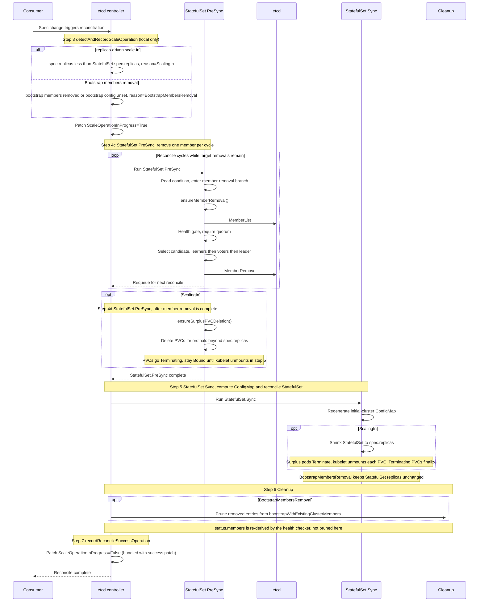
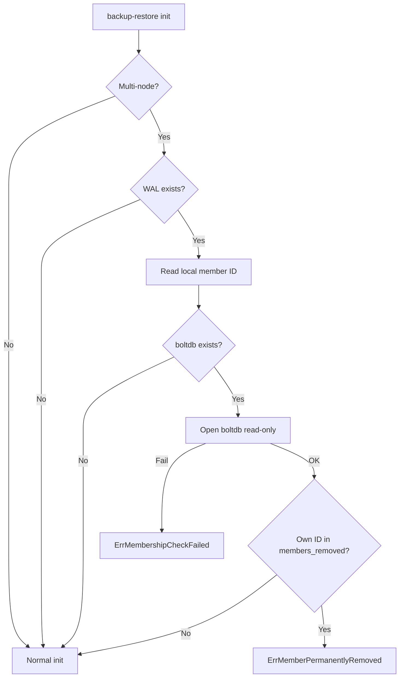

# DEP-08: Scaling-in a multi-node etcd cluster managed by `etcd-druid`

## Summary

Today, `etcd-druid` blocks any decrease of `etcd.spec.replicas` other than to zero, so operators have no declarative way to shrink a multi-node etcd cluster.

This proposal introduces safe scale-in support for multi-node etcd clusters managed by `etcd-druid`, enabling a cluster to shrink without risking quorum loss or leaving etcd membership in an inconsistent state. The user experience is symmetric with scale-out: declarative, quorum-safe, and free of `etcdctl` intervention.

## Terminology

- **bootstrap-with-existing-cluster** — the mechanism by which a new `Etcd` joins an existing etcd cluster instead of forming its own. See [Bootstrap with an Existing etcd Cluster](../concepts/bootstrap-with-existing-cluster.md).

## Motivation

`etcd-druid` supports scaling an etcd cluster *out* declaratively, but not *in*: the current admission rule rejects any decrease of `etcd.spec.replicas` other than to zero. Operators therefore have no safe, declarative way to shrink a multi-node cluster. Two concrete use cases need this.

### Use cases

**1. Shrinking an over-provisioned HA cluster.**
An operator who scaled a cluster out — either temporarily for a load spike, or because it was originally provisioned for peak load — needs to reduce it back (for example 5 → 3) by lowering `etcd.spec.replicas`, and have `etcd-druid` remove the surplus members and resize the cluster without running `etcdctl` or risking quorum. Today this is impossible: any non-zero decrease of `etcd.spec.replicas` is rejected at admission.

**2. Completing a live control-plane migration.**
An operator migrating an etcd cluster between seeds without downtime, once the destination members have joined the source cluster (via `bootstrapWithExistingCluster`), needs to decommission the source members declaratively — by removing them from `etcd.spec.etcd.bootstrapWithExistingCluster.members` — so the cluster ends up running only on the destination. Today this final removal step has no declarative path. See [GEP-0039 — Member removal from the cluster](https://github.com/gardener/enhancements/tree/main/geps/0039-live-control-plane-migration#member-removal-from-the-cluster) for the full migration sequence.

Both reduce to the same shape: a declarative signal that the cluster should shrink, and a controller that removes members from the etcd cluster in `StatefulSet.PreSync` — before `StatefulSet.Sync` lowers the StatefulSet's replica count. This proposal exposes one mechanism that handles both.

This ordering, not the StatefulSet update strategy, is what makes scale-in safe. `UpdateStrategy` (`RollingUpdate` vs `OnDelete`) governs how pod-*template* changes roll out; it does not gate a replica decrease — the StatefulSet controller removes the highest-ordinal pods by ordinal under either strategy. Scale-in therefore needs no change to the current `RollingUpdate` strategy: the guarantee comes from member removal in `PreSync` completing before the replica count drops in `Sync`.

## Goals

* Provide a declarative, safe scale-in path via the `Etcd` API, covering both triggers: an `etcd.spec.replicas` decrease and removal of source members joined via `bootstrapWithExistingCluster`.
* Guarantee quorum and availability throughout the operation.
* Ensure a removed member cannot silently rejoin the cluster afterwards — even if its pod later restarts with stale data on a reused PVC.

## Non-Goals

* Scaling `replicas` to `0` (`replicas: N → 0`) — a distinct operation, out of scope for this DEP.
* Single-node etcd clusters — no quorum-safe path to remove the sole member.
* Exposing member removal via any externally callable surface (EtcdOpsTask, HTTP endpoint, CLI subcommand, Job). Member removal is a sensitive operation that must remain internal to the controller's reconciliation flow. Exposing it as an external API would make it easy to leave the cluster below quorum, or hard to recover, through incorrect or ill-timed invocation.

## Proposal

### Approach

Scale-in is orchestrated by `etcd-druid` through the existing `etcd` controller (`internal/controller/etcd`). The process is driven by changes to the `Etcd` resource, and progress is tracked explicitly through the `ScaleOperationInProgress` status condition to ensure deterministic coordination across reconcile cycles.

It aims to achieve safe scale-in by:

- Removing etcd members one per reconcile cycle, in a quorum-safe order, before the underlying StatefulSet is shrunk.
- Deleting freed PVCs during `StatefulSet.PreSync`, after etcd membership has converged, and allowing them to finalize when `StatefulSet.Sync` terminates the surplus pods.
- Preventing removed members from silently rejoining by adding an anti-rejoin guard in `etcd-backup-restore`.

Scale-in is triggered when:

- An operator decreases `etcd.spec.replicas`, or
- An operator removes member entries from `etcd.spec.etcd.bootstrapWithExistingCluster.members` or unsets `etcd.spec.etcd.bootstrapWithExistingCluster`.

### Prerequisites

* The etcd cluster should be running with all members healthy and quorum intact for scale-in to make progress. If quorum is not intact, the controller still records the scale operation but withholds every `MemberRemove`: the per-cycle quorum-safety check keeps requeuing with backoff until the cluster recovers, so no member is removed while quorum is degraded. The operator can either wait for quorum to be restored or declaratively roll back the change (increase `spec.replicas` / restore the bootstrap members again).

### `etcd-druid` changes

This section describes the status, validation, and reconcile-flow changes required in `etcd-druid`.

#### Status condition

##### Why this condition is required

Scale-in removes etcd members one at a time before the StatefulSet is shrunk. Consider a `3 → 2` scale-in: the controller removes a member from the etcd cluster, but the StatefulSet has not yet been reduced. If a `2 → 3` scale-out lands in this window, the cluster is left in a conflicting state — a member has already been removed from etcd, yet `spec.replicas` is back to `3`. Looking only at `spec.replicas` and the StatefulSet replica count is no longer enough to decide whether the controller should finish the in-flight scale-in or treat the missing member as a fresh scale-out target. The safe behaviour is to **let an in-flight scale-in (or scale-out) complete and reject the opposite-direction scaling until it does**.

To enforce this at admission time without introducing an admission webhook, the controller records an explicit `ScaleOperationInProgress` condition on the `Etcd` resource before starting membership-changing work, and CEL validation rules on the CRD reject an opposite-direction change while that condition is set. The condition is therefore both the admission-time gate (read by CEL) and the in-flight signal (read by `StatefulSet.PreSync`). The admission gate is best-effort — see [Admission gate is best-effort; the controller is the guarantee](#admission-gate-is-best-effort-the-controller-is-the-guarantee) below for how the controller closes the remaining window.

A new `ScaleOperationInProgress` condition is introduced in `etcd.status.conditions` to track scale operations. The `etcd` controller sets it to `True` when scale work starts and clears it on successful completion.

| Type                       | Status | Reason                    | Description |
|----------------------------|--------|---------------------------|-------------|
| `ScaleOperationInProgress` | True   | ScalingIn                 | `etcd.spec.replicas`-driven scale-in in progress |
| `ScaleOperationInProgress` | True   | BootstrapMembersRemoval   | Removing source members joined via `bootstrapWithExistingCluster` |
| `ScaleOperationInProgress` | True   | ScalingOut                | Scale-out in progress — set so the admission gate can reject a scale-in that races an in-flight scale-out (see below) |
| `ScaleOperationInProgress` | False  | —                         | No scale operation in progress |

The condition is used by:

- CEL validation rules to reject conflicting concurrent scale changes.
- `StatefulSet.PreSync` to decide whether to run the member-removal branch.

The `ScalingOut` reason does not change the existing scale-out mechanics from [DEP-03](https://github.com/gardener/etcd-druid/blob/master/docs/proposals/03-scaling-up-an-etcd-cluster.md). Scale-out remains driven by a `spec.replicas` increase; new members join as learners via the `etcd-backup-restore` sidecar. The reason is introduced as a coordination marker for the symmetric admission gate: while a scale-out is in flight, a racing scale-in must be rejected for the same conflict reason described above. The controller therefore records `ScalingOut` for CEL to read, while the actual scale-out flow remains unchanged.


#### CEL validation rules

The existing [field-level rule that blocks `replicas` decreases](https://github.com/gardener/etcd-druid/blob/master/api/core/v1alpha1/etcd.go#L385) will be removed so that multi-node clusters can be scaled in declaratively. Scaling to `replicas: 0` remains handled by the existing `replicas → 0` code path (see Non-Goals) and is unaffected by the new rules, which apply only when both `self.spec.replicas > 0` and `oldSelf.spec.replicas > 0`.

New object-level CEL rules will guard conflicting operations using the `ScaleOperationInProgress` condition. A `replicas` decrease while `bootstrapWithExistingCluster` is set is treated as a normal `ScalingIn`; bootstrap-member removal is tracked as a distinct operation and is not run concurrently with scale-in or scale-out.

This serialization is **not** a quorum guard — quorum is already protected on every removal by etcd's own `MemberRemove` admission check and by the controller's per-cycle quorum-safety check, which remove at most one member per reconcile. It is a state-machine constraint: this DEP intentionally models one active membership-changing operation per `Etcd` resource. Supporting interleaved scale-in, scale-out, and bootstrap-member removal would require richer operation state, target-set tracking, recovery semantics, and cross-step conflict resolution. That complexity is unnecessary for the requested flows, so the operations are serialized rather than interleaved. Note these CEL rules are scoped to a single `Etcd` resource; when a cluster's members are split across two `Etcd` resources (as during a live migration), cross-resource quorum is not coordinated by admission but by one-member-per-cycle removal, etcd's own removal check, and the anti-rejoin guard.

| User action | Allowed when | Rejected when |
|-------------|--------------|---------------|
| Increase `spec.replicas` | No `ScalingIn` or `BootstrapMembersRemoval` is in progress | `ScaleOperationInProgress=True` with reason `ScalingIn` or `BootstrapMembersRemoval` |
| Decrease `spec.replicas` | No `ScalingOut` or `BootstrapMembersRemoval` is in progress | `ScaleOperationInProgress=True` with reason `ScalingOut` or `BootstrapMembersRemoval` |
| Remove entries from `spec.etcd.bootstrapWithExistingCluster.members` | No `ScalingIn` or `ScalingOut` is in progress | `ScaleOperationInProgress=True` with reason `ScalingIn` or `ScalingOut` |
| Unset `spec.etcd.bootstrapWithExistingCluster` | No `ScalingIn` or `ScalingOut` is in progress | `ScaleOperationInProgress=True` with reason `ScalingIn` or `ScalingOut` |

This gives consumers an immediate admission rejection instead of accepting conflicting changes that would only requeue or fail later in reconciliation.

##### Admission gate is best-effort; the controller is the guarantee

The condition is set by the controller during reconciliation, *after* the triggering spec change has already been admitted. There is therefore a small window between the spec change being persisted and the controller writing `ScaleOperationInProgress=True`. A conflicting opposite-direction change that arrives inside this window is not yet visible to CEL and can be admitted. The CEL rules are therefore a fast-fail guardrail, not the correctness boundary.

The controller closes this window at the point where it matters — just before it removes a member. Member removal runs in `StatefulSet.PreSync`, which executes **before** `StatefulSet.Sync` patches the StatefulSet's `spec.replicas` from `etcd.spec.replicas`. So at removal time the live `StatefulSet.spec.replicas` still holds the observed cluster size from before the StatefulSet sync, while `etcd.spec.replicas` holds the latest requested size. Before removing any member, the controller re-fetches both objects and compares them in the context of the recorded operation:

- If `ScaleOperationInProgress=True` with reason `ScalingIn`, member removal proceeds only when `etcd.spec.replicas < StatefulSet.spec.replicas`.
- If `ScaleOperationInProgress=True` with reason `ScalingOut`, the scale-out path proceeds only when `etcd.spec.replicas > StatefulSet.spec.replicas`.
- If `etcd.spec.replicas == StatefulSet.spec.replicas`, there is no longer an observable replica-count delta. In the admission-window race case, this means the spec was reverted to the pre-operation count (for example `3 → 2 → 3`) before any destructive membership change started. The controller aborts the recorded operation, clears `ScaleOperationInProgress`, and requeues.
- If the latest replica comparison points in the opposite direction from the recorded reason, an opposite-direction update landed inside the CEL window. The controller must not continue the recorded operation. It aborts the recorded operation, clears or recomputes `ScaleOperationInProgress`, and requeues so the latest desired operation is handled separately. No member is removed in this reconcile.

For `BootstrapMembersRemoval`, the same principle applies, but the guard revalidates the latest `spec.etcd.bootstrapWithExistingCluster` against the observed joined bootstrap members instead of comparing replica counts. If the bootstrap-member removal request was reverted before `MemberRemove`, no member is removed and the condition is cleared or recomputed.

Because detection and this guard are re-evaluated every reconcile against observed state (level-triggered), a revert or opposite-direction update inside the CEL window converges without any member wrongly removed and without a stale condition left behind. The CEL rules handle the common case fast; this controller check is what makes the design correct regardless of the window.

```go
// REMOVED from the Replicas field:
// +kubebuilder:validation:XValidation:message="Replicas can either be increased or be downscaled to 0.",rule="self==0 ? true : self < oldSelf ? false : true"

// ADDED at the Etcd type level. The two replica-direction rules are gated on
// both self.spec.replicas > 0 and oldSelf.spec.replicas > 0 so that transitions
// to/from 0 (the replicas -> 0 path and wake-up) are never blocked.
// +kubebuilder:validation:XValidation:message="Cannot scale out while a scale-in or bootstrap members removal is in progress.",rule="(self.spec.replicas > oldSelf.spec.replicas && self.spec.replicas > 0 && oldSelf.spec.replicas > 0) ? !self.status.conditions.exists(c, c.type == 'ScaleOperationInProgress' && c.status == 'True' && (c.reason == 'ScalingIn' || c.reason == 'BootstrapMembersRemoval')) : true"
// +kubebuilder:validation:XValidation:message="Cannot scale in while a scale-out or bootstrap members removal operation is in progress.",rule="(self.spec.replicas < oldSelf.spec.replicas && self.spec.replicas > 0 && oldSelf.spec.replicas > 0) ? !self.status.conditions.exists(c, c.type == 'ScaleOperationInProgress' && c.status == 'True' && (c.reason == 'ScalingOut' || c.reason == 'BootstrapMembersRemoval')) : true"
// +kubebuilder:validation:XValidation:message="Cannot remove bootstrap members while scale-in or scale-out is in progress.",rule="has(oldSelf.spec.etcd.bootstrapWithExistingCluster) && has(self.spec.etcd.bootstrapWithExistingCluster) && self.spec.etcd.bootstrapWithExistingCluster.members != oldSelf.spec.etcd.bootstrapWithExistingCluster.members ? !self.status.conditions.exists(c, c.type == 'ScaleOperationInProgress' && c.status == 'True' && (c.reason == 'ScalingIn' || c.reason == 'ScalingOut')) : true"
// +kubebuilder:validation:XValidation:message="Cannot unset bootstrapWithExistingCluster while scale-in or scale-out is in progress.",rule="has(oldSelf.spec.etcd.bootstrapWithExistingCluster) && !has(self.spec.etcd.bootstrapWithExistingCluster) ? !self.status.conditions.exists(c, c.type == 'ScaleOperationInProgress' && c.status == 'True' && (c.reason == 'ScalingIn' || c.reason == 'ScalingOut')) : true"
```

#### Reconcile flow

The `etcd` controller reconciliation is extended with a scale-operation detection step, a member-removal branch in `StatefulSet.PreSync`, and bootstrap-member status cleanup where the removed-member status is not otherwise re-derived. Existing reconciliation steps continue to run in the same order. The `ScaleOperationInProgress=False` update is folded into `recordReconcileSuccessOperation`, so completing scale-in does not require an additional status patch.

The `ScaleOperationInProgress` condition is written by the spec-reconcile flow — set as the operation starts and cleared as it completes — rather than by the eventually-consistent status-reconcile flow. This is deliberate: the condition is an operation-lifecycle marker (like `LastOperation`), and, more importantly, the CEL admission rules can only reject a conflicting update if the condition is already persisted. Writing it asynchronously in the status flow would widen the admission window described above. By contrast, `etcd.status.members` is a health observation owned by the status-reconcile flow and is not touched here (see [Status cleanup](#status-cleanup-step-6)).

```
reconcileSpec()
  1. recordReconcileStartOperation
  2. ensureFinalizer
  3. detectAndRecordScaleOperation       — NEW: reconciler patches Status.ScaleOperationInProgress
  4. preSyncEtcdResources
       → StatefulSet.PreSync():
            a. Pre-hibernation snapshot   (existing)
            b. Pre-upgrade snapshot       (existing)
            c. Scale-in member removal    — NEW: at most one removal per reconcile cycle
                 - ensureMemberRemoval()  via etcd v3 client
                 - next reconcile health-checks, picks next candidate
            d. PVC deletion               — NEW: ScalingIn only; runs once after the
                                                 final removal in this reconcile cycle.
                                                 Issues Delete for each PVC of an ordinal
                                                 beyond spec.replicas. Each PVC enters
                                                 Terminating immediately but stays Bound
                                                 until step 5 unmounts it.
  5. syncEtcdResources
       → ConfigMap.Sync()                  regenerate initial-cluster
       → StatefulSet.Sync()                reconcile StatefulSet
  6. cleanupEtcdResources
       → BootstrapMembersRemoval only: prune the just-removed entries from
                                                 status.bootstrapWithExistingClusterMembers.
                                                 (status.members is re-derived by the
                                                 health checker, not pruned here.)
  7. recordReconcileSuccessOperation
       → Patch Status.ScaleOperationInProgress=False (existing patch already runs here)
```

The Mermaid diagram below shows the scale-in control flow. The existing pre-hibernation and pre-upgrade snapshot steps remain in `StatefulSet.PreSync`, but are omitted because they are not changed by this proposal.



The relevant additions are described below. Existing steps (1–2, 4a–4b, 5) are unchanged and not described here.

##### Detection (Step 3)

`detectAndRecordScaleOperation` runs after `ensureFinalizer` and decides the active scale operation by comparing `etcd.spec` against the existing `StatefulSet.spec` and `etcd.status`. It does not query the etcd cluster (no `MemberList()` call), so detection cannot be blocked by a transient etcd outage.

| Signal | Condition update |
|--------|------------------|
| `etcd.spec.replicas < StatefulSet.spec.replicas` | `ScaleOperationInProgress=True`, reason `ScalingIn` |
| `etcd.spec.replicas > StatefulSet.spec.replicas` | `ScaleOperationInProgress=True`, reason `ScalingOut` |
| `bootstrapWithExistingCluster` is unset, or joined bootstrap members are removed from spec | `ScaleOperationInProgress=True`, reason `BootstrapMembersRemoval` |
| No scale signal is present | `ScaleOperationInProgress=False` |

The condition is patched before component reconciliation starts, allowing CEL validation to reject conflicting changes while the operation is in progress.

##### Member removal in `StatefulSet.PreSync` (Step 4c)

`StatefulSet.PreSync` calls `ensureMemberRemoval` for `ScalingIn` and `BootstrapMembersRemoval`.

Scale-in introduces direct etcd member removal from `etcd-druid` using an etcd v3 client. `ensureMemberRemoval` connects through the corresponding Etcd cluster's Kubernetes etcd client Service and uses client TLS credentials from the configured secret when client TLS is enabled. It uses the etcd client `MemberList()` API for membership discovery and removes at most one member per reconcile cycle with the etcd client `MemberRemove(id)` API. Each cycle recomputes the target set, so the operation can safely resume after controller restarts.

The removal sequence is:

1. Verify that removing another member keeps quorum intact.
2. Recompute the members to remove:
   - `ScalingIn`: members with pod ordinal `≥ spec.replicas`.
   - `BootstrapMembersRemoval`: joined bootstrap members no longer present in spec, or all joined bootstrap members when `bootstrapWithExistingCluster` is unset.
3. Select the next candidate: learners first, then non-leader voters, and the leader last if it is part of the removal set.
4. Call the etcd client `MemberRemove(id)` API and requeue so the next reconcile observes the updated cluster state.

Serial removal is intentional. It avoids parallel membership changes in the same etcd cluster and gives the cluster one reconcile cycle to stabilize between removals. Conditions, events, and logs should reference member names; member IDs remain internal to the helper.

##### PVC deletion in `StatefulSet.PreSync` (Step 4d)

**This step runs only for `ScalingIn`**, since only an `etcd.spec.replicas` decrease frees PVCs that the controller owns. `BootstrapMembersRemoval` does not delete PVCs because the removed members belong to the source etcd cluster.

A StatefulSet does not reclaim the PVCs of removed ordinals on scale-down — the default `persistentVolumeClaimRetentionPolicy` retains them — so `etcd-druid` must delete the surplus PVCs explicitly; Kubernetes does not do it for us.

This deletion is kept in `StatefulSet.PreSync`, **grouped with the rest of the scale-in handling** (member removal, Step 4c), rather than split into `StatefulSet.Sync`. Scale-in is a single logical operation — remove the etcd members, then release the storage they backed — and keeping both halves in one place, gated on the same `ScaleOperationInProgress` condition and the same "membership has converged" check, keeps the flow cohesive and easy to reason about. Splitting PVC deletion into `Sync` would scatter one operation across two components and require `Sync` to re-derive the same scale-in state that `PreSync` already established.

Keeping it in `PreSync` is also safe and correct: the only action taken here is issuing the `Delete` (stamping `deletionTimestamp`) — it does **not** reclaim the volume, which happens lazily once the surplus pod unmounts during `Sync`. Stamping the deletion intent in `PreSync`, immediately after membership has converged, persists that intent on the PVC object itself, so it survives a controller restart across the membership-removal → pod-termination boundary. There is therefore no ordering dependency that forces this into `Sync`.

For `ScalingIn`, PVC deletion starts only after etcd membership has converged to the target set.

For each ordinal `i ≥ spec.replicas`, the controller derives the PVC name from `StatefulSet.Spec.VolumeClaimTemplates[*].Name` and the StatefulSet pod-ordinal naming convention (`{vctName}-{stsName}-{i}`), then issues an idempotent delete request.

The surplus pods still mount these PVCs, so the PVCs enter `Terminating` but remain `Bound`. They finalize when `StatefulSet.Sync` shrinks the StatefulSet and the kubelet unmounts them. If the controller restarts in between, the PVC deletion intent remains durable through `deletionTimestamp`.

##### Status cleanup (Step 6)

`etcd.status.members` is owned and re-derived by the status-reconcile flow (the member health checker), which lists the live members every cycle, so a removed member's stale entry is pruned there without any action in the spec-reconcile flow. This DEP therefore does **not** proactively prune `etcd.status.members` in spec-reconcile — it relies on the health checker to converge it.

`etcd.status.bootstrapWithExistingClusterMembers` records the joined source members and is not re-derived by the health checker, so for `BootstrapMembersRemoval` the spec-reconcile flow prunes the entries for the members it just removed.

##### Clear condition (Step 7)

`recordReconcileSuccessOperation` includes the `ScaleOperationInProgress=False` update in its existing status patch.

### `etcd-backup-restore` changes

#### Anti-rejoin guard

##### Problem

During scale-in, `etcd-druid` removes an etcd member from the cluster before the corresponding StatefulSet pod is terminated. In that short window, the pod can still restart with its old data directory.

Without a guard, `etcd-backup-restore` interprets the state *"this pod has local etcd data, but its member ID is not present in the live cluster"* as a scale-out case and re-adds the removed member as a learner. The controller removes it again, the same pod re-adds itself, and the cluster enters a remove/re-add loop.

##### Proposed solution

`etcd-backup-restore` adds a startup guard before the learner-add path. The guard checks whether the local etcd member was already removed from the cluster. If so, startup stops with `ErrMemberPermanentlyRemoved` instead of re-adding the member.

etcd records removed member IDs in the local boltdb `members_removed` bucket when `MemberRemove` is applied. This is not about reusing etcd member IDs. `etcd-backup-restore` uses the local member's own tombstone to detect that the data directory belongs to a member that was explicitly removed from this cluster; in that case, it must not treat the missing live membership entry as a scale-out/re-add case.

The startup check is:

The guard inspects two on-disk artefacts of the local etcd data directory: the **WAL** — which records the local member's ID — and the boltdb backend's **`members_removed`** bucket. If the local member's own ID appears in `members_removed`, the cluster has explicitly removed it and the sidecar must not re-add it.



The check is deliberately conservative:

- If the WAL is missing, there is no local member ID to check, so normal initialization continues.
- If the boltdb file is missing, normal initialization continues through the existing path.
- If boltdb exists but cannot be opened, startup fails closed with `ErrMembershipCheckFailed`.
- If the local member's own ID is present in `members_removed`, startup fails with `ErrMemberPermanentlyRemoved`.

Only the local member's own ID is considered. Entries for other removed members are ignored.

The check opens boltdb read-only via `mmap` and reads only the small membership buckets (`members` and `members_removed`), so the runtime and memory overhead is negligible. This follows the same access pattern already used by `etcd-backup-restore`'s data validator.

## Alternatives

Each alternative below adds an externally callable surface for member removal. Each is rejected for a different primary reason, but they share a common concern:

**Shared concern.** Member removal is irreversible and breaks quorum if misapplied. Exposing it via any external surface (CRD, HTTP, CLI) means any caller with access can invoke it outside the controller's coordination — unlike snapshots or defragmentation, which are safe to run independently.

1. **`RemoveMembers` EtcdOpsTask with Job runner.** Reuse [DEP-05](https://github.com/gardener/etcd-druid/blob/master/docs/proposals/05-etcdopstask.md)'s lifecycle (audit, FIFO, dedup, TTL GC) and run `etcdbrctl member-remove` in a Job. **Rejected because:** [DEP-05](https://github.com/gardener/etcd-druid/blob/master/docs/proposals/05-etcdopstask.md) defines out-of-band tasks as those "executed without modifying the Etcd spec." Scale-in is triggered by `spec.replicas` changes — by DEP-05's own definition it is in-band. An OpsTask path also exposes a `druidctl` counterpart that races the reconciler with no admission-time gate.

2. **HTTP `/member/remove` on backup-restore.** **Rejected because:** backup-restore is a per-member sidecar with local-scope endpoints. A cluster-wide mutation endpoint changes its architectural role and exposes a destructive operation to anyone with pod network access.

3. **`etcdbrctl member-remove` subcommand.** **Rejected because:** no safe standalone use case — cannot be invoked outside the controller's coordination without risking quorum. Shipping it still exposes the capability via `kubectl exec`.

---

## References

### Gardener / `etcd-druid`
- [DEP-03: Scaling Up an etcd Cluster](https://github.com/gardener/etcd-druid/blob/master/docs/proposals/03-scaling-up-an-etcd-cluster.md) — existing scale-out behavior and `ScalingOut` condition reason.
- [DEP-05: Operator Out-of-band Tasks](https://github.com/gardener/etcd-druid/blob/master/docs/proposals/05-etcdopstask.md) — context for the rejected `EtcdOpsTask` alternative.
- [GEP-0039: Live Control Plane Migration](https://github.com/gardener/enhancements/tree/main/geps/0039-live-control-plane-migration) — live CPM context and source-member removal requirement.
- [Issue #1239 — Support for bootstrapping with existing etcd cluster](https://github.com/gardener/etcd-druid/issues/1239) — original bootstrap-with-existing-cluster requirement.
- [Bootstrap with an Existing etcd Cluster](../concepts/bootstrap-with-existing-cluster.md) — the join phase this DEP builds on; introduces `spec.etcd.bootstrapWithExistingCluster` and the `status.bootstrapWithExistingClusterMembers` list this proposal diffs against.
- [Existing CEL rule blocking scale-in](https://github.com/gardener/etcd-druid/blob/7a5ac3182/api/core/v1alpha1/etcd.go#L385)
- [`Etcd` type declaration for object-level CEL rules](https://github.com/gardener/etcd-druid/blob/7a5ac3182/api/core/v1alpha1/etcd.go#L58-L62)
- [`reconcileSpec` orchestration](https://github.com/gardener/etcd-druid/blob/7a5ac3182/internal/controller/etcd/reconcile_spec.go#L28-L48)

### etcd internals (v3.5.27)
- [`server.go` — `RemoveMember` quorum checks](https://github.com/etcd-io/etcd/blob/v3.5.27/server/etcdserver/server.go#L1721-L1738)
- [`store.go` — removed member IDs are written to `members_removed`](https://github.com/etcd-io/etcd/blob/v3.5.27/server/etcdserver/api/membership/store.go#L71-L123)
- [`bucket.go` — `members` and `members_removed` bucket definitions](https://github.com/etcd-io/etcd/blob/v3.5.27/server/mvcc/buckets/bucket.go#L31-L49)
- [`storage.go` — WAL metadata contains the local member ID](https://github.com/etcd-io/etcd/blob/v3.5.27/server/etcdserver/storage.go#L117-L121)
