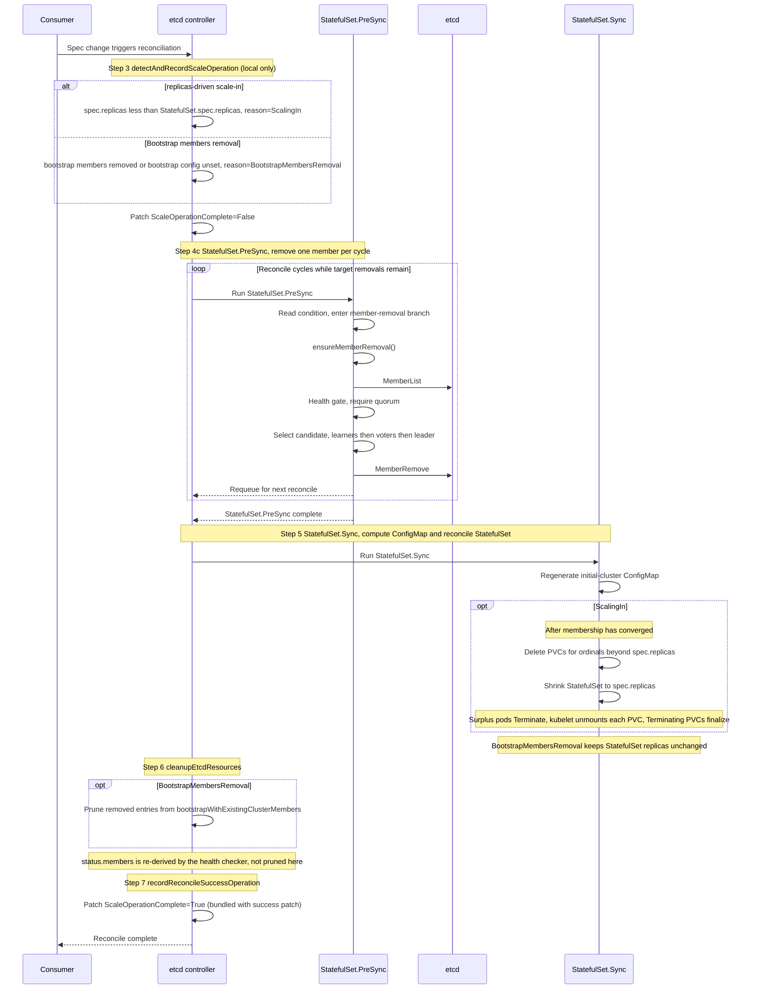
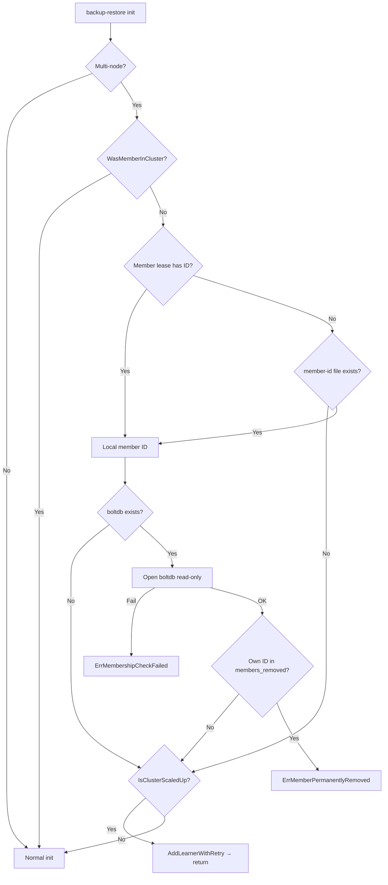

# DEP-08: Scaling-in a multi-node etcd cluster managed by `etcd-druid`

## Summary

Today, `etcd-druid` blocks any decrease of `etcd.spec.replicas` other than to zero, so operators have no declarative way to shrink a multi-node etcd cluster.

This proposal introduces safe scale-in support for multi-node etcd clusters managed by `etcd-druid`, enabling a cluster to shrink without risking quorum loss or leaving etcd membership in an inconsistent state. The user experience is symmetric with scale-out: the operator only changes the `Etcd` resource, and `etcd-druid` removes members safely.

## Terminology

- **`bootstrapWithExistingCluster`** — the mechanism by which a new `Etcd` joins an existing etcd cluster instead of forming its own, configured via `spec.etcd.bootstrapWithExistingCluster`. See [Bootstrap with an Existing etcd Cluster](../concepts/bootstrap-with-existing-cluster.md).

## Motivation

`etcd-druid` supports scaling an etcd cluster *out* declaratively, but not *in*: the current admission rule rejects any decrease of `etcd.spec.replicas` other than to zero. Operators therefore have no safe, declarative way to shrink a multi-node cluster. Three concrete use cases need this.

### Use cases

**1. Shrinking an over-provisioned HA cluster.**
An operator may have temporarily increased the cluster size — for example, to improve fault tolerance during maintenance or upgrades, or to raise read throughput on a read-heavy cluster (more followers improve read throughput, though they can increase write latency). They may also have over-provisioned and later found the extra members costly (additional volumes and compute). In these cases the operator needs to reduce the cluster back (for example 5 → 3) by lowering `etcd.spec.replicas`, and have `etcd-druid` remove the surplus members and resize the cluster without running `etcdctl` or risking quorum. Today this is impossible: any non-zero decrease of `etcd.spec.replicas` is rejected at admission.

**2. Migrating an etcd cluster with zero downtime.**
An operator migrating an etcd cluster from one hosting Kubernetes cluster to another without downtime, once the new members have joined the existing cluster (via [`bootstrapWithExistingCluster`](../concepts/bootstrap-with-existing-cluster.md)), needs to decommission the original members declaratively — by removing them from `etcd.spec.etcd.bootstrapWithExistingCluster.members` — so the cluster ends up running only on the new members. Today this final removal step has no declarative path. Gardener's [Live Control Plane Migration (GEP-0039)](https://github.com/gardener/enhancements/tree/main/geps/0039-live-control-plane-migration#member-removal-from-the-cluster) is one concrete use of this pattern.

**3. Zero-downtime update of a single-node etcd cluster.**
An operator running a single-node (non-HA) etcd cluster needs to perform a disruptive change — such as a node/volume migration — without downtime. This can be done by temporarily scaling *out* (`1 → 3`) so the additional members take over serving, and then scaling *in* (`3 → 1`) once the change is complete. (An odd count such as 3 is used rather than 2 so the cluster can tolerate a member failure without losing quorum; a 2-member cluster cannot.) The scale-in half (`3 → 1`) is blocked today.

These reduce to the same shape: a declarative signal that the cluster should shrink, and a controller that safely removes the surplus etcd members before the underlying StatefulSet is resized. This proposal exposes one mechanism that handles them.

## Goals

* Provide a declarative, safe scale-in path via the `Etcd` API, covering both triggers: an `etcd.spec.replicas` decrease and removal of source members joined via `bootstrapWithExistingCluster`.
* Guarantee quorum and availability throughout the operation.
* Ensure a removed member cannot silently rejoin the cluster afterwards — even if its pod later restarts with stale data on a reused PVC.

## Non-Goals

* Supporting scale-in to zero (`replicas: N → 0`). This includes a single-member cluster, whose only scale-in would be `1 → 0`.

## Proposal

### Prerequisites

Scale-in makes progress as long as the cluster has quorum. Any member — including an unhealthy one — can be removed as long as the remaining members still form a quorum after the removal; the per-cycle quorum-safety check enforces this (removing a dead member is the safe case, since it was not contributing to quorum anyway). If a removal would drop the cluster below quorum, the controller withholds that `MemberRemove` and requeues with backoff until the removal is once again quorum-safe.

### Approach

Scale-in is orchestrated by `etcd-druid` through the existing [etcd controller](https://github.com/gardener/etcd-druid/blob/master/docs/development/controllers.md#etcd-controller). The process is driven by changes to the `Etcd` resource, and progress is tracked explicitly through the `ScaleOperationComplete` condition in the `Etcd.Status` to ensure deterministic coordination across reconcile cycles.

Scale-in is triggered when:

- An operator decreases `etcd.spec.replicas`, or
- An operator removes member entries from `etcd.spec.etcd.bootstrapWithExistingCluster.members` or unsets `etcd.spec.etcd.bootstrapWithExistingCluster`.

It aims to achieve safe scale-in by:

- Removing etcd cluster members one per reconcile cycle, in a quorum-safe order, before the underlying StatefulSet is shrunk.
- Deleting freed PVCs during `StatefulSet.Sync`, before the StatefulSet replica count is reduced, so the surplus PVCs are reclaimed as the pods are terminated.
- Preventing removed members from silently rejoining by adding an [anti-rejoin guard](#anti-rejoin-guard) in `etcd-backup-restore`.

### `etcd-druid` changes

This section describes the status, validation, and reconcile-flow changes required in `etcd-druid`.

#### Status condition

##### Why the `ScaleOperationComplete` condition is required

Scale-in removes etcd members one at a time before the StatefulSet is shrunk. Consider a `3 → 2` scale-in: the controller removes a member from the etcd cluster, but the StatefulSet has not yet been reduced. If a `2 → 3` scale-out lands in this window, the cluster is left in a conflicting state — a member has already been removed from etcd, yet `spec.replicas` is back to `3`. Looking only at `spec.replicas` and the StatefulSet replica count is no longer enough to decide whether the controller should finish the in-flight scale-in or treat the missing member as a fresh scale-out target. The safe behaviour is to **let an in-flight scale-in (or scale-out) complete and reject the opposite-direction scaling until it does**.

To enforce this at admission time without introducing an admission webhook, the controller records an explicit `ScaleOperationComplete` condition on the `Etcd.Status` sub-resource before starting membership-changing work, and CEL validation rules on the CRD reject an opposite-direction change while an operation is in flight (the condition is `False`). The condition is therefore both the admission-time gate (read by CEL) and the in-flight signal (read by `StatefulSet.PreSync`). The admission gate is best-effort — see [Admission gate is best-effort; the controller is the guarantee](#admission-gate-is-best-effort-the-controller-is-the-guarantee) below for how the controller closes the remaining window.

A new `ScaleOperationComplete` condition is introduced in `etcd.status.conditions` to track scale operations. It uses **positive polarity**, consistent with the other `Etcd` conditions (`Ready`, `AllMembersReady`): `True` (reason `NoScaleOperation`) is the converged, healthy state, and `False` (with a reason naming the operation) marks an in-flight operation. The `etcd` controller sets it to `False` when scale work starts and back to `True` on successful completion.

| Type                     | Status | Reason                    | Description |
|--------------------------|--------|---------------------------|-------------|
| `ScaleOperationComplete` | False  | ScalingIn                 | `etcd.spec.replicas`-driven scale-in in progress |
| `ScaleOperationComplete` | False  | BootstrapMembersRemoval   | Removing source members joined via `bootstrapWithExistingCluster` |
| `ScaleOperationComplete` | False  | ScalingOut                | Scale-out in progress — a `spec.replicas` increase, or a `bootstrapWithExistingCluster` join (which also adds members). Set so the admission gate can reject a scale-in that races an in-flight scale-out (see below) |
| `ScaleOperationComplete` | True   | NoScaleOperation          | No scale operation in progress |

The condition is used by:

- CEL validation rules to reject conflicting concurrent scale changes.
- `StatefulSet.PreSync` to decide whether to run the member-removal branch.

The `ScalingOut` reason does not change the existing scale-out mechanics from [DEP-03](https://github.com/gardener/etcd-druid/blob/master/docs/proposals/03-scaling-up-an-etcd-cluster.md). Scale-out remains driven by a `spec.replicas` increase; new members join as learners via the `etcd-backup-restore` sidecar. The reason is introduced as a coordination marker for the symmetric admission gate: while a scale-out is in flight, a racing scale-in must be rejected for the same conflict reason described above. The controller therefore records `ScalingOut` for CEL to read, while the actual scale-out flow remains unchanged.

A `bootstrapWithExistingCluster` join is also a scale-out — the target members are added to an existing cluster — so it likewise carries `ScaleOperationComplete=False` with reason `ScalingOut`. In this case the condition is only set back to `True` once all `bootstrapWithExistingCluster` members have joined, i.e. when `BootstrappedWithExistingCluster` becomes `True`.


#### CEL validation rules

The existing [field-level rule that blocks `replicas` decreases](https://github.com/gardener/etcd-druid/blob/5b90b4a7dc7da4f4d35ea9905103d8b60b9f6e8e/api/core/v1alpha1/etcd.go#L546) will be removed so that multi-node clusters can be scaled in declaratively. Scaling to `replicas: 0` remains handled by the existing `replicas → 0` code path (see Non-Goals) and is unaffected by the new rules, which apply only when both `self.spec.replicas > 0` and `oldSelf.spec.replicas > 0`.

New object-level CEL rules will guard conflicting operations using the `ScaleOperationComplete` condition. A `replicas` decrease while `bootstrapWithExistingCluster` is set is treated as a normal `ScalingIn`; bootstrap-member removal is tracked as a distinct operation and is not run concurrently with scale-in or scale-out.

This serialization is **not** a quorum guard — quorum is already protected on every removal by etcd's own `MemberRemove` admission check and by the controller's per-cycle quorum-safety check, which remove at most one member per reconcile. It is a state-machine constraint: this DEP intentionally models one active membership-changing operation per `Etcd` resource. Supporting interleaved scale-in, scale-out, and bootstrap-member removal would require richer operation state, target-set tracking, recovery semantics, and cross-step conflict resolution. That complexity is unnecessary for the requested flows, so the operations are serialized rather than interleaved. Note these CEL rules are scoped to a single `Etcd` resource; when a cluster's members are split across two `Etcd` resources (as during a live migration), cross-resource quorum is not coordinated by admission but by one-member-per-cycle removal, etcd's own removal check, and the anti-rejoin guard.

| User action | Allowed when | Rejected when |
|-------------|--------------|---------------|
| Increase `spec.replicas` | No `ScalingIn` or `BootstrapMembersRemoval` is in progress | `ScaleOperationComplete=False` with reason `ScalingIn` or `BootstrapMembersRemoval` |
| Decrease `spec.replicas` | No `ScalingOut` or `BootstrapMembersRemoval` is in progress | `ScaleOperationComplete=False` with reason `ScalingOut` or `BootstrapMembersRemoval` |
| Remove entries from `spec.etcd.bootstrapWithExistingCluster.members` | No `ScalingIn` or `ScalingOut` is in progress | `ScaleOperationComplete=False` with reason `ScalingIn` or `ScalingOut` |
| Unset `spec.etcd.bootstrapWithExistingCluster` | No `ScalingIn` or `ScalingOut` is in progress | `ScaleOperationComplete=False` with reason `ScalingIn` or `ScalingOut` |

This gives consumers an immediate admission rejection instead of accepting conflicting changes that would only requeue or fail later in reconciliation.

##### Admission gate is best-effort; the controller is the guarantee

The condition is set by the controller during reconciliation, *after* the triggering spec change has already been admitted. There is therefore a small window between the spec change being persisted and the controller writing `ScaleOperationComplete=False`. A conflicting opposite-direction change that arrives inside this window is not yet visible to CEL and can be admitted. The CEL rules are therefore a fast-fail guardrail, not the correctness boundary.

The controller closes this window at the point where it matters — just before it removes a member. Member removal runs in `StatefulSet.PreSync`, which executes **before** `StatefulSet.Sync` patches the StatefulSet's `spec.replicas` from `etcd.spec.replicas`. So at removal time the live `StatefulSet.spec.replicas` still holds the observed cluster size from before the StatefulSet sync, while `etcd.spec.replicas` holds the latest requested size. Before removing any member, the controller re-fetches both objects and compares them in the context of the recorded operation:

- If `ScaleOperationComplete=False` with reason `ScalingIn`, member removal proceeds only when `etcd.spec.replicas < StatefulSet.spec.replicas`.
- If `ScaleOperationComplete=False` with reason `ScalingOut`, the scale-out path proceeds only when `etcd.spec.replicas > StatefulSet.spec.replicas`.
- If `etcd.spec.replicas == StatefulSet.spec.replicas`, there is no longer an observable replica-count delta. In the admission-window race case, this means the spec was reverted to the pre-operation count (for example `3 → 2 → 3`) before any destructive membership change started. The controller aborts the recorded operation, sets `ScaleOperationComplete` back to `True`, and requeues.
- If the latest replica comparison points in the opposite direction from the recorded reason, an opposite-direction update landed inside the CEL window. The controller must not continue the recorded operation. It aborts the recorded operation, recomputes `ScaleOperationComplete`, and requeues so the latest desired operation is handled separately. No member is removed in this reconcile.

For `BootstrapMembersRemoval`, the same principle applies, but the guard revalidates the latest `spec.etcd.bootstrapWithExistingCluster` against the observed joined bootstrap members instead of comparing replica counts. If the bootstrap-member removal request was reverted before `MemberRemove`, no member is removed and the condition is recomputed.

Because detection and this guard are re-evaluated every reconcile against observed state (level-triggered), a revert or opposite-direction update inside the CEL window converges without any member wrongly removed and without a stale condition left behind. The CEL rules handle the common case fast; this controller check is what makes the design correct regardless of the window.

```go
// REMOVED from the Replicas field:
// +kubebuilder:validation:XValidation:message="Replicas can either be increased or be downscaled to 0.",rule="self==0 ? true : self < oldSelf ? false : true"

// ADDED at the Etcd type level. The condition uses positive polarity, so an
// in-flight operation is status == 'False' with the reason naming it. The two
// replica-direction rules are gated on both self.spec.replicas > 0 and
// oldSelf.spec.replicas > 0 so that transitions to/from 0 (the replicas -> 0
// path and wake-up) are never blocked.
// +kubebuilder:validation:XValidation:message="Cannot scale out while a scale-in or bootstrap members removal is in progress.",rule="(self.spec.replicas > oldSelf.spec.replicas && self.spec.replicas > 0 && oldSelf.spec.replicas > 0) ? (!has(self.status) || !has(self.status.conditions) || !self.status.conditions.exists(c, c.type == 'ScaleOperationComplete' && c.status == 'False' && (c.reason == 'ScalingIn' || c.reason == 'BootstrapMembersRemoval'))) : true"
// +kubebuilder:validation:XValidation:message="Cannot scale in while a scale-out or bootstrap members removal operation is in progress.",rule="(self.spec.replicas < oldSelf.spec.replicas && self.spec.replicas > 0 && oldSelf.spec.replicas > 0) ? (!has(self.status) || !has(self.status.conditions) || !self.status.conditions.exists(c, c.type == 'ScaleOperationComplete' && c.status == 'False' && (c.reason == 'ScalingOut' || c.reason == 'BootstrapMembersRemoval'))) : true"
// +kubebuilder:validation:XValidation:message="Cannot remove bootstrap members while scale-in or scale-out is in progress.",rule="has(oldSelf.spec.etcd.bootstrapWithExistingCluster) && has(self.spec.etcd.bootstrapWithExistingCluster) && self.spec.etcd.bootstrapWithExistingCluster.members != oldSelf.spec.etcd.bootstrapWithExistingCluster.members ? (!has(self.status) || !has(self.status.conditions) || !self.status.conditions.exists(c, c.type == 'ScaleOperationComplete' && c.status == 'False' && (c.reason == 'ScalingIn' || c.reason == 'ScalingOut'))) : true"
// +kubebuilder:validation:XValidation:message="Cannot unset bootstrapWithExistingCluster while scale-in or scale-out is in progress.",rule="has(oldSelf.spec.etcd.bootstrapWithExistingCluster) && !has(self.spec.etcd.bootstrapWithExistingCluster) ? (!has(self.status) || !has(self.status.conditions) || !self.status.conditions.exists(c, c.type == 'ScaleOperationComplete' && c.status == 'False' && (c.reason == 'ScalingIn' || c.reason == 'ScalingOut'))) : true"
```

#### Reconcile flow

The `etcd` controller reconciliation is extended with a scale-operation detection step, a member-removal branch in `StatefulSet.PreSync`, and bootstrap-member status cleanup where the removed-member status is not otherwise re-derived. Existing reconciliation steps continue to run in the same order. The `ScaleOperationComplete=True` update is folded into `recordReconcileSuccessOperation`, so completing scale-in does not require an additional status patch.

The `ScaleOperationComplete` condition is written by the spec-reconcile flow — set to `False` as the operation starts and back to `True` as it completes — rather than by the eventually-consistent status-reconcile flow. This is deliberate: the condition is an operation-lifecycle marker (like `LastOperation`), and, more importantly, the CEL admission rules can only reject a conflicting update if the condition is already persisted. Writing it asynchronously in the status flow would widen the admission window described above. By contrast, `etcd.status.members` is a health observation owned by the status-reconcile flow and is not touched here (see [Status cleanup](#status-cleanup-step-6)).

```
reconcileSpec()
  1. recordReconcileStartOperation
  2. ensureFinalizer
  3. detectAndRecordScaleOperation       — NEW: reconciler patches Status.ScaleOperationComplete
  4. preSyncEtcdResources
       → StatefulSet.PreSync():
            a. Pre-hibernation snapshot   (existing)
            b. Pre-upgrade snapshot       (existing)
            c. Scale-in member removal    — NEW: at most one removal per reconcile cycle
                 - ensureMemberRemoval()  via etcd v3 client
                 - next reconcile health-checks, picks next candidate
  5. syncEtcdResources
       → ConfigMap.Sync()                  regenerate initial-cluster
       → StatefulSet.Sync()                — NEW (ScalingIn): after membership has
                                              converged, delete PVCs for ordinals
                                              beyond spec.replicas, then reduce the
                                              StatefulSet replica count. Each PVC enters
                                              Terminating and is reclaimed as the surplus
                                              pod is terminated by the replica reduction.
  6. cleanupEtcdResources
       → BootstrapMembersRemoval only: prune the just-removed entries from
                                                 status.bootstrapWithExistingClusterMembers.
                                                 (status.members is re-derived by the
                                                 health checker, not pruned here.)
  7. recordReconcileSuccessOperation
       → Patch Status.ScaleOperationComplete=True (existing patch already runs here)
```

The Mermaid diagram below shows the scale-in control flow. The existing pre-hibernation and pre-upgrade snapshot steps remain in `StatefulSet.PreSync`, but are omitted because they are not changed by this proposal.


```mermaid
sequenceDiagram
    participant C as Consumer
    participant R as etcd controller
    participant P as StatefulSet.PreSync
    participant E as etcd
    participant S as StatefulSet.Sync

    C->>R: Spec change triggers reconciliation

    Note over R: Step 3 detectAndRecordScaleOperation (local only)
    alt replicas-driven scale-in
        R->>R: spec.replicas less than StatefulSet.spec.replicas, reason=ScalingIn
    else Bootstrap members removal
        R->>R: bootstrap members removed or bootstrap config unset, reason=BootstrapMembersRemoval
    end
    R->>R: Patch ScaleOperationComplete=False

    Note over R,P: Step 4c StatefulSet.PreSync, remove one member per cycle
    loop Reconcile cycles while target removals remain
        R->>P: Run StatefulSet.PreSync
        P->>P: Read condition, enter member-removal branch
        P->>P: ensureMemberRemoval()
        P->>E: MemberList
        P->>P: Health gate, require quorum
        P->>P: Select candidate, learners then voters then leader
        P->>E: MemberRemove
        P-->>R: Requeue for next reconcile
    end
    P-->>R: StatefulSet.PreSync complete

    Note over R,S: Step 5 StatefulSet.Sync, compute ConfigMap and reconcile StatefulSet
    R->>S: Run StatefulSet.Sync
    S->>S: Regenerate initial-cluster ConfigMap
    opt ScalingIn
        Note over S: After membership has converged
        S->>S: Delete PVCs for ordinals beyond spec.replicas
        S->>S: Shrink StatefulSet to spec.replicas
        Note over S: Surplus pods Terminate, kubelet unmounts each PVC, Terminating PVCs finalize
    end
    Note over S: BootstrapMembersRemoval keeps StatefulSet replicas unchanged

    Note over R: Step 6 cleanupEtcdResources
    opt BootstrapMembersRemoval
        R->>R: Prune removed entries from bootstrapWithExistingClusterMembers
    end
    Note over R: status.members is re-derived by the health checker, not pruned here

    Note over R: Step 7 recordReconcileSuccessOperation
    R->>R: Patch ScaleOperationComplete=True (bundled with success patch)
    R-->>C: Reconcile complete
```

The relevant additions are described below. Existing steps (1–2, 4a–4b) are unchanged and not described here.

##### Detection (Step 3)

`detectAndRecordScaleOperation` runs after `ensureFinalizer` and decides the active scale operation by comparing `etcd.spec` against the existing `StatefulSet.spec` and `etcd.status`. It does not query the etcd cluster (no `MemberList()` call), so detection cannot be blocked by a transient etcd outage.

| Signal | Condition update |
|--------|------------------|
| `etcd.spec.replicas < StatefulSet.spec.replicas` | `ScaleOperationComplete=False`, reason `ScalingIn` |
| `etcd.spec.replicas > StatefulSet.spec.replicas` | `ScaleOperationComplete=False`, reason `ScalingOut` |
| `bootstrapWithExistingCluster` is unset, or joined bootstrap members are removed from spec | `ScaleOperationComplete=False`, reason `BootstrapMembersRemoval` |
| No scale signal is present | `ScaleOperationComplete=True`, reason `NoScaleOperation` |

The condition is patched before component reconciliation starts, allowing CEL validation to reject conflicting changes while the operation is in progress.

##### Member removal in `StatefulSet.PreSync` (Step 4c)

`StatefulSet.PreSync` calls `ensureMemberRemoval` for `ScalingIn` and `BootstrapMembersRemoval`.

Scale-in introduces direct etcd member removal from `etcd-druid` using an etcd v3 client. `ensureMemberRemoval` connects through the corresponding Etcd cluster's Kubernetes etcd client Service and uses client TLS credentials from the configured secret when client TLS is enabled. It uses the etcd client `MemberList()` API for membership discovery and removes at most one member per reconcile cycle with the etcd client `MemberRemove(id)` API. Each cycle recomputes the target set, so the operation can safely resume after controller restarts.

The removal proceeds in two distinct steps — selecting the set of candidates, then ordering the removals within that set:

1. Verify that removing another member keeps quorum intact.
2. **Select the candidate set** to remove:
   - `ScalingIn`: members with pod ordinal `≥ spec.replicas` (the highest ordinals, which preserves contiguous ordinals for the members that remain).
   - `BootstrapMembersRemoval`: only members recorded in `etcd.status.bootstrapWithExistingClusterMembers` are eligible for removal. From that set, the candidates are the ones no longer present in `spec.etcd.bootstrapWithExistingCluster.members` — or all of them when `bootstrapWithExistingCluster` is unset. A member that is not in `status.bootstrapWithExistingClusterMembers` is never removed by this operation.
3. **Order the removals within that already-selected set**: learners first, then non-leader voters, and the leader last if it is part of the set. This ordering applies only among the candidates chosen in step 2 — it does not change *which* members are removed, only the sequence in which they are removed (so the leader goes last, avoiding an unnecessary leadership change mid-operation).
4. Call the etcd client `MemberRemove(id)` API for the next candidate and requeue so the following reconcile observes the updated cluster state.

Serial removal is intentional. It avoids parallel membership changes in the same etcd cluster and gives the cluster one reconcile cycle to stabilize between removals. Conditions and events should reference member names; logs may additionally include member IDs for debugging.

If the quorum check in step 1 determines that removing the next member would break quorum, the controller does not remove it and requeues. This is surfaced in the `Etcd` status: a `LastError` is recorded in `etcd.status.lastErrors` with a coded reason (for example `ERR_QUORUM_UNSAFE_MEMBER_REMOVAL`) and a description such as *"member `<name>` not removed: removal would break quorum; requeuing until the cluster is healthy"*, and `etcd.status.lastOperation.State` is set to `Error` so the operation is retried. `ScaleOperationComplete` stays `False` (reason `ScalingIn`) because the operation is still in progress — the block is transient, and `lastErrors` is what surfaces *why* no member is being removed right now.

**Source cluster.** For `BootstrapMembersRemoval`, the members being removed belong to the source cluster. The source may be managed by another `etcd-druid` `Etcd` resource or by something outside `etcd-druid` entirely.

> [!CAUTION]
> After the target has joined the source (forming a single joint cluster), avoid performing any scale-in or scale-out operation on the source. The source and target share one etcd cluster, so scaling the source affects the target as well, and `etcd-druid` does not coordinate operations across the two — the CEL rules here are scoped to this `Etcd` resource only. Concurrent membership changes from both sides can cause churn or stall progress (etcd's own quorum check still prevents an outright quorum loss, but the operation is per-removal, not cluster-wide). Scaling the source while the migration is in progress is therefore not recommended.

> [!NOTE]
> Unsetting `spec.etcd.bootstrapWithExistingCluster` signals that the etcd cluster should become self-sustaining — running only on the members managed by this `Etcd` resource. To achieve that, the source members are decommissioned from the cluster. Once they are decommissioned, the source cluster becomes unusable (it no longer holds any members), and the cluster is left as a standalone, fully `etcd-druid`-managed cluster. This is the intended end state of the migration.

##### PVC deletion in `StatefulSet.Sync`

**This step runs only for `ScalingIn`**, since only an `etcd.spec.replicas` decrease frees PVCs that the controller owns. `BootstrapMembersRemoval` does not delete PVCs because the removed members belong to the source etcd cluster.

A StatefulSet does not reclaim the PVCs of removed ordinals on scale-in — the default `persistentVolumeClaimRetentionPolicy` retains them — so `etcd-druid` must delete the surplus PVCs explicitly; Kubernetes does not do it for us.

`StatefulSet.Sync` determines the surplus ordinals from the `etcd.spec.replicas` vs `StatefulSet.spec.replicas` delta and, before it lowers the StatefulSet's replica count, deletes the PVCs of the ordinals being removed.

For each ordinal `i ≥ spec.replicas`, the controller derives the PVC name from `StatefulSet.Spec.VolumeClaimTemplates[*].Name` and the StatefulSet pod-ordinal naming convention (`{vctName}-{stsName}-{i}`), then issues an idempotent delete request. The `Delete` only stamps `deletionTimestamp`; the volume is reclaimed once the surplus pod is terminated by the replica reduction that immediately follows in the same `Sync` and the kubelet unmounts it.

##### Status cleanup (Step 6)

`etcd.status.members` is owned and re-derived by the status-reconcile flow (the member health checker), which lists the live members every cycle, so a removed member's stale entry is pruned there without any action in the spec-reconcile flow. This DEP therefore does **not** proactively prune `etcd.status.members` in spec-reconcile — it relies on the health checker to converge it.

`etcd.status.bootstrapWithExistingClusterMembers` records the joined source members and is not re-derived by the health checker, so for `BootstrapMembersRemoval` the spec-reconcile flow prunes the entries for the members it just removed.

##### Complete the operation (Step 7)

`recordReconcileSuccessOperation` includes the `ScaleOperationComplete=True` update in its existing status patch.

##### Limitation

Once a scale-in has removed at least one member, it cannot be aborted or reversed back to the original cluster size until it completes. Increasing `spec.replicas` again (or restoring the removed bootstrap members) while `ScaleOperationComplete=False` is an opposite-direction change and is rejected by the CEL rules. So if a scale-in gets stuck — for example, it removed one member of a `5 → 3` and then cannot remove the next because doing so would break quorum — the only way forward is to restore the affected members to health so the scale-in can finish reaching the target size; there is no supported path to cancel it and return to the original size.

This applies only once a member has actually been removed. A change reverted before any removal — such as the `3 → 2 → 3` case within the admission window described above — converges to a no-op, since no membership change has occurred.

### `etcd-backup-restore` changes

#### Anti-rejoin guard

##### Problem

During scale-in, `etcd-druid` removes an etcd member from the cluster before the corresponding StatefulSet pod is terminated. In that short window, the pod can still restart with its old data directory.

Without a guard, `etcd-backup-restore` interprets the state *"this pod has local etcd data, but its member ID is not present in the live cluster"* as a scale-out case and re-adds the removed member as a learner. The controller removes it again, the same pod re-adds itself, and the cluster enters a remove/re-add loop.

##### Proposed solution

`etcd-backup-restore` adds an **anti-rejoin guard** that runs at startup before the learner-add path. The guard detects prior etcd data on the PV and, if the local member was explicitly removed from this cluster, refuses to re-add it.

etcd records removed member IDs in the local boltdb `members_removed` bucket when `MemberRemove` is applied. The anti-rejoin guard reads the local member's own tombstone from that bucket to detect that the data directory belongs to a member that was explicitly removed from this cluster; in that case, it must not treat the missing live membership entry as a scale-out/re-add case.

The startup flow after `WasMemberInCluster` returns false is:

1. **Local member ID resolution** — resolve the local member ID in priority order:
   - **Member lease** — reads the k8s lease holder identity (`<memberID-hex>:<clusterID-hex>:<role>`).
   - **Member-id file** (`<data-dir>/member-id`) — fallback, persisted on the PV by the heartbeat component, used when the lease is unavailable or has no holder identity.
   - If neither yields an ID, the guard skips (treats as fresh member).
2. **Anti-rejoin guard** — open the local boltdb **read-only** and check the `members_removed` bucket for the resolved local member ID. Prior etcd data is detected by the presence of the boltdb file itself; if it is absent, this is a fresh PVC and the guard skips.
3. **Scale-up check** (`IsClusterScaledUp`) — runs when the guard skips or passes. If the member is not in the live cluster, it is added as a learner.


```mermaid
flowchart TD
    Start[backup-restore init]
    Start --> Multi{Multi-node?}
    Multi -->|No| Normal[Normal init]
    Multi -->|Yes| Heartbeat{WasMemberInCluster?}
    Heartbeat -->|Yes| Normal
    Heartbeat -->|No| Lease{Member lease has ID?}
    Lease -->|Yes| Have[Local member ID]
    Lease -->|No| File{member-id file exists?}
    File -->|No| ScaleUp{IsClusterScaledUp?}
    File -->|Yes| Have
    Have --> DB{boltdb exists?}
    DB -->|No| ScaleUp
    DB -->|Yes| Open[Open boltdb read-only]
    Open -->|Fail| Failed[ErrMembershipCheckFailed]
    Open -->|OK| Removed{Own ID in members_removed?}
    Removed -->|No| ScaleUp
    Removed -->|Yes| Stop[ErrMemberPermanentlyRemoved]
    ScaleUp -->|Yes| Learner[AddLearnerWithRetry → return]
    ScaleUp -->|No| Normal
```

The guard is deliberately conservative:

- If **no local member ID** can be resolved (lease unavailable / no holder identity, member-id file absent), the member is treated as a fresh join and normal initialization continues.
- If the **boltdb file is missing** (fresh PVC, no prior etcd data), normal initialization continues through the existing path.
- If boltdb exists but **cannot be opened**, the guard is retried a few times (with backoff) to ride out transient I/O or lock contention; if it still cannot be opened, startup fails closed with `ErrMembershipCheckFailed`.
- If the local member's own ID is present in `members_removed`, startup fails with `ErrMemberPermanentlyRemoved`.

Only the local member's own ID is considered. Entries for other removed members are ignored.

The guard opens boltdb **read-only** and reads only the small `members_removed` bucket, so the runtime and memory overhead is negligible. This follows the same access pattern already used by `etcd-backup-restore`'s data validator.

##### Why not a WAL-based approach

An earlier design resolved the local member ID by reading it from the WAL's metadata record — opening the WAL read-only (`wal.OpenForRead`), calling `ReadAll()`, and unmarshalling the etcd `Metadata` message to extract the `NodeID`. This was **rejected because of the memory cost**: `ReadAll()` replays the entire WAL into memory to return all entries and the snapshot, which loads a potentially large, unbounded log into memory at startup. For a sidecar that must stay within a tight memory budget alongside etcd, this memory spike is unacceptable. The lease → member-id file fallback chain resolves the same ID with a small, bounded Kubernetes API call or a single file read — no WAL replay, negligible memory — so it is used instead.

##### Limitation

The guard relies on the `members_removed` tombstone in the local boltdb. If the data directory is wiped (PVC deleted and recreated during scale-out), the boltdb is absent and the guard is skipped — the member is treated as a fresh join and added as a learner. This case is outside the guard's reach by design. The backstop here is the `etcd-druid` controller: scale-in detection re-derives the target set on every reconcile and removes the surplus member again under the per-cycle quorum-safety check, so a member restarting with a wiped data directory cannot persist in the cluster after a scale-in.

The guard does not interfere with the normal single-member restoration path. It runs only on the scale-out/rejoin branch — i.e. when the member is **not present** in the live cluster's member list. A valid member whose data directory is merely corrupted is **still a member** of the cluster, so the guard is skipped and the existing single-member restoration flow runs unchanged. `ErrMembershipCheckFailed` (fail-closed on an unreadable boltdb) is reached only on that rejoin branch — for a member absent from the cluster — so it cannot block restoration of a valid member. Single-node clusters are a [Non-Goal](#non-goals) and the guard is gated on multi-node in any case.

## Alternatives

Each alternative below adds an externally callable surface for member removal. Each is rejected for a different primary reason, but they share a common concern:

**Shared concern.** Member removal is irreversible and breaks quorum if misapplied. Exposing it via any external surface (CRD, HTTP, CLI) means any caller with access can invoke it outside the controller's coordination — unlike snapshots or defragmentation, which are safe to run independently.

1. **`RemoveMembers` EtcdOpsTask with Job runner.** Reuse [DEP-05](https://github.com/gardener/etcd-druid/blob/master/docs/proposals/05-etcdopstask.md)'s lifecycle (audit, FIFO, dedup, TTL GC) and run `etcdbrctl member-remove` in a Job. **Rejected because:** [DEP-05](https://github.com/gardener/etcd-druid/blob/master/docs/proposals/05-etcdopstask.md) defines out-of-band tasks as those "executed without modifying the Etcd spec." Scale-in is triggered by `spec.replicas` changes — by DEP-05's own definition it is in-band. An OpsTask path also exposes a `druidctl` counterpart that races the reconciler with no admission-time gate.

2. **HTTP `/member/remove` on backup-restore.** **Rejected because:** backup-restore is a per-member sidecar with local-scope endpoints. A cluster-wide mutation endpoint changes its architectural role and exposes a destructive operation to anyone with pod network access.

3. **`etcdbrctl member-remove` subcommand.** **Rejected because:** no safe standalone use case — cannot be invoked outside the controller's coordination without risking quorum. Shipping it still exposes the capability via `kubectl exec`.

---

## References

### Gardener / `etcd-druid`
- [DEP-03: Scaling Up an etcd Cluster](https://github.com/gardener/etcd-druid/blob/master/docs/proposals/03-scaling-up-an-etcd-cluster.md) — existing scale-out behavior and `ScalingOut` condition reason.
- [DEP-05: Operator Out-of-band Tasks](https://github.com/gardener/etcd-druid/blob/master/docs/proposals/05-etcdopstask.md) — context for the rejected `EtcdOpsTask` alternative.
- [GEP-0039: Live Control Plane Migration](https://github.com/gardener/enhancements/tree/main/geps/0039-live-control-plane-migration) — live CPM context and source-member removal requirement.
- [Issue #1239 — Support for bootstrapping with existing etcd cluster](https://github.com/gardener/etcd-druid/issues/1239) — original `bootstrapWithExistingCluster` requirement.
- [Bootstrap with an Existing etcd Cluster](../concepts/bootstrap-with-existing-cluster.md) — the join phase this DEP builds on; introduces `spec.etcd.bootstrapWithExistingCluster` and the `status.bootstrapWithExistingClusterMembers` list this proposal diffs against.
- [Existing CEL rule blocking scale-in](https://github.com/gardener/etcd-druid/blob/5b90b4a7dc7da4f4d35ea9905103d8b60b9f6e8e/api/core/v1alpha1/etcd.go#L546)
- [`Etcd` type declaration for object-level CEL rules](https://github.com/gardener/etcd-druid/blob/7a5ac3182/api/core/v1alpha1/etcd.go#L58-L62)
- [`reconcileSpec` orchestration](https://github.com/gardener/etcd-druid/blob/7a5ac3182/internal/controller/etcd/reconcile_spec.go#L28-L48)

### etcd internals (v3.5.27)

> The links below are pinned to the `v3.5.27` release commit (`62d8759`) so they remain stable across future etcd version bumps. These APIs are not expected to change across releases.

- [`server.go` — `RemoveMember` quorum checks](https://github.com/etcd-io/etcd/blob/62d8759b7d5dbc9b3694f89d54170a55726bb485/server/etcdserver/server.go#L1721-L1738)
- [`store.go` — removed member IDs are written to `members_removed`](https://github.com/etcd-io/etcd/blob/62d8759b7d5dbc9b3694f89d54170a55726bb485/server/etcdserver/api/membership/store.go#L71-L123)
- [`bucket.go` — `members` and `members_removed` bucket definitions](https://github.com/etcd-io/etcd/blob/62d8759b7d5dbc9b3694f89d54170a55726bb485/server/mvcc/buckets/bucket.go#L31-L49)
