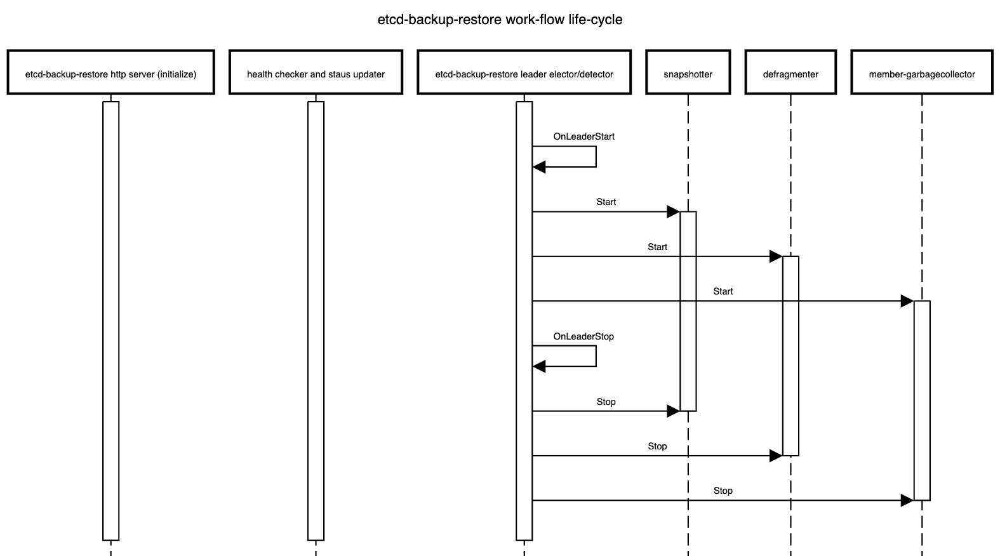

# Multi-node etcd cluster instances via etcd-druid

This document proposes an approach (along with some alternatives) to support provisioning and management of multi-node etcd cluster instances via [etcd-druid](https://github.com/gardener/etcd-druid) and [etcd-backup-restore](https://github.com/gardener/etcd-backup-restore).

## Content

- [Multi-node etcd cluster instances via etcd-druid](#multi-node-etcd-cluster-instances-via-etcd-druid)
  - [Content](#content)
  - [Goal](#goal)
  - [Background and Motivation](#background-and-motivation)
    - [Single-node etcd cluster](#single-node-etcd-cluster)
    - [Multi-node etcd-cluster](#multi-node-etcd-cluster)
    - [Dynamic multi-node etcd cluster](#dynamic-multi-node-etcd-cluster)
  - [Prior Art](#prior-art)
    - [ETCD Operator from CoreOS](#etcd-operator-from-coreos)
    - [etcdadm from kubernetes-sigs](#etcdadm-from-kubernetes-sigs)
    - [Etcd Cluster Operator from Improbable-Engineering](#etcd-cluster-operator-from-improbable-engineering)
  - [General Approach to ETCD Cluster Management](#general-approach-to-etcd-cluster-management)
    - [Bootstrapping](#bootstrapping)
      - [Assumptions](#assumptions)
    - [Adding a new member to an etcd cluster](#adding-a-new-member-to-an-etcd-cluster)
      - [Note](#note)
      - [Alternative](#alternative)
    - [Managing Failures](#managing-failures)
      - [Removing an existing member from an etcd cluster](#removing-an-existing-member-from-an-etcd-cluster)
      - [Restarting an existing member of an etcd cluster](#restarting-an-existing-member-of-an-etcd-cluster)
      - [Recovering an etcd cluster from failure of majority of members](#recovering-an-etcd-cluster-from-failure-of-majority-of-members)
  - [Kubernetes Context](#kubernetes-context)
      - [Alternative](#alternative-1)
  - [ETCD Configuration](#etcd-configuration)
    - [Alternative](#alternative-2)
  - [Data Persistence](#data-persistence)
    - [Persistent](#persistent)
    - [Ephemeral](#ephemeral)
      - [Disk](#disk)
      - [In-memory](#in-memory)
    - [How to detect if valid metadata exists in an etcd member](#how-to-detect-if-valid-metadata-exists-in-an-etcd-member)
      - [Recommendation](#recommendation)
    - [How to detect if valid data exists in an etcd member](#how-to-detect-if-valid-data-exists-in-an-etcd-member)
    - [Recommendation](#recommendation-1)
  - [Separating peer and client traffic](#separating-peer-and-client-traffic)
    - [Cutting off client requests](#cutting-off-client-requests)
      - [Manipulating Client Service podSelector](#manipulating-client-service-podselector)
  - [Health Check](#health-check)
    - [Backup Failure](#backup-failure)
        - [Alternative](#alternative-3)
  - [Status](#status)
    - [Members](#members)
      - [Note](#note-1)
      - [Member name as the key](#member-name-as-the-key)
      - [Member Leases](#member-leases)
    - [Conditions](#conditions)
    - [ClusterSize](#clustersize)
    - [Alternative](#alternative-4)
  - [Decision table for etcd-druid based on the status](#decision-table-for-etcd-druid-based-on-the-status)
    - [1. Pink of health](#1-pink-of-health)
      - [Observed state](#observed-state)
      - [Recommended Action](#recommended-action)
    - [2. Member status is out of sync with their leases](#2-member-status-is-out-of-sync-with-their-leases)
      - [Observed state](#observed-state-1)
      - [Recommended Action](#recommended-action-1)
    - [3. All members are `Ready` but `AllMembersReady` condition is stale](#3-all-members-are-ready-but-allmembersready-condition-is-stale)
      - [Observed state](#observed-state-2)
      - [Recommended Action](#recommended-action-2)
    - [4. Not all members are `Ready` but `AllMembersReady` condition is stale](#4-not-all-members-are-ready-but-allmembersready-condition-is-stale)
      - [Observed state](#observed-state-3)
      - [Recommended Action](#recommended-action-3)
    - [5. Majority members are `Ready` but `Ready` condition is stale](#5-majority-members-are-ready-but-ready-condition-is-stale)
      - [Observed state](#observed-state-4)
      - [Recommended Action](#recommended-action-4)
    - [6. Majority members are `NotReady` but `Ready` condition is stale](#6-majority-members-are-notready-but-ready-condition-is-stale)
      - [Observed state](#observed-state-5)
      - [Recommended Action](#recommended-action-5)
    - [7. Some members have been in `Unknown` status for a while](#7-some-members-have-been-in-unknown-status-for-a-while)
      - [Observed state](#observed-state-6)
      - [Recommended Action](#recommended-action-6)
    - [8. Some member pods are not `Ready` but have not had the chance to update their status](#8-some-member-pods-are-not-ready-but-have-not-had-the-chance-to-update-their-status)
      - [Observed state](#observed-state-7)
      - [Recommended Action](#recommended-action-7)
    - [9. Quorate cluster with a minority of members `NotReady`](#9-quorate-cluster-with-a-minority-of-members-notready)
      - [Observed state](#observed-state-8)
      - [Recommended Action](#recommended-action-8)
    - [10. Quorum lost with a majority of members `NotReady`](#10-quorum-lost-with-a-majority-of-members-notready)
      - [Observed state](#observed-state-9)
      - [Recommended Action](#recommended-action-9)
    - [11. Scale up of a healthy cluster](#11-scale-up-of-a-healthy-cluster)
      - [Observed state](#observed-state-10)
      - [Recommended Action](#recommended-action-10)
    - [12. Scale down of a healthy cluster](#12-scale-down-of-a-healthy-cluster)
      - [Observed state](#observed-state-11)
      - [Recommended Action](#recommended-action-11)
    - [13. Superfluous member entries in `Etcd` status](#13-superfluous-member-entries-in-etcd-status)
      - [Observed state](#observed-state-12)
      - [Recommended Action](#recommended-action-12)
  - [Decision table for etcd-backup-restore during initialization](#decision-table-for-etcd-backup-restore-during-initialization)
    - [1. First member during bootstrap of a fresh etcd cluster](#1-first-member-during-bootstrap-of-a-fresh-etcd-cluster)
      - [Observed state](#observed-state-13)
      - [Recommended Action](#recommended-action-13)
    - [2. Addition of a new following member during bootstrap of a fresh etcd cluster](#2-addition-of-a-new-following-member-during-bootstrap-of-a-fresh-etcd-cluster)
      - [Observed state](#observed-state-14)
      - [Recommended Action](#recommended-action-14)
    - [3. Restart of an existing member of a quorate cluster with valid metadata and data](#3-restart-of-an-existing-member-of-a-quorate-cluster-with-valid-metadata-and-data)
      - [Observed state](#observed-state-15)
      - [Recommended Action](#recommended-action-15)
    - [4. Restart of an existing member of a quorate cluster with valid metadata but without valid data](#4-restart-of-an-existing-member-of-a-quorate-cluster-with-valid-metadata-but-without-valid-data)
      - [Observed state](#observed-state-16)
      - [Recommended Action](#recommended-action-16)
    - [5. Restart of an existing member of a quorate cluster without valid metadata](#5-restart-of-an-existing-member-of-a-quorate-cluster-without-valid-metadata)
      - [Observed state](#observed-state-17)
      - [Recommended Action](#recommended-action-17)
    - [6. Restart of an existing member of a non-quorate cluster with valid metadata and data](#6-restart-of-an-existing-member-of-a-non-quorate-cluster-with-valid-metadata-and-data)
      - [Observed state](#observed-state-18)
      - [Recommended Action](#recommended-action-18)
    - [7. Restart of the first member of a non-quorate cluster without valid data](#7-restart-of-the-first-member-of-a-non-quorate-cluster-without-valid-data)
      - [Observed state](#observed-state-19)
      - [Recommended Action](#recommended-action-19)
    - [8. Restart of a following member of a non-quorate cluster without valid data](#8-restart-of-a-following-member-of-a-non-quorate-cluster-without-valid-data)
      - [Observed state](#observed-state-20)
      - [Recommended Action](#recommended-action-20)
  - [Backup](#backup)
    - [Leading ETCD main container’s sidecar is the backup leader](#leading-etcd-main-containers-sidecar-is-the-backup-leader)
    - [Independent leader election between backup-restore sidecars](#independent-leader-election-between-backup-restore-sidecars)
  - [History Compaction](#history-compaction)
  - [Defragmentation](#defragmentation)
  - [Work-flows in etcd-backup-restore](#work-flows-in-etcd-backup-restore)
    - [Work-flows independent of leader election in all members](#work-flows-independent-of-leader-election-in-all-members)
    - [Work-flows only on the leading member](#work-flows-only-on-the-leading-member)
  - [High Availability](#high-availability)
    - [Zonal Cluster - Single Availability Zone](#zonal-cluster---single-availability-zone)
      - [Alternative](#alternative-5)
    - [Regional Cluster - Multiple Availability Zones](#regional-cluster---multiple-availability-zones)
      - [Alternative](#alternative-6)
    - [PodDisruptionBudget](#poddisruptionbudget)
  - [Rolling updates to etcd members](#rolling-updates-to-etcd-members)
  - [Follow Up](#follow-up)
    - [Ephemeral Volumes](#ephemeral-volumes)
    - [Shoot Control-Plane Migration](#shoot-control-plane-migration)
    - [Performance impact of multi-node etcd clusters](#performance-impact-of-multi-node-etcd-clusters)
    - [Metrics, Dashboards and Alerts](#metrics-dashboards-and-alerts)
    - [Costs](#costs)
  - [Future Work](#future-work)
    - [Gardener Ring](#gardener-ring)
    - [Autonomous Shoot Clusters](#autonomous-shoot-clusters)
    - [Optimization of recovery from non-quorate cluster with some member containing valid data](#optimization-of-recovery-from-non-quorate-cluster-with-some-member-containing-valid-data)
    - [Optimization of rolling updates to unhealthy etcd clusters](#optimization-of-rolling-updates-to-unhealthy-etcd-clusters)

## Goal 

- Enhance etcd-druid and etcd-backup-restore to support provisioning and management of multi-node etcd cluster instances within a single Kubernetes cluster. 
- The etcd CRD interface should be simple to use. It should preferably work with just setting the `spec.replicas` field to the desired value and should not require any more configuration in the CRD than currently required for the single-node etcd instances. The `spec.replicas` field is part of the [`scale` sub-resource](https://kubernetes.io/docs/tasks/extend-kubernetes/custom-resources/custom-resource-definitions/#scale-subresource) [implementation](https://github.com/gardener/etcd-druid/blob/eaf04a2d0e6c7a4f2c8c220182b7a141aabfc70b/api/v1alpha1/etcd_types.go#L299) in `Etcd` CRD.
- The single-node and multi-node scenarios must be automatically identified and managed by `etcd-druid` and `etcd-backup-restore`.
- The etcd clusters (single-node or multi-node) managed by `etcd-druid` and `etcd-backup-restore` must automatically recover from failures (even quorum loss) and disaster (e.g. etcd member persistence/data loss) as much as possible.
- It must be possible to dynamically scale an etcd cluster horizontally (even between single-node and multi-node scenarios) by simply scaling the `Etcd` scale sub-resource.
- It must be possible to (optionally) schedule the individual members of an etcd clusters on different nodes or even infrastructure availability zones (within the hosting Kubernetes cluster).

Though this proposal tries to cover most aspects related to single-node and multi-node etcd clusters, there are some more points that are not goals for this document but are still in the scope of either etcd-druid/etcd-backup-restore and/or gardener.
In such cases, a high-level description of how they can be [addressed in the future](#future-work) are mentioned at the end of the document.

## Background and Motivation

### Single-node etcd cluster

At present, `etcd-druid` supports only single-node etcd cluster instances.
The advantages of this approach are given below.

- The problem domain is smaller.
There are no leader election and quorum related issues to be handled.
It is simpler to setup and manage a single-node etcd cluster.
- Single-node etcd clusters instances have [less request latency]((https://etcd.io/docs/v2/admin_guide/#optimal-cluster-size)) than multi-node etcd clusters because there is no requirement to replicate the changes to the other members before committing the changes.
- `etcd-druid` provisions etcd cluster instances as pods (actually as `statefulsets`) in a Kubernetes cluster and Kubernetes is quick (<`20s`) to restart container/pods if they go down.
- Also, `etcd-druid` is currently only used by gardener to provision etcd clusters to act as back-ends for Kubernetes control-planes and Kubernetes control-plane components (`kube-apiserver`, `kubelet`, `kube-controller-manager`, `kube-scheduler` etc.) can tolerate etcd going down and recover when it comes back up.
- Single-node etcd clusters incur less cost (CPU, memory and storage)
- It is easy to cut-off client requests if backups fail by using [`readinessProbe` on the `etcd-backup-restore` healthz endpoint](https://github.com/gardener/etcd-druid/blob/eaf04a2d0e6c7a4f2c8c220182b7a141aabfc70b/charts/etcd/templates/etcd-statefulset.yaml#L54-L62) to minimize the gap between the latest revision and the backup revision.

The disadvantages of using single-node etcd clusters are given below.

- The [database verification](https://github.com/gardener/etcd-backup-restore/blob/master/doc/proposals/design.md#workflow) step by `etcd-backup-restore` can introduce additional delays whenever etcd container/pod restarts (in total ~`20-25s`).
This can be much longer if a database restoration is required.
Especially, if there are incremental snapshots that need to be replayed (this can be mitigated by [compacting the incremental snapshots in the background](https://github.com/gardener/etcd-druid/issues/88)).
- Kubernetes control-plane components can go into `CrashloopBackoff` if etcd is down for some time. This is mitigated by the [dependency-watchdog](https://github.com/gardener/gardener/blob/9e4a809008fb122a6d02045adc08b9c98b5cd564/charts/seed-bootstrap/charts/dependency-watchdog/templates/endpoint-configmap.yaml#L29-L41).
But Kubernetes control-plane components require a lot of resources and create a lot of load on the etcd cluster and the apiserver when they come out of `CrashloopBackoff`.
Especially, in medium or large sized clusters (> `20` nodes).
- Maintenance operations such as updates to etcd (and updates to `etcd-druid` of `etcd-backup-restore`), rolling updates to the nodes of the underlying Kubernetes cluster and vertical scaling of etcd pods are disruptive because they cause etcd pods to be restarted.
The vertical scaling of etcd pods is somewhat mitigated during scale down by doing it only during the target clusters' [maintenance window](https://github.com/gardener/gardener/blob/86aa30dfd095f7960ae50a81d2cee27c0d18408b/charts/seed-controlplane/charts/etcd/templates/etcd-hvpa.yaml#L53).
But scale up is still disruptive.
- We currently use some form of elastic storage (via `persistentvolumeclaims`) for storing which have some upper-bounds on the I/O latency and throughput. This can be potentially be a problem for large clusters (> `220` nodes).
Also, some cloud providers (e.g. Azure) take a long time to attach/detach volumes to and from machines which increases the down time to the Kubernetes components that depend on etcd.
It is difficult to use ephemeral/local storage (to achieve better latency/throughput as well as to circumvent volume attachment/detachment) for single-node etcd cluster instances.

### Multi-node etcd-cluster

The advantages of introducing support for multi-node etcd clusters via `etcd-druid` are below.
- Multi-node etcd cluster is highly-available. It can tolerate disruption to individual etcd pods as long as the quorum is not lost (i.e. more than half the etcd member pods are healthy and ready).
- Maintenance operations such as updates to etcd (and updates to `etcd-druid` of `etcd-backup-restore`), rolling updates to the nodes of the underlying Kubernetes cluster and vertical scaling of etcd pods can be done non-disruptively by [respecting `poddisruptionbudgets`](https://kubernetes.io/docs/concepts/workloads/pods/disruptions/) for the various multi-node etcd cluster instances hosted on that cluster.
- Kubernetes control-plane components do not see any etcd cluster downtime unless quorum is lost (which is expected to be lot less frequent than current frequency of etcd container/pod restarts).
- We can consider using ephemeral/local storage for multi-node etcd cluster instances because individual member restarts can afford to take time to restore from backup before (re)joining the etcd cluster because the remaining members serve the requests in the meantime.
- High-availability across availability zones is also possible by specifying (anti)affinity for the etcd pods (possibly via [`kupid`](https://github.com/gardener/kupid)).

Some disadvantages of using multi-node etcd clusters due to which it might still be desirable, in some cases, to continue to use single-node etcd cluster instances in the gardener context are given below.
- Multi-node etcd cluster instances are more complex to manage.
The problem domain is larger including the following.
  - Leader election
  - Quorum loss
  - Managing rolling changes
  - Backups to be taken from only the leading member.
  - More complex to cut-off client requests if backups fail to minimize the gap between the latest revision and the backup revision is under control.
- Multi-node etcd cluster instances incur more cost (CPU, memory and storage).

### Dynamic multi-node etcd cluster

Though it is [not part of this proposal](#non-goal), it is conceivable to convert a single-node etcd cluster into a multi-node etcd cluster temporarily to perform some disruptive operation (etcd, `etcd-backup-restore` or `etcd-druid` updates, etcd cluster vertical scaling and perhaps even node rollout) and convert it back to a single-node etcd cluster once the disruptive operation has been completed. This will necessarily still involve a down-time because scaling from a single-node etcd cluster to a three-node etcd cluster will involve etcd pod restarts, it is still probable that it can be managed with a shorter down time than we see at present for single-node etcd clusters (on the other hand, converting a three-node etcd cluster to five node etcd cluster can be non-disruptive).

This is _definitely not_ to argue in favour of such a dynamic approach in all cases (eventually, if/when dynamic multi-node etcd clusters are supported). On the contrary, it makes sense to make use of _static_ (fixed in size) multi-node etcd clusters for production scenarios because of the high-availability.

## Prior Art

### ETCD Operator from CoreOS

> [etcd operator](https://github.com/coreos/etcd-operator#etcd-operator)
>
> [Project status: archived](https://github.com/coreos/etcd-operator#project-status-archived)
>
> This project is no longer actively developed or maintained. The project exists here for historical reference. If you are interested in the future of the project and taking over stewardship, please contact etcd-dev@googlegroups.com.

### etcdadm from kubernetes-sigs
> [etcdadm](https://github.com/kubernetes-sigs/etcdadm#etcdadm) is a command-line tool for operating an etcd cluster. It makes it easy to create a new cluster, add a member to, or remove a member from an existing cluster. Its user experience is inspired by kubeadm.   

It is a tool more tailored for manual command-line based management of etcd clusters with no API's.
It also makes no assumptions about the underlying platform on which the etcd clusters are provisioned and hence, doesn't leverage any capabilities of Kubernetes.

### Etcd Cluster Operator from Improbable-Engineering
> [Etcd Cluster Operator](https://github.com/improbable-eng/etcd-cluster-operator)
>
> Etcd Cluster Operator is an Operator for automating the creation and management of etcd inside of Kubernetes. It provides a custom resource definition (CRD) based API to define etcd clusters with Kubernetes resources, and enable management with native Kubernetes tooling._  

Out of all the alternatives listed here, this one seems to be the only possible viable alternative.
Parts of its design/implementations are similar to some of the approaches mentioned in this proposal. However, we still don't propose to use it as - 

1. The project is still in early phase and is not mature enough to be consumed as is in productive scenarios of ours.  
2. The resotration part is completely different which makes it difficult to adopt as-is and requries lot of re-work with the current restoration semantics with etcd-backup-restore making the usage counter-productive.

## General Approach to ETCD Cluster Management

### Bootstrapping 

There are three ways to bootstrap an etcd cluster which are [static](https://etcd.io/docs/v3.4.0/op-guide/clustering/#static), [etcd discovery](https://etcd.io/docs/v3.4.0/op-guide/clustering/#etcd-discovery) and [DNS discovery](https://etcd.io/docs/v3.4.0/op-guide/clustering/#dns-discovery).
Out of these, the static way is the simplest (and probably faster to bootstrap the cluster) and has the least external dependencies.
Hence, it is preferred in this proposal.
But it requires that the initial (during bootstrapping) etcd cluster size (number of members) is already known before bootstrapping and that all of the members are already addressable (DNS,IP,TLS etc.).
Such information needs to be passed to the individual members during startup using the following static configuration. 

- ETCD_INITIAL_CLUSTER
  - The list of peer URLs including all the members. This must be the same as the advertised peer URLs configuration. This can also be passed as `initial-cluster` flag to etcd. 
- ETCD_INITIAL_CLUSTER_STATE
  - This should be set to `new` while bootstrapping an etcd cluster. 
- ETCD_INITIAL_CLUSTER_TOKEN
  - This is a token to distinguish the etcd cluster from any other etcd cluster in the same network. 

#### Assumptions 

- ETCD_INITIAL_CLUSTER can use DNS instead of IP addresses. We need to verify this by deleting a pod (as against scaling down the statefulset) to ensure that the pod IP changes and see if the recreated pod (by the statefulset controller) re-joins the cluster automatically. 
- DNS for the individual members is known or computable. This is true in the case of etcd-druid setting up an etcd cluster using a single statefulset. But it may not necessarily be true in other cases (multiple statefulset per etcd cluster or deployments instead of statefulsets or in the case of etcd cluster with members distributed across more than one Kubernetes cluster. 

### Adding a new member to an etcd cluster

A [new member can be added](https://etcd.io/docs/v3.4.0/op-guide/runtime-configuration/#add-a-new-member) to an existing etcd cluster instance using the following steps.

1. If the latest backup snapshot exists, restore the member's etcd data to the latest backup snapshot. This can reduce the load on the leader to bring the new member up to date when it joins the cluster.
   1. If the latest backup snapshot doesn't exist or if the latest backup snapshot is not accessible (please see [backup failure](#backup-failure)) and if the cluster itself is quorate, then the new member can be started with an empty data. But this will will be suboptimal because the new member will fetch all the data from the leading member to get up-to-date.
1. The cluster is informed that a new member is being added using the [`MemberAdd` API](https://github.com/etcd-io/etcd/blob/6e800b9b0161ef874784fc6c679325acd67e2452/client/v3/cluster.go#L40) including information like the member name and its advertised peer URLs.
1. The new etcd member is then started with `ETCD_INITIAL_CLUSTER_STATE=existing` apart from other required configuration.

This proposal recommends this approach.

#### Note

- If there are incremental snapshots (taken by `etcd-backup-restore`), they cannot be applied because that requires the member to be started in isolation without joining the cluster which is not possible.
This is acceptable if the amount of incremental snapshots are managed to be relatively small.
This adds one more reason to increase the priority of the issue of [incremental snapshot compaction](https://github.com/gardener/etcd-druid/issues/88).
- There is a time window, between the `MemberAdd` call and the new member joining the cluster and getting up to date, where the cluster is [vulnerable to leader elections which could be disruptive](https://etcd.io/docs/v3.3.12/learning/learner/#background).

#### Alternative

With `v3.4`, the new [raft learner approach](https://etcd.io/docs/v3.3.12/learning/learner/#raft-learner) can be used to mitigate some of the possible disruptions mentioned [above](#note).
Then the steps will be as follows.

1. If the latest backup snapshot exists, restore the member's etcd data to the latest backup snapshot. This can reduce the load on the leader to bring the new member up to date when it joins the cluster.
1. The cluster is informed that a new member is being added using the [`MemberAddAsLearner` API](https://github.com/etcd-io/etcd/blob/6e800b9b0161ef874784fc6c679325acd67e2452/client/v3/cluster.go#L43) including information like the member name and its advertised peer URLs.
1. The new etcd member is then started with `ETCD_INITIAL_CLUSTER_STATE=existing` apart from other required configuration.
1. Once the new member (learner) is up to date, it can be promoted to a full voting member by using the [`MemberPromote` API](https://github.com/etcd-io/etcd/blob/6e800b9b0161ef874784fc6c679325acd67e2452/client/v3/cluster.go#L52)

This approach is new and involves more steps and is not recommended in this proposal.
It can be considered in future enhancements.

### Managing Failures

A multi-node etcd cluster may face failures of [diffent kinds](https://etcd.io/docs/v3.1.12/op-guide/failures/) during its life-cycle.
The actions that need to be taken to manage these failures depend on the failure mode.

#### Removing an existing member from an etcd cluster

If a member of an etcd cluster becomes unhealthy, it must be explicitly removed from the etcd cluster, as soon as possible.
This can be done by using the [`MemberRemove` API](https://github.com/etcd-io/etcd/blob/6e800b9b0161ef874784fc6c679325acd67e2452/client/v3/cluster.go#L46).
This ensures that only healthy members participate as voting members.

A member of an etcd cluster may be removed not just for managing failures but also for other reasons such as -

- The etcd cluster is being scaled down. I.e. the cluster size is being reduced
- An existing member is being replaced by a new one for some reason (e.g. upgrades)

If the majority of the members of the etcd cluster are healthy and the member that is unhealthy/being removed happens to be the [leader](https://etcd.io/docs/v3.1.12/op-guide/failures/#leader-failure) at that moment then the etcd cluster will automatically elect a new leader.
But if only a minority of etcd clusters are healthy after removing the member then the the cluster will no longer be [quorate](https://etcd.io/docs/v3.1.12/op-guide/failures/#majority-failure) and will stop accepting write requests.
Such an etcd cluster needs to be recovered via some kind of [disaster-recovery](#recovering-an-etcd-cluster-from-failure-of-majority-of-members).

#### Restarting an existing member of an etcd cluster

If the existing member of an etcd cluster restarts and retains an uncorrupted data directory after the restart, then it can simply re-join the cluster as an existing member without any API calls or configuration changes.
This is because the relevant metadata (including member ID and cluster ID) are [maintained in the write ahead logs](https://etcd.io/docs/v2/admin_guide/#lifecycle).
However, if it doesn't retain an uncorrupted data directory after the restart, then it must first be [removed](#removing-an-existing-member-from-an-etcd-cluster) and [added](#adding-a-new-member-to-an-etcd-cluster) as a new member.

#### Recovering an etcd cluster from failure of majority of members

If a majority of members of an etcd cluster fail but if they retain their uncorrupted data directory then they can be simply restarted and they will re-form the existing etcd cluster when they come up.
However, if they do not retain their uncorrupted data directory, then the etcd cluster must be [recovered from latest snapshot in the backup](https://etcd.io/docs/v3.4.0/op-guide/recovery/#restoring-a-cluster).
This is very similar to [bootstrapping](#bootstrapping) with the additional initial step of restoring the latest snapshot in each of the members.
However, the same [limitation](#note) about incremental snapshots, as in the case of adding a new member, applies here.
But unlike in the case of [adding a new member](#adding-a-new-member-to-an-etcd-cluster), not applying incremental snapshots is not acceptable in the case of etcd cluster recovery.
Hence, if incremental snapshots are required to be applied, the etcd cluster must be [recovered](https://etcd.io/docs/v3.4.0/op-guide/runtime-configuration/#restart-cluster-from-majority-failure) in the following steps.

1. Restore a new single-member cluster using the latest snapshot.
1. Apply incremental snapshots on the single-member cluster.
1. Take a full snapshot which can now be used while adding the remaining members.
1. [Add](#adding-a-new-member-to-an-etcd-cluster) new members using the latest snapshot created in the step above.

## Kubernetes Context 

- Users will provision an etcd cluster in a Kubernetes cluster by creating an etcd CRD resource instance. 
- A multi-node etcd cluster is indicated if the `spec.replicas` field is set to any value greater than 1. The etcd-druid will add validation to ensure that the `spec.replicas` value is an odd number according to the requirements of etcd. 
- The etcd-druid controller will provision a statefulset with the etcd main container and the etcd-backup-restore sidecar container. It will pass on the `spec.replicas` field from the etcd resource to the statefulset. It will also supply the right pre-computed configuration to both the containers. 
- The statefulset controller will create the pods based on the pod template in the statefulset spec and these individual pods will be the members that form the etcd cluster. 


This approach makes it possible to satisfy the [assumption](#assumption) that the DNS for the individual members of the etcd cluster must be known/computable.
This can be achieved by using a `headless` service (along with the statefulset) for each etcd cluster instance.
Then we can address individual pods/etcd members via the predictable DNS name of `<statefulset_name>-{0|1|2|3|…|n}.<headless_service_name>` from within the Kubernetes namespace (or from outside the Kubernetes namespace by appending `.<namespace>.svc.<cluster_domain> suffix)`.
The etcd-druid controller can compute the above configurations automatically based on the `spec.replicas` in the etcd resource. 

This proposal recommends this approach.

#### Alternative

One statefulset is used for each member (instead of one statefulset for all members).
While this approach gives a flexibility to have different pod specifications for the individual members, it makes managing the individual members (e.g. rolling updates) more complicated.
Hence, this approach is not recommended.

## ETCD Configuration

As mentioned in the [general approach section](#general-approach-to-etcd-cluster-management), there are differences in the configuration that needs to be passed to individual members of an etcd cluster in different scenarios such as [bootstrapping](#bootstrapping), [adding](#adding-a-new-member-to-an-etcd-cluster) a new member, [removing](#removing-an-existing-member-from-an-etcd-cluster) a member, [restarting](#restarting-an-existing-member-of-an-etcd-cluster) an existing member etc.
Managing such differences in configuration for individual pods of a statefulset is tricky in the [recommended approach](#kubernetes-context) of using a single statefulset to manage all the member pods of an etcd cluster.
This is because statefulset uses the same pod template for all its pods.

The recommendation is for `etcd-druid` to provision the base configuration template in a `ConfigMap` which is passed to all the pods via the pod template in the `StatefulSet`.
The `initialization` flow of `etcd-backup-restore` (which is invoked every time the etcd container is (re)started) is then enhanced to generate the customized etcd configuration for the corresponding member pod (in a shared _volume_ between etcd and the backup-restore containers) based on the supplied template configuration.
This will require that `etcd-backup-restore` will have to have a mechanism to detect which scenario listed [above](#etcd-configuration) applies during any given member container/pod restart.

### Alternative

As mentioned [above](#alternative-1), one statefulset is used for each member of the etcd cluster.
Then different configuration (generated directly by `etcd-druid`) can be passed in the pod templates of the different statefulsets.
Though this approach is advantageous in the context of managing the different configuration, it is not recommended in this proposal because it makes the rest of the management (e.g. rolling updates) more complicated.

## Data Persistence

The type of persistence used to store etcd data (including the member ID and cluster ID) has an impact on the steps that are needed to be taken when the member pods or containers ([minority](#removing-an-existing-member-from-an-etcd-cluster) of them or [majority](#restarting-an-existing-member-of-an-etcd-cluster)) need to be recovered.

### Persistent

Like the single-node case, `persistentvolumes` can be used to persist ETCD data for all the member pods. The individual member pods then get their own `persistentvolumes`. 
The advantage is that individual members retain their member ID across pod restarts and even pod deletion/recreation across Kubernetes nodes.
This means that member pods that crash (or are unhealthy) can be [restarted](#restarting-an-existing-member-of-an-etcd-cluster) automatically (by configuring `livenessProbe`) and they will re-join the etcd cluster using their existing member ID without any need for explicit etcd cluster management).

The disadvantages of this approach are as follows.

- The number of persistentvolumes increases linearly with the cluster size which is a cost-related concern. 
- Network-mounted persistentvolumes might eventually become a performance bottleneck under heavy load for a latency-sensitive component like ETCD. 
- [Volume attach/detach issues](#single-node-etcd-cluster) when associated with etcd cluster instances cause downtimes to the target shoot clusters that are backed by those etcd cluster instances.

### Ephemeral

The ephemeral volumes use-case is considered as an optimization and may be planned as a follow-up action.

#### Disk

Ephemeral persistence can be achieved in Kubernetes by using either [`emptyDir`](https://kubernetes.io/docs/concepts/storage/volumes/#emptydir) volumes or [`local` persistentvolumes](https://kubernetes.io/docs/concepts/storage/volumes/#local) to persist ETCD data. 
The advantages of this approach are as follows.

- Potentially faster disk I/O. 
- The number of persistent volumes does not increase linearly with the cluster size (at least not technically). 
- Issues related volume attachment/detachment can be avoided.

The main disadvantage of using ephemeral persistence is that the individual members may retain their identity and data across container restarts but not across pod deletion/recreation across Kubernetes nodes. If the data is lost then on restart of the member pod, the [older member (represented by the container) has to be removed and a new member has to be added](#restarting-an-existing-member-of-an-etcd-cluster).

Using `emptyDir` ephemeral persistence has the disadvantage that the volume doesn't have its own identity.
So, if the member pod is recreated but scheduled on the same node as before then it will not retain the identity as the persistence is lost.
But it has the advantage that scheduling of pods is unencumbered especially during pod recreation as they are free to be scheduled anywhere.

Using `local` persistentvolumes has the advantage that the volume has its own indentity and hence, a recreated member pod will retain its identity if scheduled on the same node.
But it has the disadvantage of tying down the member pod to a node which is a problem if the node becomes unhealthy requiring etcd druid to take additional actions (such as deleting the local persistent volume).

Based on these constraints, if ephemeral persistence is opted for, it is recommended to use `emptyDir` ephemeral persistence.

#### In-memory

In-memory ephemeral persistence can be achieved in Kubernetes by using `emptyDir` with [`medium: Memory`](https://kubernetes.io/docs/concepts/storage/volumes/#emptydir). 
In this case, a `tmpfs` (RAM-backed file-system) volume will be used.
In addition to the advantages of [ephemeral persistence](#ephemeral), this approach can achieve the fastest possible _disk I/O_. 
Similarly, in addition to the disadvantages of [ephemeral persistence](#ephemeral), in-memory persistence has the following additional disadvantages.

- More memory required for the individual member pods. 
- Individual members may not at all retain their data and identity across container restarts let alone across pod restarts/deletion/recreation across Kubernetes nodes.
I.e. every time an etcd container restarts, [the old member (represented by the container) will have to be removed and a new member has to be added](#restarting-an-existing-member-of-an-etcd-cluster).

### How to detect if valid metadata exists in an etcd member

Since the likelyhood of a member not having valid metadata in the WAL files is much more likely in the [ephemeral](#ephemeral) persistence scenario, one option is to pass the information that ephemeral persistence is being used to the `etcd-backup-restore` sidecar (say, via command-line flags or environment variables).

But in principle, it might be better to determine this from the WAL files directly so that the possibility of corrupted WAL files also gets handled correctly.
To do this, the [wal](https://github.com/etcd-io/etcd/tree/master/server/wal) package has [some](https://github.com/etcd-io/etcd/blob/57a092b45d0eae6c9e600e62513ffcd2f1f25a92/server/wal/wal.go#L324-L326) [functions](https://github.com/etcd-io/etcd/blob/57a092b45d0eae6c9e600e62513ffcd2f1f25a92/server/wal/wal.go#L429-L548) that might be useful.

#### Recommendation

It might be possible that using the [wal](https://github.com/etcd-io/etcd/tree/master/server/wal) package for verifying if valid metadata exists might be performance intensive.
So, the performance impact needs to be measured.
If the performance impact is acceptable (both in terms of resource usage and time), it is recommended to use this way to verify if the member contains valid metadata.
Otherwise, alternatives such as a simple check that WAL folder exists coupled with the static information about use of [persistent](#persistent) or [ephemeral](#ephemeral) storage might be considered.

### How to detect if valid data exists in an etcd member

The [initialization sequence](#decision-table-for-etcd-backup-restore-during-initialization) in `etcd-backup-restore` already includes [database verification](https://github.com/gardener/etcd-backup-restore/blob/c98f76c7c55f7d1039687cc293536d7caf893ba5/pkg/initializer/validator/datavalidator.go#L78-L94).
This would suffice to determine if the member has valid data.

### Recommendation

Though [ephemeral](#ephemeral) persistence has performance and logistics advantages,
it is recommended to start with [persistent](#persistent) data for the member pods.
In addition to the reasons and concerns listed above, there is also the additional concern that in case of [backup failure](#backup-failure), the risk of additional data loss is a bit higher if ephemeral persistence is used (simultaneous quoram loss is sufficient) when compared to persistent storage (simultaenous quorum loss with majority persistence loss is needed).
The risk might still be acceptable but the idea is to gain experience about how frequently member containers/pods get restarted/recreated, how frequently leader election happens among members of an etcd cluster and how frequently etcd clusters lose quorum.
Based on this experience, we can move towards using [ephemeral](#ephemeral) (perhaps even [in-memory](#in-memory)) persistence for the member pods.

## Separating peer and client traffic

The current single-node ETCD cluster implementation in `etcd-druid` and `etcd-backup-restore` uses a single `service` object to act as the entry point for the client traffic.
There is no separation or distinction between the client and peer traffic because there is not much benefit to be had by making that distinction.

In the multi-node ETCD cluster scenario, it makes sense to distinguish between and separate the peer and client traffic. 
This can be done by using two `services`.

- peer
  - To be used for peer communication. This could be a `headless` service. 
- client
  - To be used for client communication. This could be a normal `ClusterIP` service like it is in the single-node case.

The main advantage of this approach is that it makes it possible (if needed) to allow only peer to peer communication while blocking client communication. Such a thing might be required during some phases of some maintenance tasks (manual or automated).

### Cutting off client requests

At present, in the single-node ETCD instances, etcd-druid configures the readinessProbe of the etcd main container to probe the healthz endpoint of the etcd-backup-restore sidecar which considers the status of the latest backup upload in addition to the regular checks about etcd and the side car being up and healthy. This has the effect of setting the etcd main container (and hence the etcd pod) as not ready if the latest backup upload failed. This results in the endpoints controller removing the pod IP address from the endpoints list for the service which eventually cuts off ingress traffic coming into the etcd pod via the etcd client service. The rationale for this is to fail early when the backup upload fails rather than continuing to serve requests while the gap between the last backup and the current data increases which might lead to unacceptably large amount of data loss if disaster strikes. 

This approach will not work in the multi-node scenario because we need the individual member pods to be able to talk to each other to maintain the cluster quorum when backup upload fails but need to cut off only client ingress traffic. 

It is recommended to separate the backup health condition tracking taking appropriate remedial actions.
With that, the backup health condition tracking is now separated to the [`BackupReady` condition](#conditions) in the [`Etcd` resource `status`](#status) and the cutting off of client traffic (which could now be done for more reasons than failed backups) can be achieved in a different way described [below](#manipulating-client-service-podselector).

#### Manipulating Client Service podSelector 

The client traffic can be cut off by updating (manually or automatically by some component) the `podSelector` of the client service to add an additional label (say, unhealthy or disabled) such that the `podSelector` no longer matches the member pods created by the statefulset.
This will result in the client ingress traffic being cut off.
The peer service is left unmodified so that peer communication is always possible.

## Health Check

The etcd main container and the etcd-backup-restore sidecar containers will be configured with livenessProbe and readinessProbe which will indicate the health of the containers and effectively the corresponding ETCD cluster member pod. 

### Backup Failure

As described [above](#cutting-off-client-requests) using `readinessProbe` failures based on latest backup failure is not viable in the multi-node ETCD scenario.

Though cutting off traffic by [manipulating client `service` `podSelector`](#manipulating-client-service-podselector) is workable, it may not be desirable.

It is recommended that on backup failure, the leading `etcd-backup-restore` sidecar (the one that is responsible for taking backups at that point in time, as explained in the [backup section below](#backup), updates the [`BackupReady` condition](#conditions) in the [`Etcd` status](#status) and raises a high priority alert to the landscape operators but *_does not_* cut off the client traffic.

The reasoning behind this decision to not cut off the client traffic on backup failure is to allow the Kubernetes cluster's control plane (which relies on the ETCD cluster) to keep functioning as long as possible and to avoid bringing down the control-plane due to a missed backup.

The risk of this approach is that with a cascaded sequence of failures (on top of the backup failure), there is a chance of more data loss than the frequency of backup would otherwise indicate.

To be precise, the risk of such an additional data loss manifests only when backup failure as well as a special case of quorum loss (majority of the members are not ready) happen in such a way that the ETCD cluster needs to be re-bootstrapped from the backup.
As described [here](#recovering-an-etcd-cluster-from-failure-of-majority-of-members), re-bootstrapping the ETCD cluster requires restoration from the latest backup only when a majority of members no longer have uncorrupted data persistence.

If [persistent storage](#persistent) is used, this will happen only when backup failure as well as a majority of the disks/volumes backing the ETCD cluster members fail simultaneously.
This would indeed be rare and might be an acceptable risk.

If [ephemeral storage](#ephemeral) is used (especially, [in-memory](#in-memory)), the data loss will happen if a majority of the ETCD cluster members become `NotReady` (requiring a pod restart) at the same time as the backup failure.
This may not be as rare as majority members' disk/volume failure.
The risk can be somewhat mitigated at least for planned maintenance operations by postponing potentially disruptive maintenance operations when `BackupReady` condition is `false` (vertical scaling, rolling updates, evictions due to node roll-outs).

But in practice (when [ephemeral storage](#ephemeral) is used), the current proposal suggests restoring from the latest full backup even when a minority of ETCD members (even a single pod) [restart](#restarting-an-existing-member-of-an-etcd-cluster) both to speed up the process of the new member catching up to the latest revision but also to avoid load on the leading member which needs to supply the data to bring the new member up-to-date.
But as described [here](#adding-a-new-member-to-an-etcd-cluster), in case of a minority member failure while using ephemeral storage, it is possible to restart the new member with empty data and let it fetch all the data from the leading member (only if backup is not accessible).
Though this is suboptimal, it is workable given the constraints and conditions.
With this, the risk of additional data loss in the case of ephemeral storage is only if backup failure as well as quorum loss happens.
While this is still less rare than the risk of additional data loss in case of persistent storage, the risk might be tolerable. Provided the risk of quorum loss is not too high. This needs to be monitored/evaluated before opting for ephemeral storage.

Given these constraints, it is better to dynamically avoid/postpone some potentially disruptive operations when `BackupReady` condition is `false`.
This has the effect of allowing `n/2` members to be evicted when the backups are healthy and completely disabling evictions when backups are not healthy.
1. Skip/postpone potentially disruptive maintenance operations (listed below) when the `BackupReady` condition is `false`.
  1. Vertical scaling.
  1. Rolling updates, Basically, any updates to the `StatefulSet` spec which includes vertical scaling.
1. Dynamically toggle the `minAvailable` field of the [`PodDisruptionBudget`](#poddisruptionbudget) between `n/2 + 1` and `n` (where `n` is the ETCD desired cluster size) whenever the `BackupReady` condition toggles between `true` and `false`.

This will mean that `etcd-backup-restore` becomes Kubernetes-aware. But there might be reasons for making `etcd-backup-restore` Kubernetes-aware anyway (e.g. to update the `etcd` resource [status](#status) with latest full snapshot details).
This enhancement should keep `etcd-backup-restore` backward compatible.
I.e. it should be possible to use `etcd-backup-restore` Kubernetes-unaware as before this proposal.
This is possible either by auto-detecting the existence of kubeconfig or by an explicit command-line flag (such as `--enable-client-service-updates` which can be defaulted to `false` for backward compatibility).

##### Alternative

The alternative is for `etcd-druid` to implement the [above functionality](#manipulating-client-service-podselector).

But `etcd-druid` is centrally deployed in the host Kubernetes cluster and cannot scale well horizontally.
So, it can potentially be a bottleneck if it is involved in regular health check mechanism for all the etcd clusters it manages.
Also, the recommended approach above is more robust because it can work even if `etcd-druid` is down when the backup upload of a particular etcd cluster fails.

## Status

It is desirable (for the `etcd-druid` and landscape administrators/operators) to maintain/expose status of the etcd cluster instances in the `status` sub-resource of the `Etcd` CRD.
The proposed structure for maintaining the status is as shown in the example below.

```yaml
apiVersion: druid.gardener.cloud/v1alpha1
kind: Etcd
metadata:
  name: etcd-main
spec:
  replicas: 3
  ...
...
status:
  ...
  conditions:
  - type: Ready                 # Condition type for the readiness of the ETCD cluster
    status: "True"              # Indicates of the ETCD Cluster is ready or not
    lastHeartbeatTime:          "2020-11-10T12:48:01Z"
    lastTransitionTime:         "2020-11-10T12:48:01Z"
    reason: Quorate             # Quorate|QuorumLost
  - type: AllMembersReady       # Condition type for the readiness of all the member of the ETCD cluster
    status: "True"              # Indicates if all the members of the ETCD Cluster are ready
    lastHeartbeatTime:          "2020-11-10T12:48:01Z"
    lastTransitionTime:         "2020-11-10T12:48:01Z"
    reason: AllMembersReady     # AllMembersReady|NotAllMembersReady
  - type: BackupReady           # Condition type for the readiness of the backup of the ETCD cluster
    status: "True"              # Indicates if the backup of the ETCD cluster is ready
    lastHeartbeatTime:          "2020-11-10T12:48:01Z"
    lastTransitionTime:         "2020-11-10T12:48:01Z"
    reason: FullBackupSucceeded # FullBackupSucceeded|IncrementalBackupSucceeded|FullBackupFailed|IncrementalBackupFailed
  ...
  clusterSize: 3
  ...
  replicas: 3
  ...
  members:
  - name: etcd-main-0          # member pod name
    id: 272e204152             # member Id
    role: Leader               # Member|Leader
    status: Ready              # Ready|NotReady|Unknown
    lastTransitionTime:        "2020-11-10T12:48:01Z"
    reason: LeaseSucceeded     # LeaseSucceeded|LeaseExpired|UnknownGracePeriodExceeded|PodNotRead
  - name: etcd-main-1          # member pod name
    id: 272e204153             # member Id
    role: Member               # Member|Leader
    status: Ready              # Ready|NotReady|Unknown
    lastTransitionTime:        "2020-11-10T12:48:01Z"
    reason: LeaseSucceeded     # LeaseSucceeded|LeaseExpired|UnknownGracePeriodExceeded|PodNotRead
```

This proposal recommends that `etcd-druid` (preferrably, the `custodian` controller in `etcd-druid`) maintains most of the information in the `status` of the `Etcd` resources described above.

One exception to this is the `BackupReady` condition which is recommended to be maintained by the _leading_ `etcd-backup-restore` sidecar container.
This will mean that `etcd-backup-restore` becomes Kubernetes-aware. But there are other reasons for making `etcd-backup-restore` Kubernetes-aware anyway (e.g. to [maintain health conditions](#health-check)).
This enhancement should keep `etcd-backup-restore` backward compatible.
But it should be possible to use `etcd-backup-restore` Kubernetes-unaware as before this proposal. This is possible either by auto-detecting the existence of kubeconfig or by an explicit command-line flag (such as `--enable-etcd-status-updates` which can be defaulted to `false` for backward compatibility).

### Members

 The `members` section of the status is intended to be maintained by `etcd-druid` (preferraby, the `custodian` controller of `etcd-druid`) based on the [`leases` of the individual members](#member-leases).

#### Note

An earlier design in this proposal was for the individual `etcd-backup-restore` sidecars to update the corresponding `status.members` entries themselves. But this was redesigned to use [member `leases`](#member-leases) to avoid conflicts rising from frequent updates and the limitations in the support for [Server-Side Apply](https://kubernetes.io/docs/reference/using-api/server-side-apply/) in some versions of Kubernetes.

The `spec.holderIdentity` field in the `leases` is used to communicate the ETCD member `id` and `role` between the `etcd-backup-restore` sidecars and `etcd-druid`.

#### Member name as the key

In an ETCD cluster, the member `id` is the [unique identifier for a member](https://etcd.io/docs/v3.4/dev-guide/api_reference_v3/#message-member-etcdserveretcdserverpbrpcproto).
However, this proposal recommends using a [single `StatefulSet`](#kubernetes-context) whose pods form the members of the ETCD cluster and `Pods` of a `StatefulSet` have [uniquely indexed names](https://kubernetes.io/docs/concepts/workloads/controllers/statefulset/#ordinal-index) as well as [uniquely addressible DNS](https://kubernetes.io/docs/concepts/workloads/controllers/statefulset/#stable-network-id).

This proposal recommends that the `name` of the member (which is the same as the name of the member `Pod`) be used as the unique key to identify a member in the `members` array.
This can minimise the need to cleanup superfluous entries in the `members` array after the member pods are gone to some extent because the replacement pods for any member will share the same `name` and will overwrite the entry with a [possibly new](#restarting-an-existing-member-of-an-etcd-cluster) member `id`. 

There is still the possibility of not only [superfluous entries in the `members` array](#13-superfluous-member-entries-in-etcd-status) but also [superfluous `members` in the ETCD cluster](#work-flows-only-on-the-leading-member) for which there is no corresponding pod in the `StatefulSet` anymore.

For example, if an ETCD cluster is scaled up from `3` to `5` and the new members were failing constantly due to insufficient resources and then if the ETCD client is scaled back down to `3` and failing member pods may not have the chance to clean up their `member` entries (from the `members` array as well as from the ETCD cluster) leading to superfluous members in the cluster that may have adverse effect on quorum of the cluster.

Hence, the superfluous entries in both `members` array as well as the ETCD cluster need to be [cleaned up](#recommended-action-12) [as appropriate](#work-flows-only-on-the-leading-member).

#### Member Leases

One [Kubernetes `lease` object](https://kubernetes.io/docs/reference/kubernetes-api/cluster-resources/lease-v1/) per desired ETCD member is maintained by `etcd-druid` (preferrably, the `custodian` controller in `etcd-druid`).
The `lease` objects will be created in the same `namespace` as their owning `Etcd` object and will have the same `name` as the member to which they correspond (which, in turn would be the same as [the `pod` name in which the member ETCD process runs](#member-name-as-the-key)).

The `lease` objects are created and deleted only by `etcd-druid` but are continually renewed within the `leaseDurationSeconds` by the [individual `etcd-backup-restore` sidecars](#work-flows-independent-of-leader-election-in-all-members) (corresponding to their members) if the the corresponding ETCD member is ready and is part of the ETCD cluster.

This will mean that `etcd-backup-restore` becomes Kubernetes-aware. But there are other reasons for making `etcd-backup-restore` Kubernetes-aware anyway (e.g. to [maintain health conditions](#health-check)).
This enhancement should keep `etcd-backup-restore` backward compatible.
But it should be possible to use `etcd-backup-restore` Kubernetes-unaware as before this proposal. This is possible either by auto-detecting the existence of kubeconfig or by an explicit command-line flag (such as `--enable-etcd-lease-renewal` which can be defaulted to `false` for backward compatibility).

A `member` entry in the `Etcd` resource [`status`](#status) would be marked as `Ready` (with `reason: LeaseSucceeded`) if the corresponding `pod` is ready  and the corresponding `lease` has not yet expired.
The `member` entry would be marked as `NotReady` if the corresponding `pod` is not ready (with reason `PodNotReady`) or as `Unknown` if the corresponding `lease` has expired (with `reason: LeaseExpired`).

While renewing the lease, the `etcd-backup-restore` sidecars also maintain the ETCD member `id` and their `role` (`Leader` or `Member`) separated by `:` in the `spec.holderIdentity` field of the corresponding `lease` object since this information is only available to the `ETCD` member processes and the `etcd-backup-restore` sidecars (e.g. `272e204152:Leader` or `272e204153:Member`).
When the `lease` objects are created by `etcd-druid`, the `spec.holderIdentity` field would be empty.

The value in `spec.holderIdentity` in the `leases` is parsed and copied onto the `id` and `role` fields of the corresponding `status.members` by `etcd-druid`.

### Conditions

The `conditions` section in the status describe the overall condition of the ETCD cluster.
The condition type `Ready` indicates if the ETCD cluster as a whole is ready to serve requests (i.e. the cluster is quorate) even though some minority of the members are not ready.
The condition type `AllMembersReady` indicates of all the members of the ETCD cluster are ready.
The distinction between these conditions could be significant for both external consumers of the status as well as `etcd-druid` itself.
Some maintenance operations might be safe to do (e.g. rolling updates) only when all members of the cluster are ready.
The condition type `BackupReady` indicates of the most recent backup upload (full or incremental) succeeded.
This information also might be significant because some maintenance operations might be safe to do (e.g. anything that involves re-bootstrapping the ETCD cluster) only when backup is ready.

The `Ready` and `AllMembersReady` conditions can be maintained by `etcd-druid` based on the status in the [`members` section](#members).
The `BackupReady` condition will be maintained by the leading `etcd-backup-restore` sidecar that is in charge of taking backups.

More condition types could be introduced in the future if specific purposes arise.

### ClusterSize

The `clusterSize` field contains the current size of the ETCD cluster. It will be actively kept up-to-date by `etcd-druid` in all scenarios.

- Before [bootstrapping](#bootstrapping) the ETCD cluster (during cluster creation or later bootstrapping because of [quorum failure](#recommended-action-9)), `etcd-druid` will clear the `status.members` array and set `status.clusterSize` to be equal to `spec.replicas`.
- While the ETCD cluster is quorate, `etcd-druid` will actively set `status.clusterSize` to be equal to length of the `status.members` whenever the length of the array changes (say, due to scaling of the ETCD cluster).

Given that `clusterSize` reliably represents the size of the ETCD cluster, it can be used to calculate the `Ready` [condition](#conditions).

### Alternative

The alternative is for `etcd-druid` to maintain the status in the `Etcd` status sub-resource.
But `etcd-druid` is centrally deployed in the host Kubernetes cluster and cannot scale well horizontally.
So, it can potentially be a bottleneck if it is involved in regular health check mechanism for all the etcd clusters it manages.
Also, the recommended approach above is more robust because it can work even if `etcd-druid` is down when the backup upload of a particular etcd cluster fails.

## Decision table for etcd-druid based on the status

The following decision table describes the various criteria `etcd-druid` takes into consideration to determine the different etcd cluster management scenarios and the corresponding reconciliation actions it must take.
The general principle is to detect the scenario and take the minimum action to move the cluster along the path to good health.
The path from any one scenario to a state of good health will typically involve going through multiple reconciliation actions which probably take the cluster through many other cluster management scenarios.
Especially, it is proposed that individual members auto-heal where possible, even in the case of the failure of a majority of members of the etcd cluster and that `etcd-druid` takes action only if the auto-healing doesn't happen for a configured period of time.

### 1. Pink of health

#### Observed state

- Cluster Size
  - Desired: `n`
  - Current: `n`
- `StatefulSet` replicas
  - Desired: `n`
  - Ready: `n`
- `Etcd` status
  - members
    - Total: `n`
    - Ready: `n`
    - Members `NotReady` for long enough to be evicted, i.e. `lastTransitionTime > notReadyGracePeriod`: `0`
    - Members with readiness status `Unknown` long enough to be considered `NotReady`, i.e. `lastTransitionTime > unknownGracePeriod`: `0`
    - Members with expired `lease`: `0`
  - conditions:
    - Ready: `true`
    - AllMembersReady: `true`
    - BackupReady: `true`

#### Recommended Action

Nothing to do

### 2. Member status is out of sync with their leases

#### Observed state

- Cluster Size
  - Desired: `n`
  - Current: `n`
- `StatefulSet` replicas
  - Desired: `n`
  - Ready: `n`
- `Etcd` status
  - members
    - Total: `n`
    - Ready: `r`
    - Members `NotReady` for long enough to be evicted, i.e. `lastTransitionTime > notReadyGracePeriod`: `0`
    - Members with readiness status `Unknown` long enough to be considered `NotReady`, i.e. `lastTransitionTime > unknownGracePeriod`: `0`
    - Members with expired `lease`: `l`
  - conditions:
    - Ready: `true`
    - AllMembersReady: `true`
    - BackupReady: `true`

#### Recommended Action

Mark the `l` members corresponding to the expired `leases` as `Unknown` with reason `LeaseExpired` and with `id` populated from `spec.holderIdentity` of the `lease` if they are not already updated so.

Mark the `n - l` members corresponding to the active `leases` as `Ready` with reason `LeaseSucceeded` and with `id` populated from `spec.holderIdentity` of the `lease` if they are not already updated so.

Please refer [here](#member-leases) for more details.

### 3. All members are `Ready` but `AllMembersReady` condition is stale

#### Observed state

- Cluster Size
  - Desired: N/A
  - Current: N/A
- `StatefulSet` replicas
  - Desired: `n`
  - Ready: N/A
- `Etcd` status
  - members
    - Total: `n`
    - Ready: `n`
    - Members `NotReady` for long enough to be evicted, i.e. `lastTransitionTime > notReadyGracePeriod`: `0`
    - Members with readiness status `Unknown` long enough to be considered `NotReady`, i.e. `lastTransitionTime > unknownGracePeriod`: `0`
    - Members with expired `lease`: `0`
  - conditions:
    - Ready: N/A
    - AllMembersReady: false
    - BackupReady: N/A

#### Recommended Action

Mark the status condition type `AllMembersReady` to `true`.

### 4. Not all members are `Ready` but `AllMembersReady` condition is stale

#### Observed state

- Cluster Size
  - Desired: N/A
  - Current: N/A
- `StatefulSet` replicas
  - Desired: `n`
  - Ready: N/A
- `Etcd` status
  - members
    - Total: N/A
    - Ready: `r` where `0 <= r < n`
    - Members `NotReady` for long enough to be evicted, i.e. `lastTransitionTime > notReadyGracePeriod`: `nr` where `0 < nr < n`
    - Members with readiness status `Unknown` long enough to be considered `NotReady`, i.e. `lastTransitionTime > unknownGracePeriod`: `u` where `0 < u < n`
    - Members with expired `lease`: `h` where `0 < h < n`
  - conditions:
    - Ready: N/A
    - AllMembersReady: true
    - BackupReady: N/A

  where `(nr + u + h) > 0` or `r < n`

#### Recommended Action

Mark the status condition type `AllMembersReady` to `false`.

### 5. Majority members are `Ready` but `Ready` condition is stale

#### Observed state

- Cluster Size
  - Desired: N/A
  - Current: N/A
- `StatefulSet` replicas
  - Desired: `n`
  - Ready: N/A
- `Etcd` status
  - members
    - Total: `n`
    - Ready: `r` where `r > n/2`
    - Members `NotReady` for long enough to be evicted, i.e. `lastTransitionTime > notReadyGracePeriod`: `nr` where `0 < nr < n/2`
    - Members with readiness status `Unknown` long enough to be considered `NotReady`, i.e. `lastTransitionTime > unknownGracePeriod`: `u` where `0 < u < n/2`
    - Members with expired `lease`: N/A
  - conditions:
    - Ready: `false`
    - AllMembersReady: N/A
    - BackupReady: N/A
  
  where `0 < (nr + u + h) < n/2`

#### Recommended Action

Mark the status condition type `Ready` to `true`.

### 6. Majority members are `NotReady` but `Ready` condition is stale

#### Observed state

- Cluster Size
  - Desired: N/A
  - Current: N/A
- `StatefulSet` replicas
  - Desired: `n`
  - Ready: N/A
- `Etcd` status
  - members
    - Total: `n`
    - Ready: `r` where `0 < r < n`
    - Members `NotReady` for long enough to be evicted, i.e. `lastTransitionTime > notReadyGracePeriod`: `nr` where `0 < nr < n`
    - Members with readiness status `Unknown` long enough to be considered `NotReady`, i.e. `lastTransitionTime > unknownGracePeriod`: `u` where `0 < u < n`
    - Members with expired `lease`: N/A
  - conditions:
    - Ready: `true`
    - AllMembersReady: N/A
    - BackupReady: N/A
  
  where `(nr + u + h) > n/2` or `r < n/2`

#### Recommended Action

Mark the status condition type `Ready` to `false`.

### 7. Some members have been in `Unknown` status for a while

#### Observed state

- Cluster Size
  - Desired: N/A
  - Current: `n`
- `StatefulSet` replicas
  - Desired: N/A
  - Ready: N/A
- `Etcd` status
  - members
    - Total: N/A
    - Ready: N/A
    - Members `NotReady` for long enough to be evicted, i.e. `lastTransitionTime > notReadyGracePeriod`: N/A
    - Members with readiness status `Unknown` long enough to be considered `NotReady`, i.e. `lastTransitionTime > unknownGracePeriod`: `u` where `u <= n`
    - Members with expired `lease`: N/A
  - conditions:
    - Ready: N/A
    - AllMembersReady: N/A
    - BackupReady: N/A

#### Recommended Action

Mark the `u` members as `NotReady` in `Etcd` status with `reason: UnknownGracePeriodExceeded`.

### 8. Some member pods are not `Ready` but have not had the chance to update their status

#### Observed state

- Cluster Size
  - Desired: N/A
  - Current: `n`
- `StatefulSet` replicas
  - Desired: `n`
  - Ready: `s` where `s < n`
- `Etcd` status
  - members
    - Total: N/A
    - Ready: N/A
    - Members `NotReady` for long enough to be evicted, i.e. `lastTransitionTime > notReadyGracePeriod`: N/A
    - Members with readiness status `Unknown` long enough to be considered `NotReady`, i.e. `lastTransitionTime > unknownGracePeriod`: N/A
    - Members with expired `lease`: N/A
  - conditions:
    - Ready: N/A
    - AllMembersReady: N/A
    - BackupReady: N/A

#### Recommended Action

Mark the `n - s` members (corresponding to the pods that are not `Ready`) as `NotReady` in `Etcd` status with `reason: PodNotReady`

### 9. Quorate cluster with a minority of members `NotReady`

#### Observed state

- Cluster Size
  - Desired: N/A
  - Current: `n`
- `StatefulSet` replicas
  - Desired: N/A
  - Ready: N/A
- `Etcd` status
  - members
    - Total: `n`
    - Ready: `n - f`
    - Members `NotReady` for long enough to be evicted, i.e. `lastTransitionTime > notReadyGracePeriod`: `f` where `f < n/2`
    - Members with readiness status `Unknown` long enough to be considered `NotReady`, i.e. `lastTransitionTime > unknownGracePeriod`: `0`
    - Members with expired `lease`: N/A
  - conditions:
    - Ready: true
    - AllMembersReady: false
    - BackupReady: true

#### Recommended Action

Delete the `f` `NotReady` member pods to force restart of the pods if they do not automatically restart via failed `livenessProbe`. The expectation is that they will either re-join the cluster as an existing member or remove themselves and join as new members on restart of the container or pod and [renew their `leases`](#member-leases).

### 10. Quorum lost with a majority of members `NotReady`

#### Observed state

- Cluster Size
  - Desired: N/A
  - Current: `n`
- `StatefulSet` replicas
  - Desired: N/A
  - Ready: N/A
- `Etcd` status
  - members
    - Total: `n`
    - Ready: `n - f`
    - Members `NotReady` for long enough to be evicted, i.e. `lastTransitionTime > notReadyGracePeriod`: `f` where `f >= n/2`
    - Members with readiness status `Unknown` long enough to be considered `NotReady`, i.e. `lastTransitionTime > unknownGracePeriod`: N/A
    - Members with expired `lease`: N/A
  - conditions:
    - Ready: false
    - AllMembersReady: false
    - BackupReady: true

#### Recommended Action

Scale down the `StatefulSet` to `replicas: 0`. Ensure that all member pods are deleted. Ensure that all the members are removed from `Etcd` status. Delete and recreate all the [member `leases`](#member-leases). Recover the cluster from loss of quorum as discussed [here](#recovering-an-etcd-cluster-from-failure-of-majority-of-members).

### 11. Scale up of a healthy cluster

#### Observed state

- Cluster Size
  - Desired: `d`
  - Current: `n` where `d > n`
- `StatefulSet` replicas
  - Desired: N/A
  - Ready: `n`
- `Etcd` status
  - members
    - Total: `n`
    - Ready: `n`
    - Members `NotReady` for long enough to be evicted, i.e. `lastTransitionTime > notReadyGracePeriod`: 0
    - Members with readiness status `Unknown` long enough to be considered `NotReady`, i.e. `lastTransitionTime > unknownGracePeriod`: 0
    - Members with expired `lease`: 0
  - conditions:
    - Ready: true
    - AllMembersReady: true
    - BackupReady: true

#### Recommended Action

Add `d - n` new members by scaling the `StatefulSet` to `replicas: d`. The rest of the `StatefulSet` spec need not be updated until the next cluster bootstrapping (alternatively, the rest of the `StatefulSet` spec can be updated pro-actively once the new members join the cluster. This will trigger a rolling update).

Also, create the additional [member `leases`](#member-leases) for the `d - n` new members.

### 12. Scale down of a healthy cluster

#### Observed state

- Cluster Size
  - Desired: `d`
  - Current: `n` where `d < n`
- `StatefulSet` replicas
  - Desired: `n`
  - Ready: `n`
- `Etcd` status
  - members
    - Total: `n`
    - Ready: `n`
    - Members `NotReady` for long enough to be evicted, i.e. `lastTransitionTime > notReadyGracePeriod`: 0
    - Members with readiness status `Unknown` long enough to be considered `NotReady`, i.e. `lastTransitionTime > unknownGracePeriod`: 0
    - Members with expired `lease`: 0
  - conditions:
    - Ready: true
    - AllMembersReady: true
    - BackupReady: true

#### Recommended Action

Remove `d - n` existing members (numbered `d`, `d + 1` ... `n`) by scaling the `StatefulSet` to `replicas: d`. The `StatefulSet` spec need not be updated until the next cluster bootstrapping (alternatively, the `StatefulSet` spec can be updated pro-actively once the superfluous members exit the cluster. This will trigger a rolling update).

Also, delete the [member `leases`](#member-leases) for the `d - n` members being removed.

The [superfluous entries in the `members` array](13-superfluous-member-entries-in-etcd-status) will be cleaned up as explained [here](#recommended-action-12).
The superfluous members in the ETCD cluster will be cleaned up by the [leading `etcd-backup-restore` sidecar](#work-flows-only-on-the-leading-member).

### 13. Superfluous member entries in `Etcd` status

#### Observed state

- Cluster Size
  - Desired: N/A
  - Current: `n`
- `StatefulSet` replicas
  - Desired: n
  - Ready: n
- `Etcd` status
  - members
    - Total: `m` where `m > n`
    - Ready: N/A
    - Members `NotReady` for long enough to be evicted, i.e. `lastTransitionTime > notReadyGracePeriod`: N/A
    - Members with readiness status `Unknown` long enough to be considered `NotReady`, i.e. `lastTransitionTime > unknownGracePeriod`: N/A
    - Members with expired `lease`: N/A
  - conditions:
    - Ready: N/A
    - AllMembersReady: N/A
    - BackupReady: N/A

#### Recommended Action

Remove the superfluous `m - n` member entries from `Etcd` status (numbered `n`, `n+1` ... `m`).
Remove the superfluous `m - n` [member `leases`](#member-leases) if they exist.
The superfluous members in the ETCD cluster will be cleaned up by the [leading `etcd-backup-restore` sidecar](#work-flows-only-on-the-leading-member).

## Decision table for etcd-backup-restore during initialization

As discussed above, the initialization sequence of `etcd-backup-restore` in a member pod needs to [generate suitable etcd configuration](#etcd-configuration) for its etcd container.
It also might have to handle the etcd database verification and restoration functionality differently in [different](#restarting-an-existing-member-of-an-etcd-cluster) [scenarios](#recovering-an-etcd-cluster-from-failure-of-majority-of-members).

The initialization sequence itself is proposed to be as follows.
It is an enhancement of the [existing](https://github.com/gardener/etcd-backup-restore/blob/master/doc/proposals/design.md#workflow) initialization sequence.


The details of the decisions to be taken during the initialization are given below.

### 1. First member during bootstrap of a fresh etcd cluster

#### Observed state

- Cluster Size: `n`
- `Etcd` status members:
  - Total: `0`
  - Ready: `0`
  - Status contains own member: `false`
- Data persistence
  - WAL directory has cluster/ member metadata: `false`
  - Data directory is valid and up-to-date: `false`
- Backup
  - Backup exists: `false`
  - Backup has incremental snapshots: `false`

#### Recommended Action

Generate etcd configuration with `n` initial cluster peer URLs and initial cluster state new and return success.

### 2. Addition of a new following member during bootstrap of a fresh etcd cluster

#### Observed state

- Cluster Size: `n`
- `Etcd` status members:
  - Total: `m` where `0 < m < n`
  - Ready: `m`
  - Status contains own member: `false`
- Data persistence
  - WAL directory has cluster/ member metadata: `false`
  - Data directory is valid and up-to-date: `false`
- Backup
  - Backup exists: `false`
  - Backup has incremental snapshots: `false`

#### Recommended Action

Generate etcd configuration with `n` initial cluster peer URLs and initial cluster state new and return success.

### 3. Restart of an existing member of a quorate cluster with valid metadata and data

#### Observed state

- Cluster Size: `n`
- `Etcd` status members:
  - Total: `m` where `m > n/2`
  - Ready: `r` where `r > n/2`
  - Status contains own member: `true`
- Data persistence
  - WAL directory has cluster/ member metadata: `true`
  - Data directory is valid and up-to-date: `true`
- Backup
  - Backup exists: N/A
  - Backup has incremental snapshots: N/A

#### Recommended Action

Re-use previously generated etcd configuration and return success.

### 4. Restart of an existing member of a quorate cluster with valid metadata but without valid data

#### Observed state

- Cluster Size: `n`
- `Etcd` status members:
  - Total: `m` where `m > n/2`
  - Ready: `r` where `r > n/2`
  - Status contains own member: `true`
- Data persistence
  - WAL directory has cluster/ member metadata: `true`
  - Data directory is valid and up-to-date: `false`
- Backup
  - Backup exists: N/A
  - Backup has incremental snapshots: N/A

#### Recommended Action

[Remove](#removing-an-existing-member-from-an-etcd-cluster) self as a member (old member ID) from the etcd cluster as well as `Etcd` status. [Add](#adding-a-new-member-to-an-etcd-cluster) self as a new member of the etcd cluster as well as in the `Etcd` status. If backups do not exist, create an empty data and WAL directory. If backups exist, restore only the latest full snapshot (please see [here](#recovering-an-etcd-cluster-from-failure-of-majority-of-members) for the reason for not restoring incremental snapshots). Generate etcd configuration with `n` initial cluster peer URLs and initial cluster state `existing` and return success.

### 5. Restart of an existing member of a quorate cluster without valid metadata

#### Observed state

- Cluster Size: `n`
- `Etcd` status members:
  - Total: `m` where `m > n/2`
  - Ready: `r` where `r > n/2`
  - Status contains own member: `true`
- Data persistence
  - WAL directory has cluster/ member metadata: `false`
  - Data directory is valid and up-to-date: N/A
- Backup
  - Backup exists: N/A
  - Backup has incremental snapshots: N/A

#### Recommended Action

[Remove](#removing-an-existing-member-from-an-etcd-cluster) self as a member (old member ID) from the etcd cluster as well as `Etcd` status. [Add](#adding-a-new-member-to-an-etcd-cluster) self as a new member of the etcd cluster as well as in the `Etcd` status. If backups do not exist, create an empty data and WAL directory. If backups exist, restore only the latest full snapshot (please see [here](#recovering-an-etcd-cluster-from-failure-of-majority-of-members) for the reason for not restoring incremental snapshots). Generate etcd configuration with `n` initial cluster peer URLs and initial cluster state `existing` and return success.

### 6. Restart of an existing member of a non-quorate cluster with valid metadata and data

#### Observed state

- Cluster Size: `n`
- `Etcd` status members:
  - Total: `m` where `m < n/2`
  - Ready: `r` where `r < n/2`
  - Status contains own member: `true`
- Data persistence
  - WAL directory has cluster/ member metadata: `true`
  - Data directory is valid and up-to-date: `true`
- Backup
  - Backup exists: N/A
  - Backup has incremental snapshots: N/A

#### Recommended Action

Re-use previously generated etcd configuration and return success.

### 7. Restart of the first member of a non-quorate cluster without valid data

#### Observed state

- Cluster Size: `n`
- `Etcd` status members:
  - Total: `0`
  - Ready: `0`
  - Status contains own member: `false`
- Data persistence
  - WAL directory has cluster/ member metadata: N/A
  - Data directory is valid and up-to-date: `false`
- Backup
  - Backup exists: N/A
  - Backup has incremental snapshots: N/A

#### Recommended Action

If backups do not exist, create an empty data and WAL directory. If backups exist, restore the latest full snapshot. Start a single-node embedded etcd with initial cluster peer URLs containing only own peer URL and initial cluster state `new`. If incremental snapshots exist, apply them serially (honouring source transactions). Take and upload a full snapshot after incremental snapshots are applied successfully (please see [here](#recovering-an-etcd-cluster-from-failure-of-majority-of-members) for more reasons why). Generate etcd configuration with `n` initial cluster peer URLs and initial cluster state `new` and return success.

### 8. Restart of a following member of a non-quorate cluster without valid data

#### Observed state

- Cluster Size: `n`
- `Etcd` status members:
  - Total: `m` where `1 < m < n`
  - Ready: `r` where `1 < r < n`
  - Status contains own member: `false`
- Data persistence
  - WAL directory has cluster/ member metadata: N/A
  - Data directory is valid and up-to-date: `false`
- Backup
  - Backup exists: N/A
  - Backup has incremental snapshots: N/A

#### Recommended Action

If backups do not exist, create an empty data and WAL directory. If backups exist, restore only the latest full snapshot (please see [here](#recovering-an-etcd-cluster-from-failure-of-majority-of-members) for the reason for not restoring incremental snapshots). Generate etcd configuration with `n` initial cluster peer URLs and initial cluster state `existing` and return success.

## Backup 

Only one of the etcd-backup-restore sidecars among the members are required to take the backup for a given ETCD cluster. This can be called a `backup leader`. There are two possibilities to ensure this. 

### Leading ETCD main container’s sidecar is the backup leader 

The backup-restore sidecar could poll the etcd cluster and/or its own etcd main container to see if it is the leading member in the etcd cluster.
This information can be used by the backup-restore sidecars to decide that sidecar of the leading etcd main container is the backup leader (i.e. responsible to for taking/uploading backups regularly).

The advantages of this approach are as follows.
- The approach is operationally and conceptually simple. The leading etcd container and backup-restore sidecar are always located in the same pod.
- Network traffic between the backup container and the etcd cluster will always be local.

The disadvantage is that this approach may not age well in the future if we think about moving the backup-restore container as a separate pod rather than a sidecar container.

### Independent leader election between backup-restore sidecars

We could use the etcd `lease` mechanism to perform leader election among the backup-restore sidecars. For example, using something like [`go.etcd.io/etcd/clientv3/concurrency`](https://pkg.go.dev/go.etcd.io/etcd/clientv3/concurrency#Election.Campaign).

The advantage and disadvantages are pretty much the opposite of the approach [above](#leading-etcd-main-containers-sidecar-is-the-backup-leader).
The advantage being that this approach may age well in the future if we think about moving the backup-restore container as a separate pod rather than a sidecar container.

The disadvantages are as follows.
- The approach is operationally and conceptually a bit complex. The leading etcd container and backup-restore sidecar might potentially belong to different pods.
- Network traffic between the backup container and the etcd cluster might potentially be across nodes.

## History Compaction

This proposal recommends to configure [automatic history compaction](https://etcd.io/docs/v3.2.17/op-guide/maintenance/#history-compaction) on the individual members.

## Defragmentation

Defragmentation is already [triggered periodically](https://github.com/gardener/etcd-backup-restore/blob/0dfdd50fbfc5ebc88238be3bc79c3ac3fc242c08/cmd/options.go#L209) by `etcd-backup-restore`.
This proposal recommends to enhance this functionality to be performed only by the [leading](#backup) backup-restore container.
The defragmentation must be performed only when etcd cluster is in full health and must be done in a rolling manner for each members to [avoid disruption](https://etcd.io/docs/v3.2.17/op-guide/maintenance/#defragmentation).
The leading member should be defragmented last after all the rest of the members have been defragmented to minimise potential leadership changes caused by defragmentation.
If the etcd cluster is unhealthy when it is time to trigger scheduled defragmentation, the defragmentation must be postponed until the cluster becomes healthy. This check must be done before triggering defragmentation for each member.

## Work-flows in etcd-backup-restore

There are different work-flows in etcd-backup-restore.
Some existing flows like initialization, scheduled backups and defragmentation have been enhanced or modified. 
Some new work-flows like status updates have been introduced.
Some of these work-flows are sensitive to which `etcd-backup-restore` container is [leading](#backup) and some are not.

The life-cycle of these work-flows is shown below.


### Work-flows independent of leader election in all members

- Serve the [HTTP API](https://github.com/gardener/etcd-backup-restore/blob/master/pkg/server/httpAPI.go#L101-L107) that all members are expected to support currently but some HTTP API call which are used to take [out-of-sync delta or full snapshot](https://github.com/gardener/etcd-backup-restore/blob/5dfcc1f848a9f325d41a24eae4defb70d997c215/pkg/server/httpAPI.go#L103-L105) should delegate the incoming HTTP requests to the `leading-sidecar` and one of the possible approach to achieve this is via an [HTTP reverse proxy](https://pkg.go.dev/net/http/httputil#ReverseProxy.ServeHTTP).
- Check the health of the respective etcd member and renew the corresponding [member `lease`](#member-leases).

### Work-flows only on the leading member

- Take [backups](#backup) (full and incremental) at configured regular intervals
- [Defragment](#defragmentation) all the members sequentially at configured regular intervals
- Cleanup superflous members from the ETCD cluster for which there is no corresponding pod (the [ordinal](https://kubernetes.io/docs/concepts/workloads/controllers/statefulset/#ordinal-index) in the pod name is greater than the [cluster size](#clustersize)) at regular intervals (or whenever the `Etcd` resource [status](#status) changes by watching it)
  - The cleanup of [superfluous entries in `status.members` array](#13-superfluous-member-entries-in-etcd-status) is already covered [here](#recommended-action-12)

## High Availability

Considering that high-availability is the primary reason for using a multi-node etcd cluster, it makes sense to distribute the individual member pods of the etcd cluster across different physical nodes.
If the underlying Kubernetes cluster has nodes from multiple availability zones, it makes sense to also distribute the member pods across nodes from different availability zones.

One possibility to do this is via [`SelectorSpreadPriority`](https://kubernetes.io/docs/reference/scheduling/policies/#priorities) of `kube-scheduler` but this is only [best-effort](https://kubernetes.io/docs/reference/kubernetes-api/labels-annotations-taints/#topologykubernetesiozone) and may not always be enforced strictly.

It is better to use [pod anti-affinity](https://kubernetes.io/docs/concepts/scheduling-eviction/assign-pod-node/#inter-pod-affinity-and-anti-affinity) to enforce such distribution of member pods.

### Zonal Cluster - Single Availability Zone

A zonal cluster is configured to consist of nodes belonging to only a single availability zone in a region of the cloud provider.
In such a case, we can at best distribute the member pods of a multi-node etcd cluster instance only across different nodes in the configured availability zone.

This can be done by specifying [pod anti-affinity](https://kubernetes.io/docs/concepts/scheduling-eviction/assign-pod-node/#inter-pod-affinity-and-anti-affinity) in the specification of the member pods using [`kubernetes.io/hostname`](https://kubernetes.io/docs/reference/kubernetes-api/labels-annotations-taints/#kubernetes-io-hostname) as the topology key.

```yaml
apiVersion: apps/v1
kind: StatefulSet
...
spec:
  ...
  template:
    ...
    spec:
      ...
      affinity:
        podAntiAffinity:
          requiredDuringSchedulingIgnoredDuringExecution:
          - labelSelector: {} # podSelector that matches the member pods of the given etcd cluster instance
            topologyKey: "kubernetes.io/hostname"
      ...
    ...
  ...

```

The recommendation is to keep `etcd-druid` agnostic of such topics related scheduling and cluster-topology and to use [kupid](https://github.com/gardener/kupid) to [orthogonally inject](https://github.com/gardener/kupid#mutating-higher-order-controllers) the desired [pod anti-affinity](https://github.com/gardener/kupid/blob/master/config/samples/cpsp-pod-affinity-anti-affinity.yaml).

#### Alternative

Another option is to build the functionality into `etcd-druid` to include the required pod anti-affinity when it provisions the `StatefulSet` that manages the member pods.
While this has the advantage of avoiding a dependency on an external component like [kupid](https://github.com/gardener/kupid), the disadvantage is that we might need to address development or testing use-cases where it might be desirable to avoid distributing member pods and schedule them on as less number of nodes as possible.
Also, as mentioned [below](#regional-cluster---multiple-availability-zones), [kupid](https://github.com/gardener/kupid) can be used to distribute member pods of an etcd cluster instance across nodes in a single availability zone as well as across nodes in multiple availability zones with very minor variation.
This keeps the solution uniform regardless of the topology of the underlying Kubernetes cluster.

### Regional Cluster - Multiple Availability Zones

A regional cluster is configured to consist of nodes belonging to multiple availability zones (typically, three) in a region of the cloud provider.
In such a case, we can distribute the member pods of a multi-node etcd cluster instance across nodes belonging to different availability zones.

This can be done by specifying [pod anti-affinity](https://kubernetes.io/docs/concepts/scheduling-eviction/assign-pod-node/#inter-pod-affinity-and-anti-affinity) in the specification of the member pods using [`topology.kubernetes.io/zone`](https://kubernetes.io/docs/reference/kubernetes-api/labels-annotations-taints/#topologykubernetesiozone) as the topology key.
In Kubernetes clusters using Kubernetes release older than `1.17`, the older (and now deprecated) [`failure-domain.beta.kubernetes.io/zone`](https://kubernetes.io/docs/reference/kubernetes-api/labels-annotations-taints/#failure-domainbetakubernetesiozone) might have to be used as the topology key.

```yaml
apiVersion: apps/v1
kind: StatefulSet
...
spec:
  ...
  template:
    ...
    spec:
      ...
      affinity:
        podAntiAffinity:
          requiredDuringSchedulingIgnoredDuringExecution:
          - labelSelector: {} # podSelector that matches the member pods of the given etcd cluster instance
            topologyKey: "topology.kubernetes.io/zone
      ...
    ...
  ...

```

The recommendation is to keep `etcd-druid` agnostic of such topics related scheduling and cluster-topology and to use [kupid](https://github.com/gardener/kupid) to [orthogonally inject](https://github.com/gardener/kupid#mutating-higher-order-controllers) the desired [pod anti-affinity](https://github.com/gardener/kupid/blob/master/config/samples/cpsp-pod-affinity-anti-affinity.yaml).

#### Alternative

Another option is to build the functionality into `etcd-druid` to include the required pod anti-affinity when it provisions the `StatefulSet` that manages the member pods.
While this has the advantage of avoiding a dependency on an external component like [kupid](https://github.com/gardener/kupid), the disadvantage is that such built-in support necessarily limits what kind of topologies of the underlying cluster will be supported.
Hence, it is better to keep `etcd-druid` altogether agnostic of issues related to scheduling and cluster-topology.

### PodDisruptionBudget

This proposal recommends that `etcd-druid` should deploy [`PodDisruptionBudget`](https://kubernetes.io/docs/concepts/workloads/pods/disruptions/#pod-disruption-budgets) (`minAvailable` set to `floor(<cluster size>/2) + 1`) for multi-node etcd clusters (if `AllMembersReady` [condition](#conditions) is `true`) to ensure that any planned disruptive operation can try and honour the disruption budget to ensure high availability of the etcd cluster while making potentially disrupting maintenance operations.

Also, it is recommended to toggle the `minAvailable` field between `floor(<cluster size>/2)` and `<number of members with status Ready true>` whenever the `AllMembersReady` condition toggles between `true` and `false`.
This is to disable eviction of any member pods when not all members are `Ready`.

In case of a conflict, the recommendation is to use the highest of the applicable values for `minAvailable`.

## Rolling updates to etcd members

Any changes to the `Etcd` resource spec that might result in a change to `StatefulSet` spec or otherwise result in a rolling update of member pods should be applied/propagated by `etcd-druid` only when the etcd cluster is fully healthy to reduce the risk of quorum loss during the updates.
This would include vertical autoscaling changes (via, [HVPA](https://github.com/gsrdener/hvpa-controller)).
If the cluster [status](#status) unhealthy (i.e. if either `AllMembersReady` or `BackupReady` [conditions](#conditions) are `false`), `etcd-druid` must restore it to full health [before proceeding](#backup-failure) with such operations that lead to rolling updates.
This can be further optimized in the future to handle the cases where rolling updates can still be performed on an etcd cluster that is not fully healthy.

## Follow Up

### Ephemeral Volumes

See section _[Ephemeral Volumes](#Ephemeral_Volumes)_.

### Shoot Control-Plane Migration

This proposal adds support for multi-node etcd clusters but it should not have significant impact on [shoot control-plane migration](https://github.com/gardener/gardener/blob/master/docs/proposals/07-shoot-control-plane-migration.md) any more than what already present in the single-node etcd cluster scenario.
But to be sure, this needs to be discussed further.

### Performance impact of multi-node etcd clusters

Multi-node etcd clusters incur a cost on [write performance](https://etcd.io/docs/v2/admin_guide/#optimal-cluster-size) as compared to single-node etcd clusters.
This performance impact needs to be measured and documented.
Here, we should compare different persistence option for the multi-nodeetcd clusters so that we have all the information necessary to take the decision balancing the high-availability, performance and costs.

### Metrics, Dashboards and Alerts

There are already metrics exported by etcd and `etcd-backup-restore` which are visualized in monitoring dashboards and also used in triggering alerts.
These might have hidden assumptions about single-node etcd clusters.
These might need to be enhanced and potentially new metrics, dashboards and alerts configured to cover the multi-node etcd cluster scenario.

Especially, a high priority alert must be raised if `BackupReady` [condition](#condition) becomes [`false`](#backup-failure).

### Costs

Multi-node etcd clusters will clearly involve higher cost (when compared with single-node etcd clusters) just going by the CPU and memory usage for the additional members.
Also, the [different options](#data-persistence) for persistence for etcd data for the members will have different cost implications.
Such cost impact needs to be assessed and documented to help navigate the trade offs between high availability, performance and costs.

## Future Work

### Gardener Ring

[Gardener Ring](https://github.com/gardener/gardener/issues/233), requires provisioning and management of an etcd cluster with the members distributed across more than one Kubernetes cluster. 
This cannot be achieved by etcd-druid alone which has only the view of a single Kubernetes cluster.
An additional component that has the view of all the Kubernetes clusters involved in setting up the gardener ring will be required to achieve this.
However, etcd-druid can be used by such a higher-level component/controller (for example, by supplying the initial cluster configuration) such that individual etcd-druid instances in the individual Kubernetes clusters can manage the corresponding etcd cluster members.

### Autonomous Shoot Clusters

[Autonomous Shoot Clusters](https://github.com/gardener/gardener/issues/2906) also will require a highly availble etcd cluster to back its control-plane and the multi-node support proposed here can be leveraged in that context.
However, the current proposal will not meet all the needs of a autonomous shoot cluster.
Some additional components will be required that have the overall view of the autonomous shoot cluster and they can use etcd-druid to manage the multi-node etcd cluster. But this scenario may be different from that of [Gardener Ring](#gardener-ring) in that the individual etcd members of the cluster may not be hosted on different Kubernetes clusters.

### Optimization of recovery from non-quorate cluster with some member containing valid data

It might be possible to optimize the actions during the recovery of a non-quorate cluster where some of the members contain valid data and some other don't.
The optimization involves verifying the data of the valid members to determine the data of which member is the most recent (even considering the latest backup) so that the [full snapshot](#recovering-an-etcd-cluster-from-failure-of-majority-of-members) can be taken from it before recovering the etcd cluster.
Such an optimization can be attempted in the future.

### Optimization of rolling updates to unhealthy etcd clusters

As mentioned [above](#rolling-updates-to-etcd-members), optimizations to proceed with rolling updates to unhealthy etcd clusters (without first restoring the cluster to full health) can be pursued in future work.
