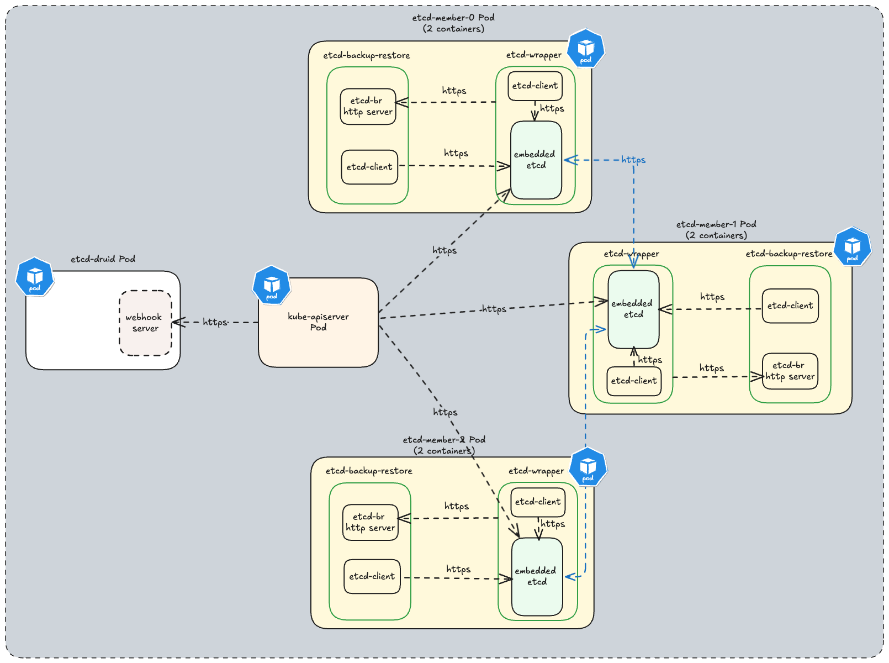

# Securing etcd cluster

This document will describe all the TLS artifacts that are typically generated for setting up etcd-druid and etcd clusters in Gardener clusters. You can take inspiration from this and decide which communication lines are essential to be TLS enabled.

## Communication lines

In order to undertand all the TLS artifacts that are required to setup etcd-druid and one or more etcd-clusters, one must have a clear view of all the communication channels that needs to be protected via TLS. In the diagram below all communication lines in a typical 3-node etcd cluster along with `kube-apiserver` and `etcd-druid` is illustrated.

> **Note:** For [Gardener](https://github.com/gardener/gardener) setup all the communication lines are TLS enabled. 

## TLS artifacts

An etcd cluster setup by `etcd-druid` leverages the following TLS artifacts:

* Certificate Authority used to sign server and client certificate key-pair for `etcd-backup-restore` specified via `etcd.spec.backup.tls.tlsCASecretRef`.
* Server certificate key-pair specified via `etcd.spec.backup.tls.serverTLSSecretRef` used by `etcd-backup-restore` HTTPS server.
* Client certificate key-pair specified via `etcd.spec.backup.tls.clientTLSSecretRef` used by `etcd-wrapper` to securely communicate to the `etcd-backup-restore` HTTPS server.
* Certificate Authority used to sign server and client certificate key-pair for `etcd` and `etcd-wrapper` specified via `etcd.spec.etcd.clientUrlTls.tlsCASecretRef` for etcd client communication.
* Server certificate key-pair specified via `etcd.spec.etcd.clientUrlTls.serverTLSSecretRef` used by `etcd` and `etcd-wrapper` HTTPS servers.
* Client certificate key-pair specified via `etcd.spec.etcd.clientUrlTls.clientTLSSecretRef` used by:
  *  `etcd-wrapper` and `etcd-backup-restore` to securely communicate to the `etcd` HTTPS server.
  * `etcd-backup-restore` to securely communicate to the `etcd-wrapper` HTTPS server.

* Certificate Authority used to sign server certificate key-pair for `etcd` peer communication specified via `etcd.spec.etcd.peerUrlTls.tlsCASecretRef`.
* Server certificate key-pair specified via `etcd.spec.etcd.peerUrlTls.serverTLSSecretRef` used for `etcd` peer communication. 

> **NOTE:** TLS artifacts should be created prior to creating `Etcd` clusters. `etcd-druid` currently does not provide a convenience way to generate these TLS artifacts. [etcd](https://etcd.io/docs/v3.4/op-guide/security/) recommends to use [cfssl](https://github.com/cloudflare/cfssl) to generate certificates. However you can use any other tool as well. We do provide a convenience script for local development [here](https://github.com/gardener/etcd-wrapper/blob/main/hack/local-dev/generate_pki.sh) which can be used to generate TLS artifacts. Currently this script is part of [etcd-wrapper](https://github.com/gardener/etcd-wrapper) github repository but we will harmonize these scripts to be used across all github projects under the `etcd-druid` ecosystem.

